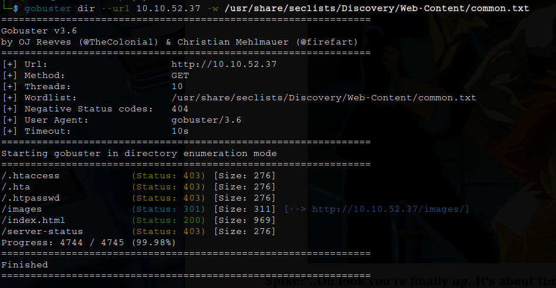
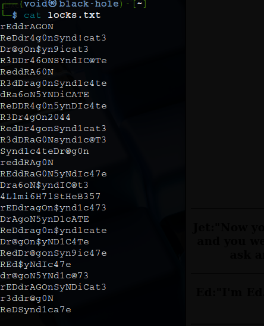
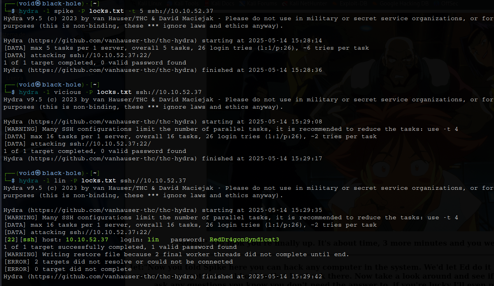

# _**Bounty Hacker CTF**_


## _**Enumeração**_
Primeiro, vamos começar com um scan <mark>Nmap</mark>
> ```bash
> nmap -p 0-9999 -A -T5 [ip_address]
> ```


Parece que temos login anônimo via FTP  
Vamos verificar os arquivos que estão ali  
Extraindo  


Visitando o website, temos a seguinte página  


Vamos realizar um scan com <mark>Gobuster</mark>
> ```bash
> gobuster dir --url [ip_address] -w ../Discovery/Web-Content/common.txt
> ```


Vamos primeiro investigar os arquivos _.txt_ extraídos via FTP
Primeiro, <mark>task.txt</mark>  


Já em <mark>locks.txt</mark>, temos o que parece ser uma lista de senhas!



Vamos começar visitando os diretórios descobertos com o scan *Gobuster*
Primeiro, <mark>/index.html</mark>  
Nada muito de diferente de antes  
Vamos continuar com <mark>/images</mark>  


## _**Ganhando acesso**_

Temos a imagem da tela inicial  
Vamos realizar download dela com ```wget```  
Esta imagem parece estar ofuscada, vamos investigar  
Tentando extrair com <mark>steghide</mark> e as senhas descobertas, não obtemos sucesso  


Vamos tentar realizar _brute force_ no serviço SSH com os nomes: vicious, spike e lin  



Parece que temos uma senha!  
Vamos realizar login  
Após procurar em _**Desktop**_, temos nossa primeira flag!

## _**Escalando privilégios**_
Vamos tentar escalar privilégios agora
Primeiro, tentaremos alguns comandos conhecidos como ```sudo -l```  
Parece que temos um comando que podemos executar como _root_  


Vamos executar o seguinte comando:
> ```bash
> sudo tar -cf /dev/null /dev/null --checkpoint=1 --checkpoint-action=exec=/bin/sh
> ```


Agora, basta buscar a flag root!

