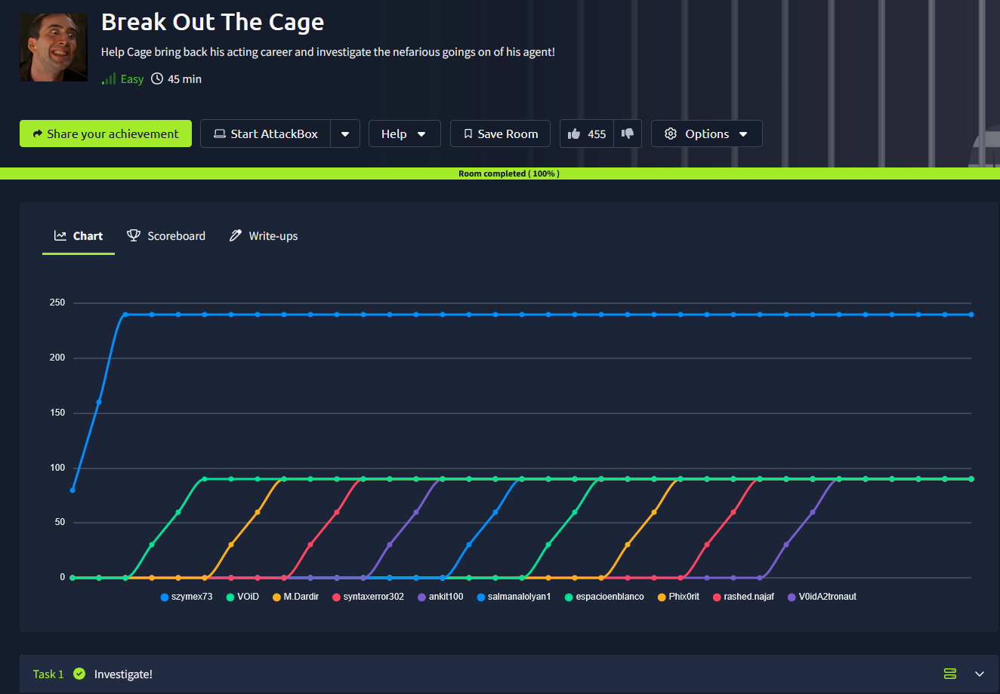
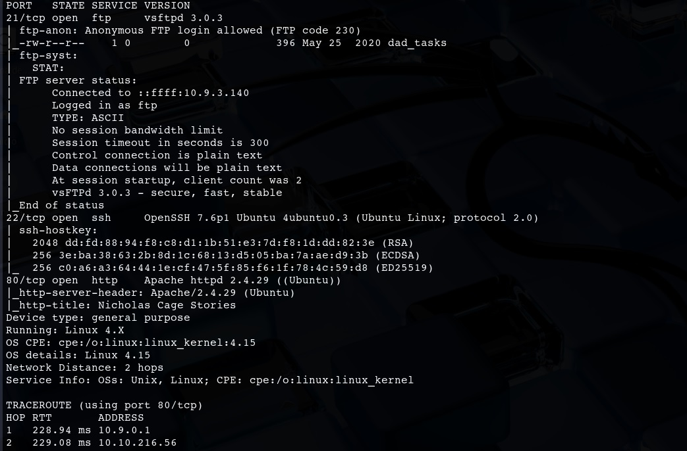
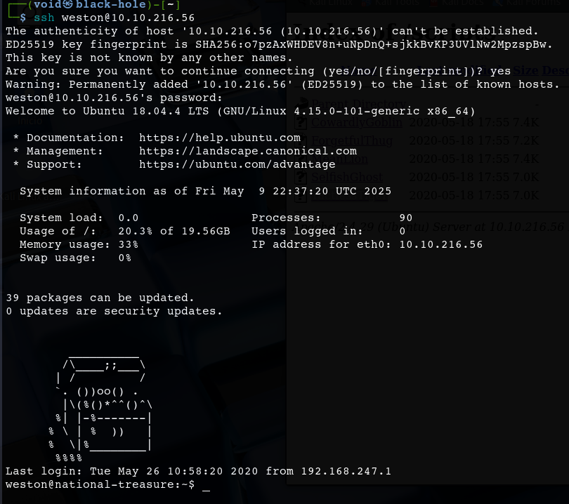
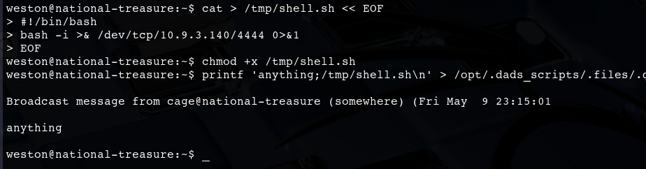

# _**Break Out The Cage CTF**_


## _**Enumeração**_
Primeiro, vamos começar com um scan <mark>Nmap</mark>
> ```bash
> nmap -p 0-9999 -A -T5 [ip_address]
> ```


Vamos também realizar um scan com <mark>Gobuster</mark>
> ```bash
> gobuster dir --url [ip_address] -w ../Discovery/Web-Content/common.txt
> ```


Primeiro, vamos tentar realizar login via FTP anonimamente e recuperar o arquivo que está lá  


Verificando o arquivo que recuperamos, temos uma longa string de caracteres  
Vamos investigar com <mark>hash-identifier</mark>  


Parece que não temos nenhum resultado de hash  
Vamos tentar então para ver se o GPT sabe o que essa string pode significar  
E também não temos resultados  
Vamos continuar com nossa investigação  

Primeiro, vamos visitar <mark>/contracts</mark>  


Não parece ter algo útil  
Nem no código da página
Vamos continuar, agora com <mark>images</mark>  


Temos uma grande quantidade de imagens das quais podem estar ofuscadas com conteúdo valioso para nós
Mas vamos continuar nossa investigação com outro diretório  

Acessando <mark>/scripts</mark>  


Parece que temos arquivos a investigar  
Vamos começar por aqui, o primeiro arquivo, **CowardlyGoblin**  
Parece ser uma _screenplay_ apenas  
Continuando  
Todos parecem ser _screenplays_

Vamos voltar para as imagens
Após investigações com a imagem, nada foi encontrado  
Vamos voltar para o arquivo encontrado no serviço FTP  
Usando o GPT para tentar identificar a _string_, ele automaticamente traduziu de base64, e temos aluma frase oculta  


Parece que precisamos quebrar novamente
Uma das sugestões foi cifra simples, como Vigenère  
Usando este [decodificador](https://www.guballa.de/vigenere-solver) para a nova string, temos um resultado  


E temos a senha de Weston  
Vamos tentar realizar login via SSH  



## _**Escalando privilégios**_
Investigando, temos alguns arquivos interessantes


Após algumas verificações e tentativas de alteração e execução de <mark>/usr/bin/bees</mark>, não obtemos nada  
Observando um pouco, uma mensagem aparece de vez em quando  
Vamos investigar transferindo LinPEAS para a máquina-alvo  
Arquivos muito interessantes foram encontrados:
* /opt/.dads.scripts/.files
* /opt/.dads.scripts/.files/..
* /opt/.dads.scripts/.files/.quotes
* /opt/.dads.scripts/spread.the-quotes.py


Podemos obter shell root através de um dos arquivos ali  
Primeiro, tentamos com _**.quotes**_
Vamos executar como a imagem abaixo:  



Um ```cat``` em Super_Duper_Checklist e temos nossa primeira flag  
Agora vamos para a segunda  
Investigando o arquivo _**backups**_ e os e-mails dali, temos a seguinte string: <mark>haiinspsyanileph</mark>  
Parece ser (novamente) Vigènere  
Vamos tentar quebrá-la  
E temos resposta: cageisnotalegend  

Basta buscarmos agora a útlima flag


