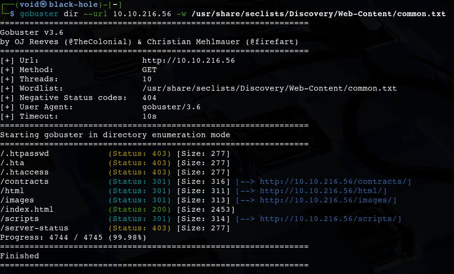

# _**Break Out The Cage CTF**_


## _**Enumeração**_
Primeiro, vamos começar com um scan <mark>Nmap</mark>
> ```bash
> nmap -p 0-9999 -A -T5 [ip_address]
> ```


Vamos também realizar um scan com <mark>Gobuster</mark>
> ```bash
> gobuster dir --url [ip_address] -w ../Discovery/Web-Content/common.txt
> ```


