# _**Easy Peasy CTF**_


## _**Enumeração**_
Primeiro, começamos com um scan Nmap
> ```bash
> nmap -p- -A -T5 [ip_address]
> ```


Vamos usar o <mark>gobuster</mark> para encontrar diretórios escondidos nas portas com servidores web
> ```bash
> gobuster dir --url [ip_address]:80 -w ../seclists/Discovery/Web-Content/common.txt
> ```
> ```bash
> gobuster dir --url [ip_address]:65524 -w ../seclists/Disocvery/Web-Content/common.txt
> ```
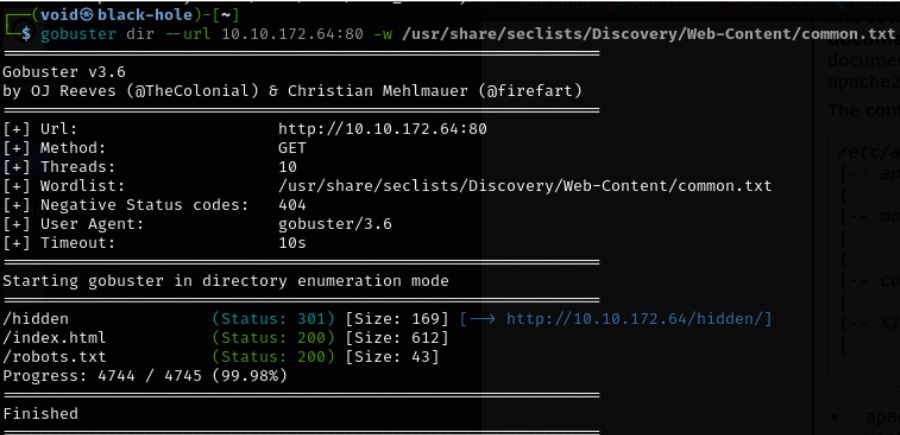
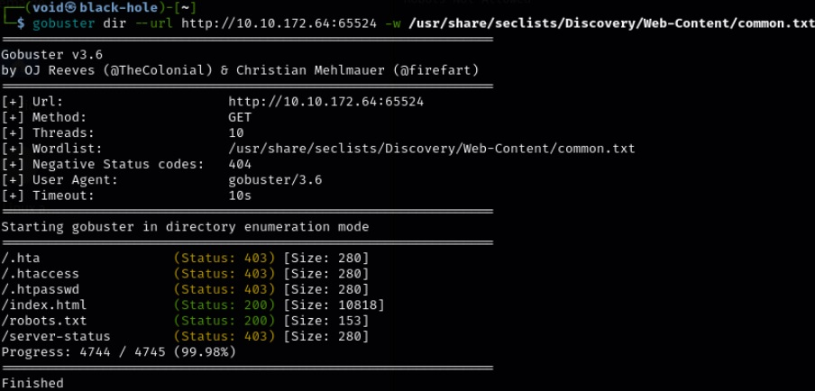

Conteúdo de <mark>:80/robots.txt</mark>  

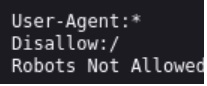

Conteúdo de <mark>:80/hidden</mark>  

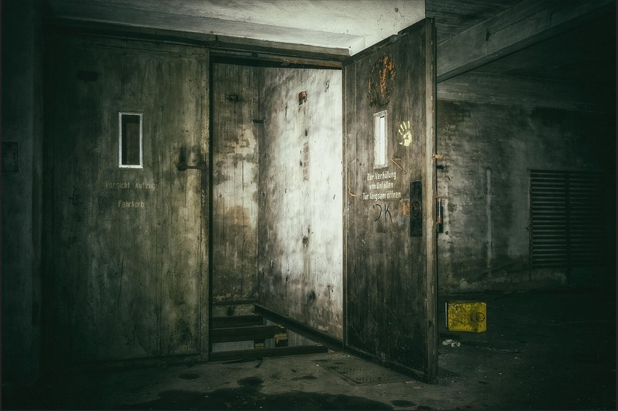

Uma imagem, possível esteganografia (tentativa com algumas ferramentas como steghide, exiftool e binwalk, mas nada foi obtido)  
Escrita nas portas, talvez possa significar algo (está em alemão, possivelmente de um jogo)  

Vamos verificar <mark>:65524/robots.txt</mark>  

  

Usamos novamente a ferramenta Gobuster, mas agora em <mark>/hidden</mark>  


Temos mais um diretório, uma imagem  
Tentamos novamente com as ferramentas de esteganografia, mas nada foi obtido  
Vamos tentar mais uma vez com Gobuster  

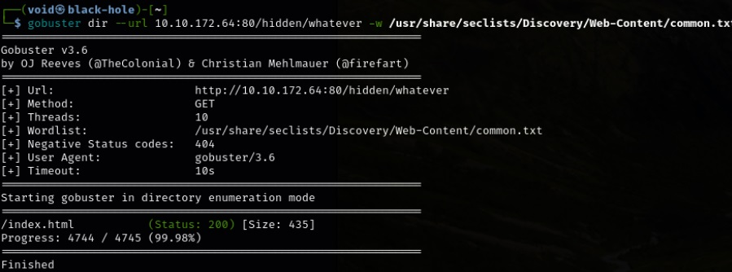

Nenhum caminho a ser seguido
Porém, vamos inspecionar o código-fonte de cada uma das imagens e ver o que podemos obter  
Na primeira imagem, nada, já na segunda, temos o seguinte:  

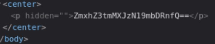  

Um código base64
Vamos tentar decodificar com echo
> ```bash
> echo ‘ZmxhZ3tmMXJzN19mbDRnfQ==’ | base64 -d
> ````
Temos nossa primeira _flag!_

Pela forma da sala, isso pode ser um padrão  
Vamos investigar cada diretório descoberto (e acessível) procurando pela palavra-chave _flag_.  
Em :65524, temos uma  


Em <mark>/robots.txt</mark>, o User-agent descrito é uma hash, não percebido anteriormente
Vamos identificar usando <mark>hash-identifier</mark>  

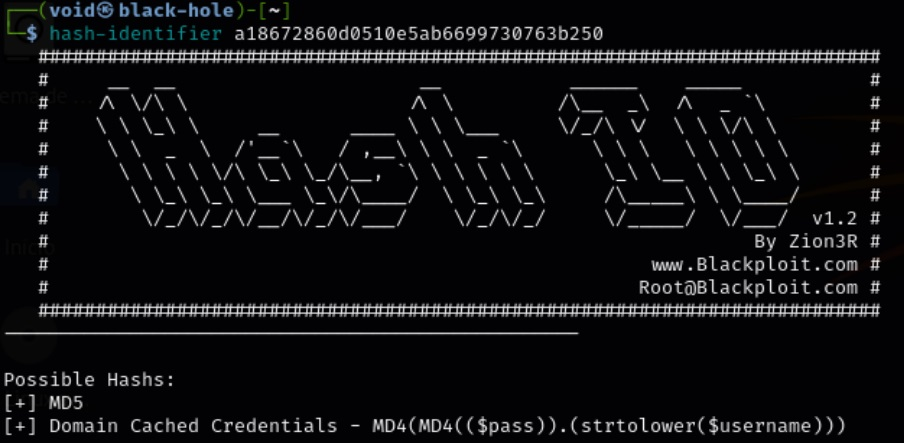

Bem provável uma md5
Buscando uma ferramenta online, podemos quebrar essa hash facilmente  

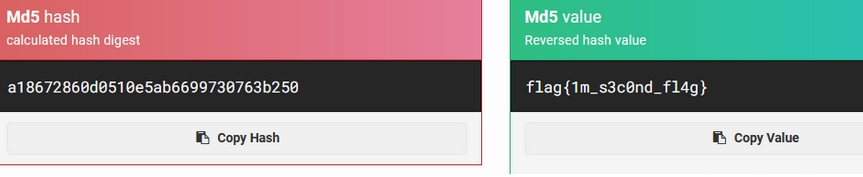

E obtemos a _segunda flag_  
Agora, precisamos encontrar um diretório escondido  
Quebrando um pouco a cabeça, pensamos no que havia escrito em um dos diretórios  
Então, buscamos em cada um dos diretórios descobertos pela palavra _**hidden**_ e encontramos o seguinte:  


## _**Ganhando acesso**_
Um texto codificado em alguma base  
Perguntando ao gpt, temos que ele não conseguiu identificar qual base está codificado  
Tentou-se 16, 32, 64 e 58. Então, pedi para ele sugerir qual base poderia ser, e ele retornou 64 e 62  
Uma já havíamos tentado, a outra ainda não. E então, encontramos o diretório escondido. Era base 62!  
Após traduzir, temos uma string do que parece ser um diretório  
Vamos visitar este diretório escondido  

  

Inspecionando o código-fonte da página, temos duas observações
* a imagem
* a string de caracteres escrita, quase que invisível ao observar a página  

Vamos usar <mark>hash-identifier</mark> para verificar essa _string_  

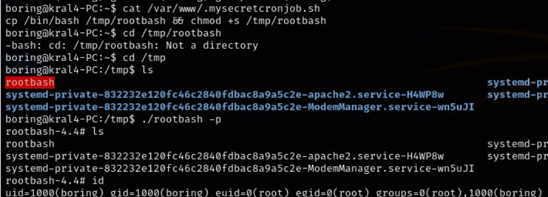

Uma possível é _sha-256_  
Providenciado pelo exercício, temos uma wordlist, vamos usar ela para quebrar a hash  
Usando a dica, conseguimos quebrar a hash  


Foi feito o download da imagem central e verificou-se com binwalk e exiftool, porém, sem resultados  
Então, utilizou-se <mark>steghide</mark> para tentar extrair o que poderia conter dentro da imagem, foi requisitada uma senha, usamos a qual quebramos com <mark>John</mark> e deu certo!  


Verificando o conteúdo de _secrettext.txt_, temos  


Decodificando o binário com um decodificador online (ou gpt), temos a senha
Agora, usuário e senha para login via ssh  
Vamos tentar realizar login via _ssh_  

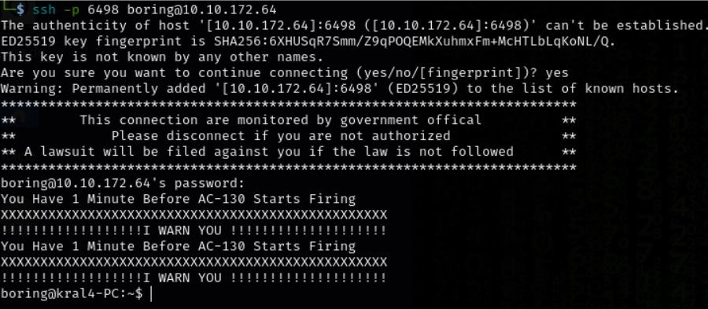

Sucesso!
Agora, para a _user flag_  


Vamos ter que verificar isso
Parece ser cifra de césar
Usando ferramenta online e força bruta, temos que a flag foi descoberta com sucesso
Agora, precisamos encontrar a root flag escalonando privilégios

## Escalando privilégios
Vamos começar com o comando ```sudo -l```  


Parece que vamos ter que encontrar outra forma
Vamos tentar com o comando abaixo
> ```bash
> find / -writable -type f -name "*.sh" 2>/dev/null
> ```
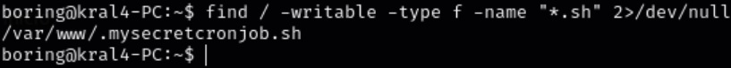

Parece que temos um arquivo que podemos escrever do tipo _.sh_
Vamos fazer o seguinte
> ```bash
> echo "cp /bin/bash /tmp/rootbash && chmod +s /tmp/rootbash" > /var/www/.mysecretcronjob.sh
> ```
Após executar o comando, navegue até o diretório do qual foi copiado o arquivo _/bin/bash_ (neste caso _/tmp/rootbash_) e execute com ```./rootbash -p``` para obter _root_  


Basta buscar a _flag root_ e completar a sala!
