# _**Lian_Yu CTF**_
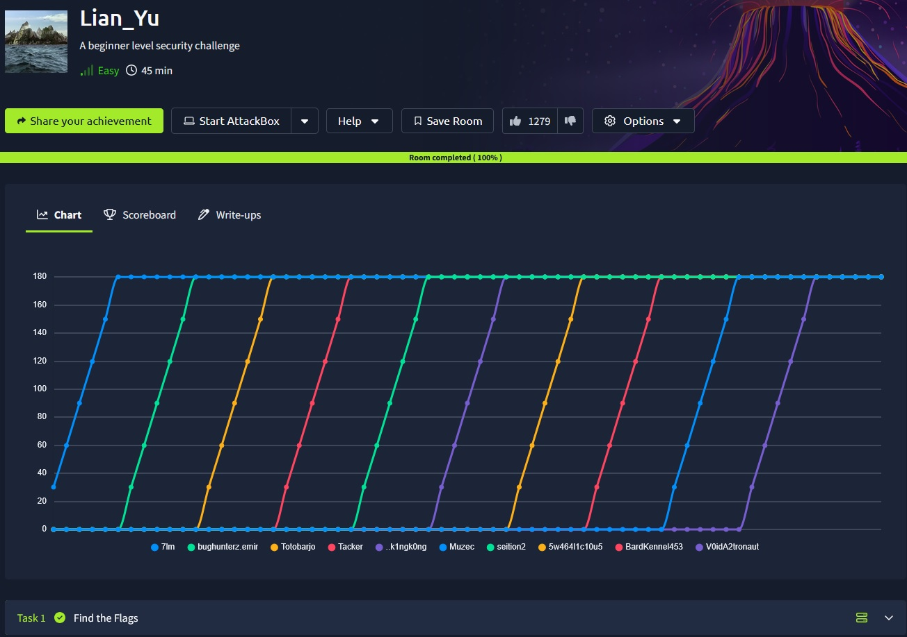

## _**Enumeração**_
Primeiro, vamos começar com um scan <mark>Nmap</mark>
> ```bash
> nmap -p 0-9999 -A -T5 [ip_address]
> ```


Vamos também começar um scan <mark>Gobuster</mark>
> ```bash
> gobuster dir --url [ip_address] -w ../Discovery/Web-Content/common.txt
> ```


Em ambos os scans, não encontramos muitas informações relevantes  
Vamos tentar com outros arquivos:
* PHP.fuzz.txt
* Common-PHP-Filenames.txt
* Apache.txt

Não tivemos nenhum resultado  
Então, olhamos a dica  
O diretório escondido é em números  
Vamos criar um script em python para percorrer de 1000 até 9999 e mostrar qual é após um retorno de código 200
> ```bash
> import requests
> url_base = "http://10.10.141.18/{}"
> 
> for i in range(1000, 10000):
>     url = url_base.format(i)
>     try:
>         response = requests.get(url, timeout=3)
>         if response.status_code == 200:
>             print(f"[+] Código 200 encontrado em: {i}")
>             break
>         else:
>             print(f"[-] Tentativa {i}: {response.status_code}")
>     except requests.RequestException as e:
>         print(f"[!] Erro na tentativa {i}: {e}")
> ```

Enquanto o script está executando, vamos realizar download da imagem que está na página  
Investigando com ```exiftool```, encontramos uma ID
> 9d91003d4080b03d40742c819ea5228e

Utilizando a ferramenta <mark>hash-identifier</mark>, identificamos como sendo uma possível md5  
Vamos tentar quebrá-la nestes dois links:
* [md5decrypt](https://md5decrypt.net/en/)
* [crackstation](https://crackstation.net/)

Não tivemos nenhum resultado  
Vamos continuar  
Tentando novamente com gobuster, desta vez, um número maior de diretórios (único pensamento encontrado)
> ```bash
> gobuster dir --url [ip_address] -w ../Discovery/Web-Content/directory-list-lowercase-2.3-medium.txt
> ```
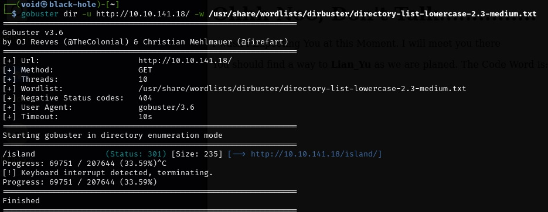

Encontramos um diretório escondido! Vamos investigar  


Inspecionando a página, temos que o código é <mark>vigilante</mark>  

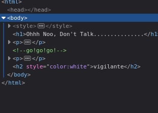

Mas este código é para que?  
Ele fala de nos encontramos na ilha  
Minha ideia, download da imagem e extração de arquivos com <mark>binwalk</mark>

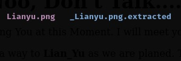

Aparentemente funcionou  
Vamos investigar  
Acabou não levando a nada  
O que podemos fazer, é continuar investigando _/island_ com um novo scan com Gobuster
Estamos procurando 
> ```bash
> gobuster dir --url [ip_address]/island -w ../Discovery/Web-Content/directory-list-lowercase-2.3-medium.txt
> ```
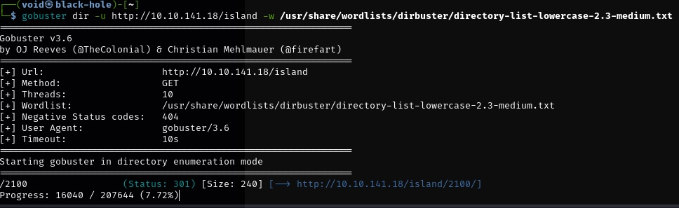

Usando também o script em python anterior, temos resultado  
Visitando [ip_address]/island/2100, temos:


Investigando a página, temos um vídeo no YT, mas do qual não está funcionando  
Estamos procurando um arquivo _.ticket_  
Vamos novamente usar gobuster para encontrar
> ```bash
> gobuster dir --url [ip_address]/island/2100 -w ../Discovery/Web-Content/directory-list-lowercase-2.3-medium.txt -x .ticket
> ```


Visitando o arquivo descoberto, temos:

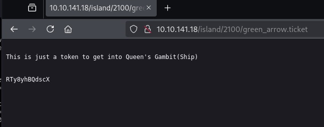

Vendo a dica e usando [cyberchef](), chegamos em uma senha: <mark>!#th3h00d</mark>

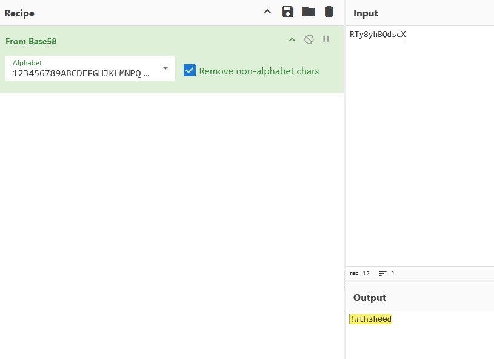

## _**Ganhando acesso**_
Agora, em qual serviço devemos tentar login? SSH ou FTP  
Vamos começar pela ordem, então, FTP  
* usuário: oliver
* senha: !#th3h00d

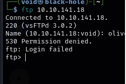

Vamos tentar com o nome descoberto anteriormente, _vigilante_  

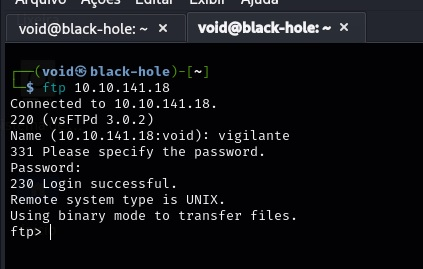

Vamos investigar  
Temos 3 arquivos. Vamos adquirir através de ```mget*```

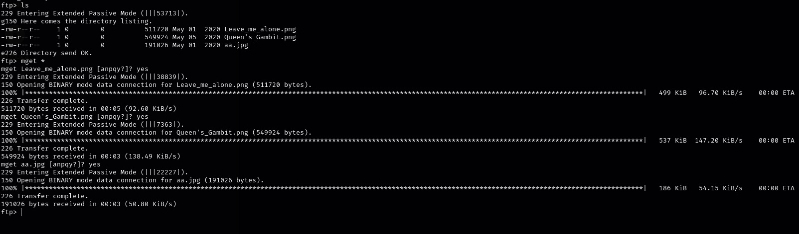

Investigando cada um deles com ```exiftool```, temos que um deles não está abrindo  


Vamos usar a ferramenta <mark>hexeditor</mark> para alterar o _hex_ para o correto (.png)  

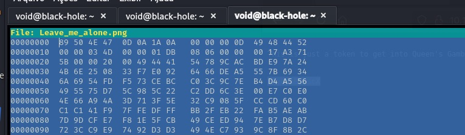

E temos resultado!!!


Vamos tentar extrair o conteúdo de _**aa.jpg**_ com essa senha através de <mark>steghide</mark>
> ```bash
> steghide extract -sf aa.jpg
> ```


Vamos investigar o conteúdo extraído com ```unzip```


Tentativa de login via SSH na conta de _slade_


## _**Escalando privilégios**_
Primeiro, vamos tentar o comando ```sudo -l```

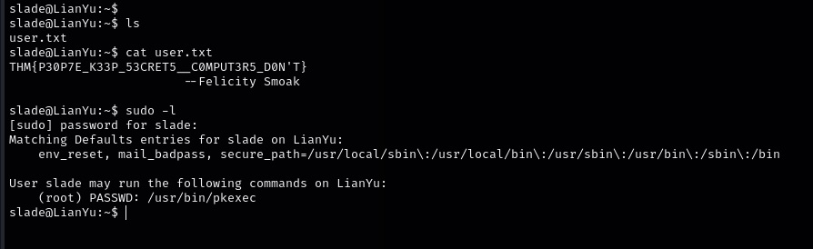

Temos um arquivo do qual precisamos de senha para poder executar  
Como temos essa senha, vamos tentar o seguinte comando
> ```bash
> sudo pkexec /bin/sh
> ```
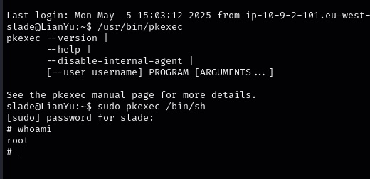

A partir daí, basta um ```cat``` para buscar a última flag!
