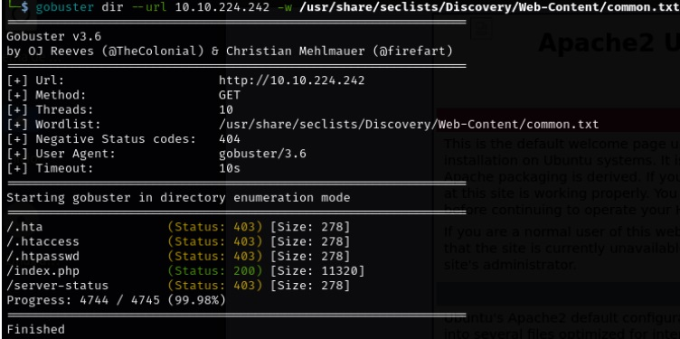
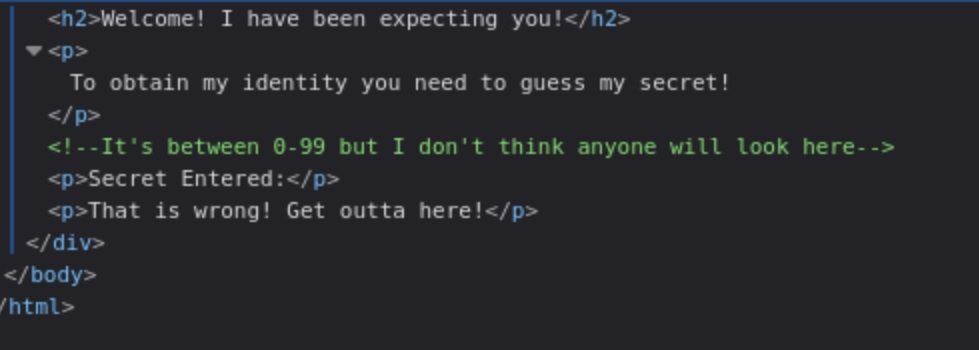
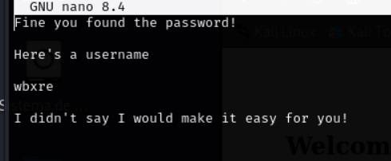
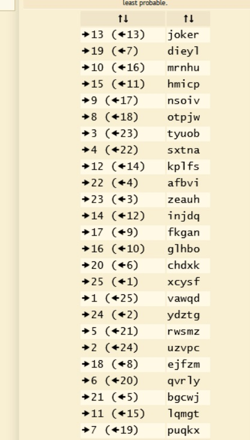
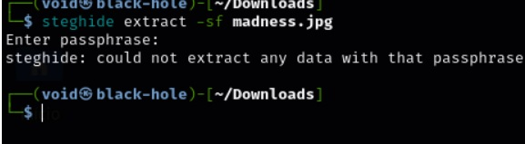
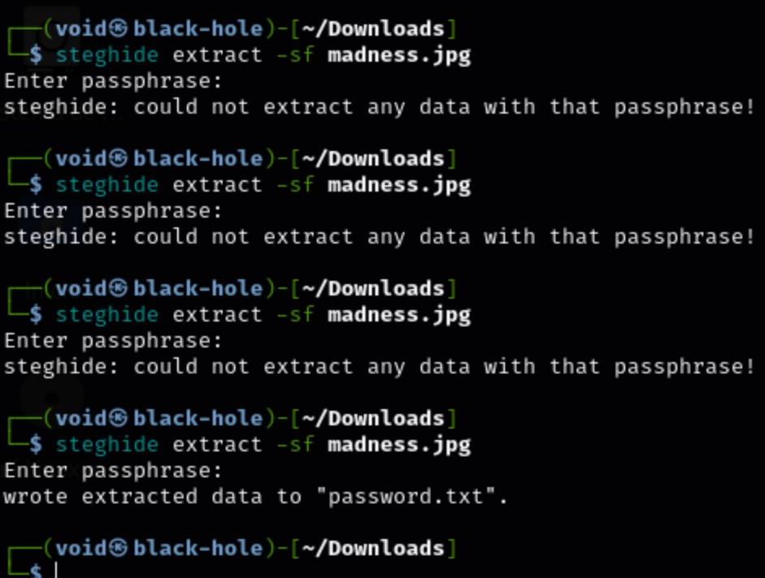
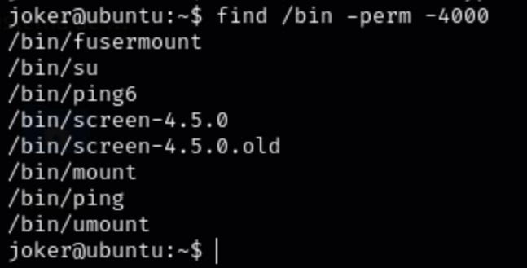
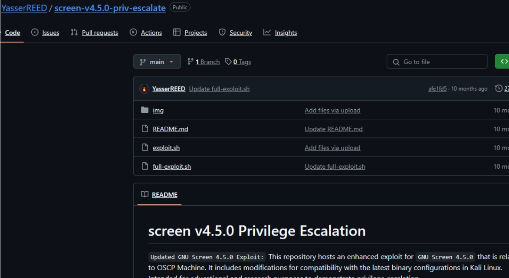

# _**Madness**_


## _**Enumeração**_
Primeiro, começamos com um scan <mark>nmap</mark> na máquina-alvo
> ```bash
> nmap --open -A -T5 [ip_address]
> ```


Poucas informações disponíveis neste início. Vamos realizar uma enumeração de diretórios com o <mark>Gobuster</mark>
> ```bash
> gobuster dir --url ../Disovery/Web-Content/common.txt
> ```


Verificando <mark>/index.php</mark>, não encontramos algo de relevante  
Nada encontrado após vários scans com gobuster e nmap  
Meu próximo passo é buscar no inimaginável, a imagem na página do desafio  

Vamos baixar e salvar no computador  
Após baixado, vamos usar a ferramenta <mark>xxd</mark> para verificar a imagem
> ```bash
> xxd [image_file] | head -1
> ```


Ainda desconfio que existe dados dentro desta imagem  
Perguntando ao gpt qual comando posso usar com <mark>xxd</mark>  
Vamos tentar este outro
> ```bash
> xxd [image.jpg] | grep -A 10 FFD9
> ```

Nada encontrado. Parece não ser nada  
Após buscar por ajuda, vamos inspecionar o código-fonte da página  



Uma imagem que não deveria estar ali!  
Vamos realizar o download da imagem com wget  
> ```bash
> wget http://[ip_address]:80/thm.jpg
> ```

Agora, vamos usar o comando ```head```  


Parece conter dados escondidos dentro da imagem  
E o header parece ser de um .png, mas a imagem é do tipo _**.jpg**_  
Vamos alterar isso para poder abrir a imagem
> ```bash
> echo "ffd8 ffe0 0010 4a46 4946 0001" | xxd -r -p | dd of=image.jpg bs=1 seek=0 conv=notrunc
> ```

Temos resultado!  


Abrindo a página indicada e inspecionando os elementos, temos  


Pedi para o gpt criar um código em <mark>Python</mark> para percorrer os números entre 0 e 99 tentando acessar o site
>
```bash
base_url = "http://[ip_address]/th1s_1s_h1dd3n/?secret="

for i in range(100):
	url = f"{base_url}{i}"
	try:
    	response = requests.get(url, timeout=3)
    	if response.status_code == 200 and "Not Found" not in response.text:
        	print(f"[+] Possível válido: {url}")
        	print(response.text[:1000])  # mostra os primeiros 1000 caracteres
    	else:
        	print(f"[-] {i}: {response.status_code}")
	except requests.RequestException as e:
    	print(f"[!] Erro em {url}: {e}")
```
Após algum tempo, temos que o código 73 é o correto  
Vamos verificar o seu conteúdo  
Temos a seguinte frase: <mark>y2RPJ4QaPF!</mark>  
Acreditando ser uma senha, mas como não temos nenhum usuário conhecido, vamos tentar na imagem antes baixada
> ```bash
> steghide extract -sf [file_name].jpg
> ```

Conseguimos extrair o que a imagem estava guardando  

  

Este conteúdo parece ser simples demais  
Letras minúsculas e curto, quem sabe tentando cifra de césar  

  

Temos uma tradução! Com 13 shifts, o nome <mark>joker</mark> aparece  
Vamos tentar realizar um login ssh e usar a senha descoberta anteriormente  
Login incorreto!

## _**Ganhando acesso**_
Ainda sem a senha, podemos tentar novamente, mas agora com outra ferramenta, a imagem do desafio  

  

Vamos tentar o comando ```head```  


Um retorno um tanto quanto estranho, não reconhecido  
Vamos tentar ```file```  


Usando <mark>steghide</mark>, tentamos buscar o conteúdo escondido (novamente) dentro desta imagem, mas sem sucesso  
Foi feita várias e várias tentativas com as senhas encontradas e até o nome da imagem de download  
Foi então, que tentamos sem nenhuma senha  



Finalmente, conseguimos login via ssh e a primeira flag em user.txt  


## _**Escalando privilégios**_
Para a segunda flag, precisamos escalonar privilégios  
Vamos começar com o comando ```find```
> ```bash
> find /bin -perm -4000
> ```


Pesquisando alguns dos nomes que estão ali, um chama a atenção por possuir a possibilidade de escalação de privilégios, _**screen-4.5.0**_  



Copiando o exploit para um arquivo _.sh_ no diretório _/tmp_ e concedendo execução com ```chmod```, executando, temos _root_ e _flag_:  


