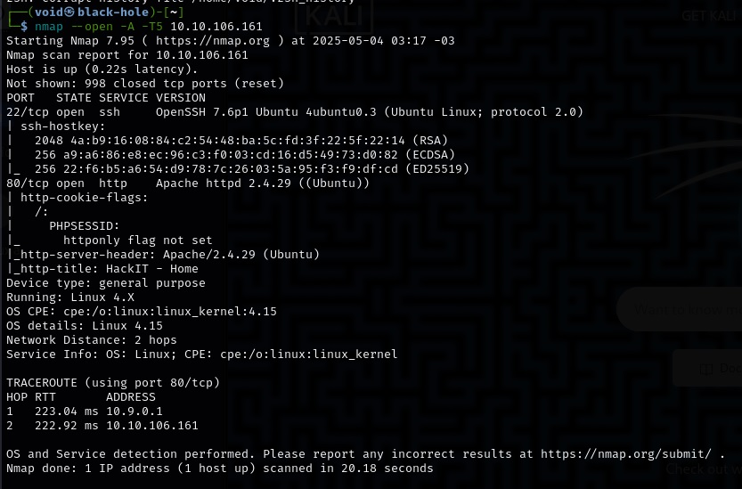
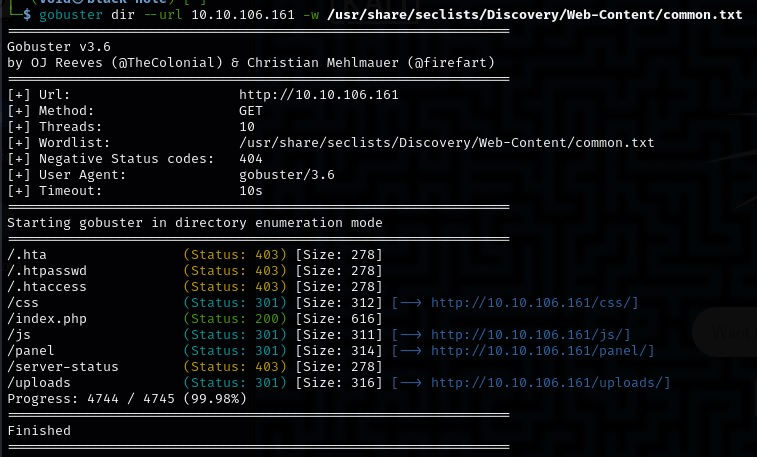
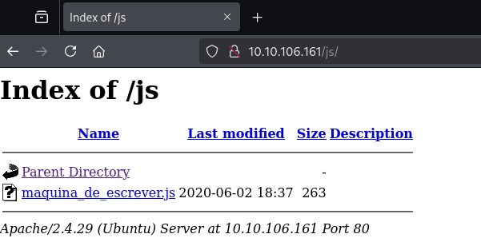
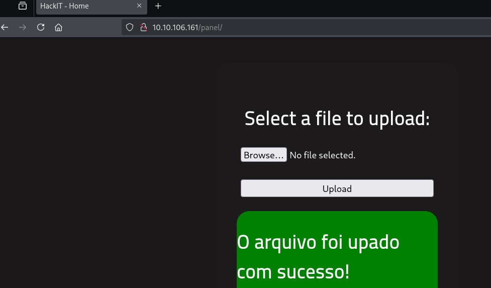
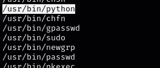

# _**RootMe CTF**_


## _**Enumeração**_
Vamos começar com um scan <mark>Nmap</mark>
> ```bash
> nmap --open -A -T5 [ip_address]
> ```


Vamos também realizar um scan com <mark>Gobuster</mark>
> ```bash
> gobuster dir --url [ip_adress] -w ../Discovery/Web-Content/common.txt
> ```


Vamos verificar a <mark>página HTTP</mark>  


Vamos ir verificando os diretórios descobertos com o scan Gobuster
Primeiro, <mark>index.php</mark>  


Segundo, <mark>css</mark>  


Terceiro, <mark>js</mark>  



Em máquina de escrever, temos um pequeno trecho de código  
Acredito que serve apenas para dar _display_ das mensagens que foram vistas  
Vamos continuar  

Chegamos onde queriamos chegar  
No diretório <mark>pannel</mark>, podemos realizar upload de arquivos  


## _**Ganhando acesso**_

Vamos montar um script para podermos obter um _reverse shell_ em PHP  
Para encontrar, basta seguir este link do [_PentestMonkey_](https://github.com/pentestmonkey/php-reverse-shell)
Terminando de montar o arquivo, temos o seguinte erro  


Pareceq que não podemos realizar upload de arquivos .php  
Vamos buscar uma alternativa  
Segundo a dica, devemos buscar _Search for "file upload bypass" and "PHP reverse shell"._  
Encontramos este [link](https://github.com/swisskyrepo/PayloadsAllTheThings/blob/master/Upload%20Insecure%20Files/README.md)  
Aqui, ele explica sobre as maneiras de realizar esse _bypass_  
Vamos tentar com .phtml



Agora, vamos usar o comando ```curl``` e ```netcat``` para obter o _reverse shell_  


Agora, basta um comando ```find``` para buscar a primeira flag!
> ```bash
> find / -name "user.txt" 2>/dev/null
> ```

## _**Escalando privilégios**_
Vamos começar buscando os arquivos com permissões SUID
> ```bash
> find / -user root -perm /4000 2>/dev/null
> ```

Encontramos diversos arquivos suspeitos, mas o que acabou se destacando foi: <mark>/usr/bin/python</mark>  



Ele vai nos permitir escalar privilégios  
Vamos executar o comando abaixo
> ```bash
> /usr/bin/python -c 'import os; os.setuid(0); os.system("/bin/bash")'
> ```


Conseguimos!!!  
Basta buscar a última flag agora (em /root)!
