# _**All in one CTF**_
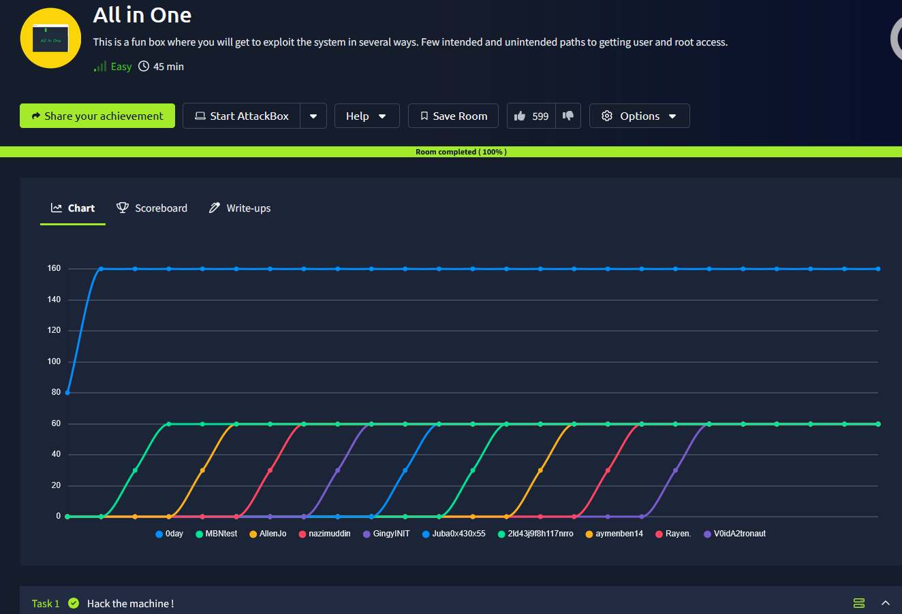

## _**Enumeração**_
Primeiro, vamos começar com um scan <mark>Nmap</mark>
> ```bash
> nmap -p 0-9999 -A -T5 [ip_address]
> ```
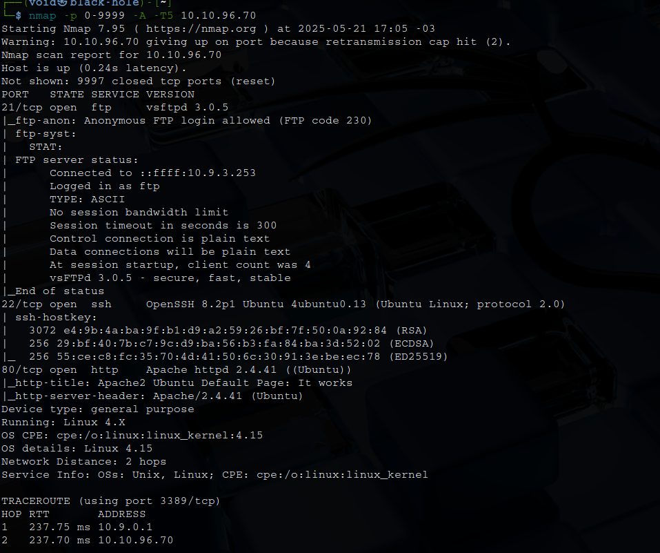

Parece que temos login anônimo via FTP e um _web-server_  
Vamos investigar primeiro apenas a página web  
Parece ser a página _default_ do Apache2  
Agora, vamos realizar login via FTP  
Nenhum arquivo  

Segundo, vamos realizar uma enumeração de diretórios com <mark>Gobuster</mark>
> ```
> gobuster dir --url [ip_address] -w ../seclists/Discovery/Web-Content/common.txt
> ```
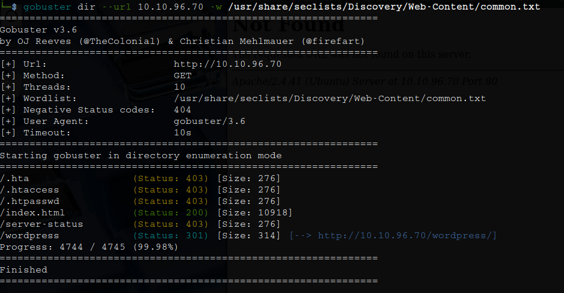

Temos um diretório _wordpress_  
Vamos realizar novamente um scan com <mark>Gobuster</mark>, mas com uma _wordlist_ diferente  
> ```bash
> gobuster dir --url [ip_address]/wordpress -w ../seclists/Discovery/Web-Content/CMS/wordpress.fuzz.txt
> ```
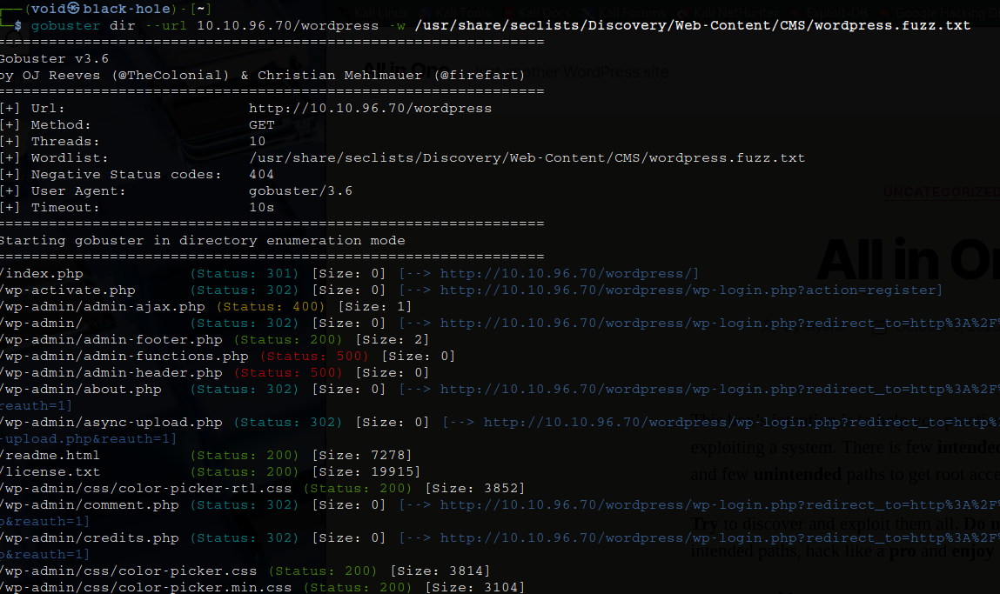

Temos um LONGO retorno  
Mas por enquanto, iremos deixar de lado  
Vamos investigar a página seguindo alguns links encontrados  
Após um pouco de leitura, um dos links que nos chama a atenção é: _/wordpress/wp-login.php_  
Verificando, temos uma página de login  

## _**Ganhando acesso**_

Tentamos primeiro qualquer login, nada  
Segundo, tentamos login com credenciais de administrador (admin:admin), também nada  
Terceiro, o _username_ no site, **elyana**, com credenciais normais, nenhum sucesso  

Já fazia um tempo que não acontecia, mas resolvi tentar um <mark>brute force com hydra</mark>  
E sucesso!  

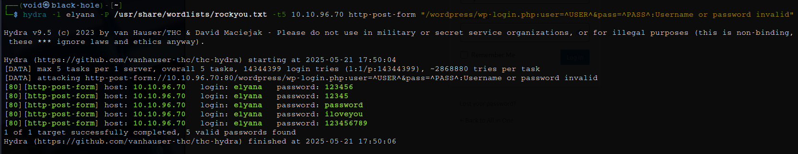  

Apesar, nenhuma das senhas funcionou  
Parece que vamos ter que achar outra maneira  
Com nenhuma outra opção em mente, voltamos a estaca zero e novamente com um scan de diretórios
> ```bash
> gobuster dir --url [ip_address] -w /usr/share/seclists/Discovery/Web-Content/directory-list-2.3-medium.txt
> ```
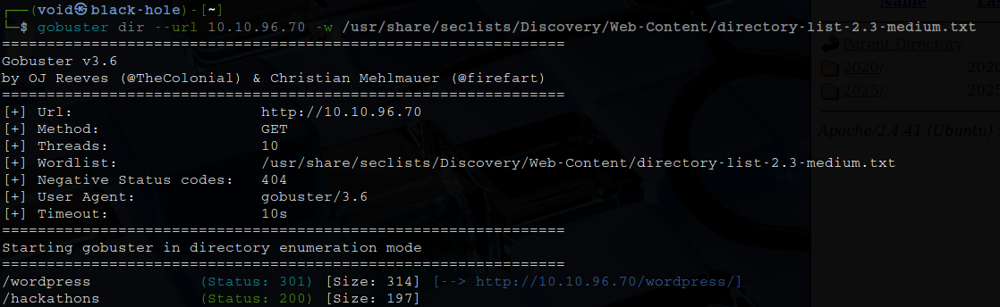

Verificando o novo diretório encontrado, parece que temos uma senha  
Vamos tentar na página de login do wordpress com elyana  
Nada  
Jogando a senha no google, parece que está criptografada com **Vigènere**  
Usando a ferramenta <mark>CyberChef</mark>, temos resultado  

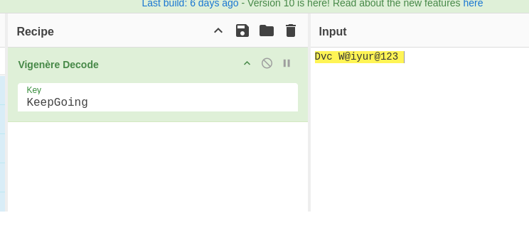

Tentano realizar login com o usuário elyana e essa nova senha, mas nada!  
Vamos buscar outras maneiras  
Com a ferramenta <mark>wpscan</mark>, que realiza varreduras automáticas em sites WordPress para detectar diversas informações, incluindo vulnerabilidades!  
> ```bash
> wpscan — url [ip_address]/wordpress -e u
> wpscan — url [ip_address]/wordpress -e ap
> ```
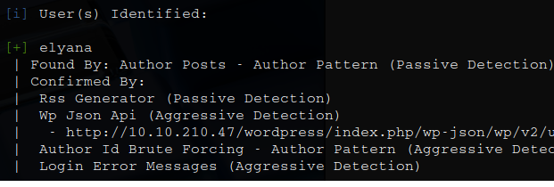  

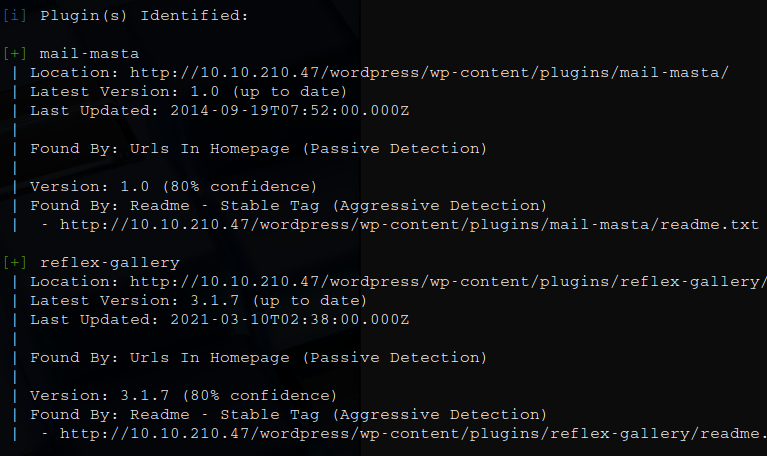

Parece que temos 3 informações valiosas:
* ```username```: elyana (já mencionado)
* ```plugin```: <mark>mail-masta</mark> e <mark>reflex-gallery</mark>

Procurando por vulnerabilidades referentes a estes _plugins_, encontramos o seguinte:
* [WordPress Plugin Mail Masta 1.0 - Local File Inclusion](https://www.exploit-db.com/exploits/40290)
* [WordPress Plugin Reflex Gallery 3.1.3 - Arbitrary File Upload](https://www.exploit-db.com/exploits/36374)

Vamos tentar explorar LFI  
Tentando a seguinte URL: ```../wp-content/plugins/mail-masta/inc/campaign/count_of_send.php?pl=/etc/passwd```  

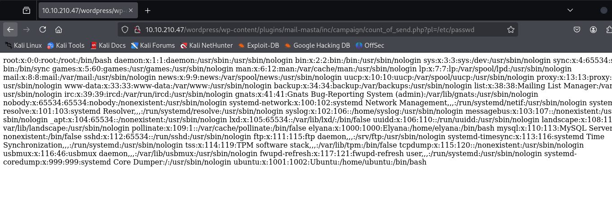  

Sucesso!  
Vamos tentar buscar <mark>wp-config.php</mark>  
URL: ```../wp-content/plugins/mail-masta/inc/campaign/count_of_send.php?pl=php://filter/convert.base64-encode/resource=../../../../../wp-config.php```  

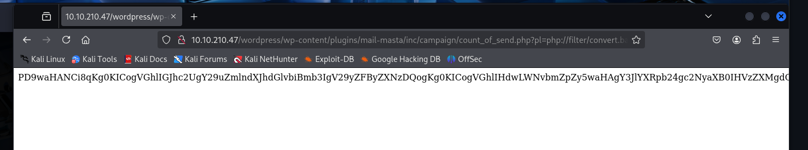

Decodificando a _string_ base64, temos:  

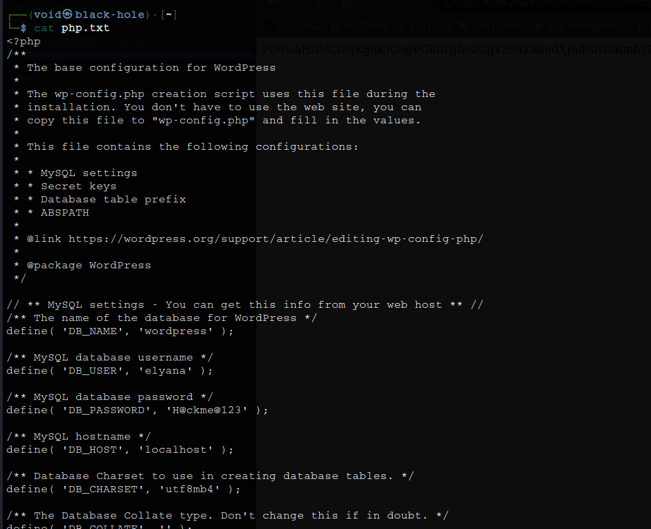

Investigando o arquivo, encontramos usuário e senha para **elyana**  
Vamos realizar login  
Após, navegamos para: <mark>Appearance > Theme Editor ></mark>  
Nele, trocamos na lateral para _theme_functions_ e adicionamos nosso código _.PHP_  
Nisso, conseguimos obter uma shell!  

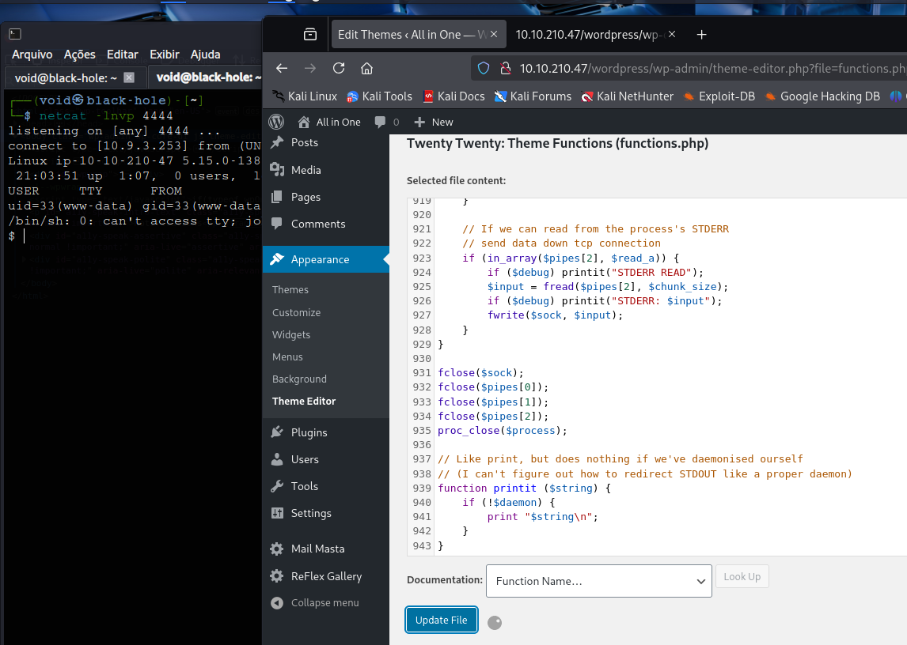  

## _**Escalando privilégios**_
Para escalarmos privilégios, vamos investigar o sistema com alguns comandos  

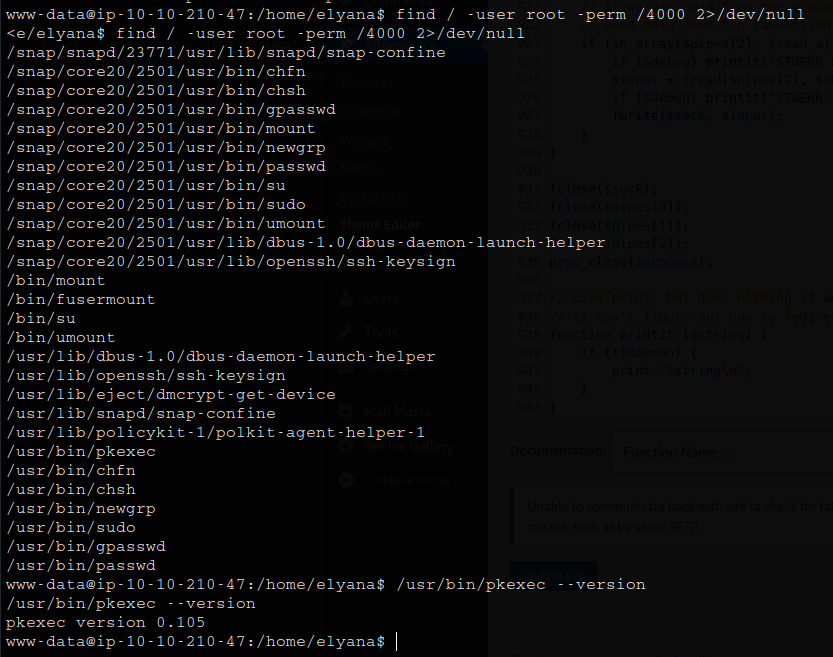

Parece que temos o serviço ```pkexec``` e também na versão <mark>0.105</mark>  
Sabemos já como escalar privilégios  
Mas parece que não iremos conseguir, permissão negada  
Vamos buscar outra maneira  
Uma dica diz que no sistema, a senha de **elyana** está escondida  
> ```bash
> find / -user elyana -type f -exec grep -iE 'user|password' {} \; 2>/dev/null
> ```
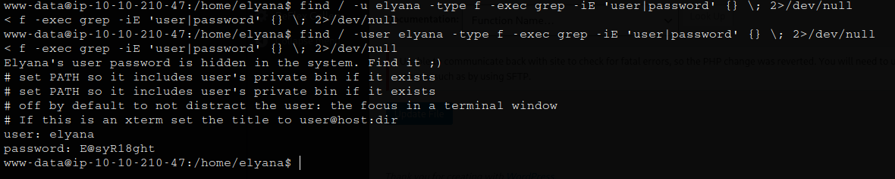

Sucesso!  
Vamos tentar login via SSH  
Conseguimos  
Agora para escalarmos privilégios, vamos primeiro executar o comando ```sudo -l```  

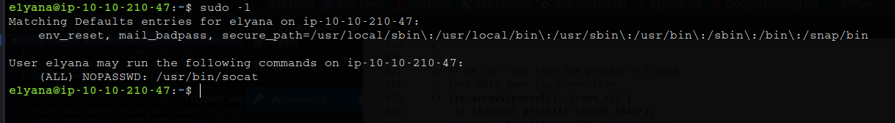

Podemos executar o seguinte comando para obter _root_
> ```bash
> sudo socat - EXEC:'sh -li',pty,stderr,setsid,sigint,sane
> ```
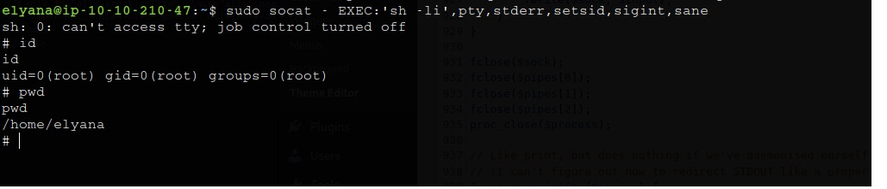

Agora só ir atrás das flags que estão criptografadas em **base64**
