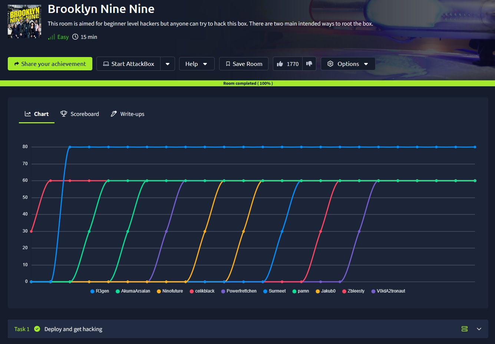
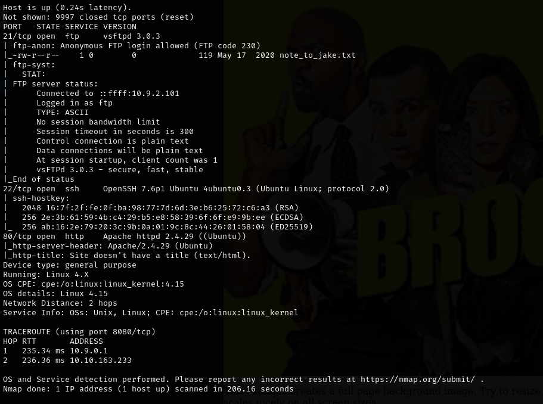
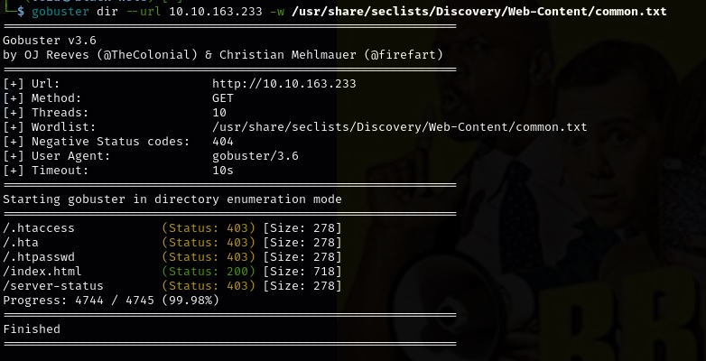
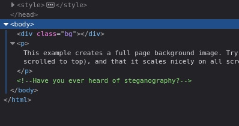
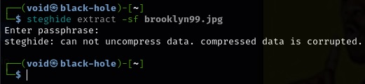
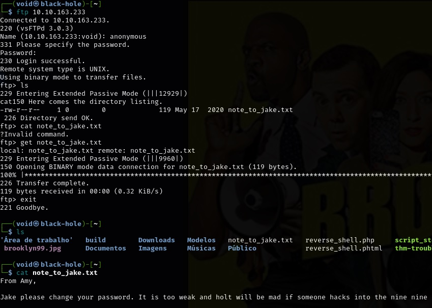
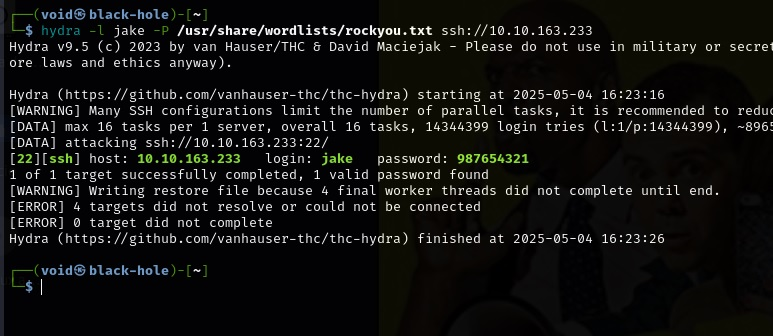
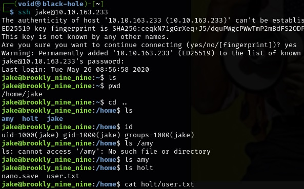
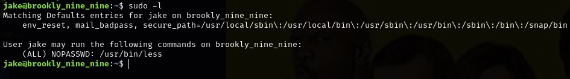

# _**Brooklyn Nine Nine CTF**_


## _**Enumeração**_
Primeiro, vamos começar com um scan <mark>Nmap</mark>
> ```bash
> nmap -p 0-9999 -A -T5 [ip_address]
> ```


Também vamos realizar um scan com <mark>Gobuster</mark>
> ```bash
> gobuster dir --url [ip_address] -w ../Discovery/Web-Content/common.txt
> ```


Investigando <mark>index.html</mark>  


Olhando o código da página, temos a seguinte mensagem:  



Vamos realizar o download da imagem com ```wget```
> ```bash
> wget [ip_address]/brooklyn99.jpg
> ```

## _**Ganhando acesso**_
Agora, vamos utilizar a ferramenta <mark>Steghide</mark> para tentar extrair seu conteúdo  



Precisamos de uma senha  
Acredito que ela deva estar no serviço FTP 
Vamos realizar login anonimamente  



Sabemos um detalhe agora, nome de usuário: **jake**  
Vamos continuar realizando um ataque de força bruta com <mark>Hydra</mark> no serviço SSH  



Vamos realizar login e obter a primeira flag  



## _**Escalando privilégios**_
Primeiro, vamos olhar a dica  
Diz para utilizarmos o comando ```sudo```  
Vamos usar ```sudo -l``` e ver o que podemos fazer  



Podemos usar o comando ```less``` sem precisarmos de senha através de /usr/bin/less  
O comando ```less``` é um leitor de paginas de texto para sistemas Unix-like, como Linux e macOS  
Ele é usado para visualizar o conteúdo de arquivos de texto  
Vamos usar isso para buscar a próxima flag
> ```bash
> sudo /usr/bin/less /root/root.txt
> ```


E assim, concluído!
