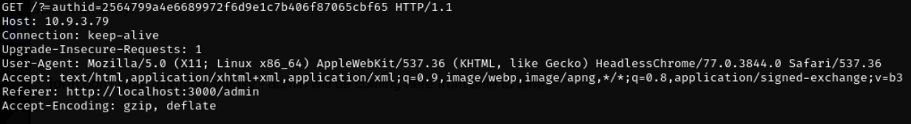

# _**Contexto de páginas web**_
As páginas da web são compostas por 3 componentes comuns:
* HTML - é a sintaxe usada para definir o conteúdo e a estrutura de uma página web.
* CSS - é a linguagem usada para projetar e estilizar o conteúdo da página web.
* Javascript - é a linguagem usada para fornecer interatividade e animação a uma página web.

A maior parte do código Javascript é encontrada dentro de:   
Estas tags em uma página web  
O código JavaScript é adicionado diretamente entre essas tags ou é chamado em um arquivo usando o atributo src dentro da tag de script de abertura, por exemplo:   
Em geral, o JavaScript dentro das tags de script é sempre executado quando a página é carregada  

Um dos outros locais onde o JavaScript pode ser adicionado são os atributos dentro de outras tags HTML  
Por exemplo:  <a href=’/link’ onclick=’code-here’>  
Esta tag HTML abre um link, mas o atributo onclick executa o código JavaScript quando o texto especificado pela tag HTML é clicado  
A execução do JavaScript no atributo depende do atributo, por exemplo, onload só executará JavaScript quando o elemento for carregado  

Muitos sites exigem a participação do usuário  
Isso inclui tudo, desde adicionar posts a um formulário até adicionar um valor em uma transferência bancária  
Vimos que sites exigem Javascript para funcionar corretamente  
Um usuário mal-intencionado poderia facilmente injetar JavaScript em uma página e executar ações maliciosas  
Esse tipo de ataque é chamado de XSS; _Cross Site Scripting_  

**Reflected XSS**
XSS refletido ocorre quando JavaScript arbitrário é refletido de um servidor (e não é permanente)  
Isso ocorre em cenários como páginas de erro e links onde o payload é passado como uma solicitação e também incluído na resposta  
O caso mais comum é quando um invasor envia uma URL contendo um payload malicioso para a vítima  
A vítima clica nesse URL e o payload é executado (exploraremos exatamente o que podemos fazer com um payload Javascript)  

**Stored XSS**
XSS armazenado ocorre quando JavaScript arbitrário é armazenado em um banco de dados e esse JavaScript é recuperado e exibido ao usuário  
Isso tende a ser mais perigoso do que XSS refletido, pois o payload é automaticamente passado (e até executado) ao usuário  

O JavaScript é muito poderoso e um invasor pode fazer muitas coisas com ele:
* **Roubar cookies de sessão:** Isso permitiria que um invasor acessasse a conta de um usuário
* **Escrever Keyloggers:** Isso permitiria que um invasor extraísse informações confidenciais de um usuário, como detalhes de cartão de crédito
* **Spam em geral:** Um invasor pode ser apenas um incômodo e arruinar a experiência do usuário com um site, manipulando vários elementos da página e muito mais

Executar esse payload sozinho não seria benéfico para um invasor  
Ele conseguiu acessar o cookie, mas como poderia recuperá-lo?  
Um método comum é redirecionar um usuário para um domínio que inclua o cookie como parâmetro  
Isso é feito usando:   

Aqui, _window.location_ redireciona o usuário para o site controlado pelo invasor e passa o cookie como parâmetro  
O invasor pode então acessar o log do servidor, recuperar esse cookie e efetuar login como o usuário  
Esta não é a única maneira de recuperar o cookie:
* Faça uma solicitação HTTP XML para um domínio controlado por um invasor: Isso é mais furtivo, pois você não precisa redirecionar o usuário para uma página diferente.
* Torne o cookie visível para um invasor: Se você conseguir obter XSS em algum tipo de fórum/mensagem, poderá recriar a solicitação usada para adicionar dados a essas páginas

Assim que um invasor visitar essas páginas, ele poderá simplesmente visualizar o cookie  

***

**Requisições**
Como mencionado acima, extrair um cookie usando uma solicitação é bastante comum  
Essas solicitações podem ser GET ou POST e geralmente são feitas usando AJAX (Javascript Assíncrono)  
Isso funciona bem porque o AJAX pode interagir com um servidor em segundo plano (não há necessidade de atualizar ou recarregar uma página)  

Ao injetar esse payload em uma página, não conseguiremos separá-los como mostrado acima  
Então, colocaríamos tudo em uma linha, por isso o ponto e vírgula no final de cada linha é importante  
Ponto e vírgula é usado para indicar que uma solicitação foi concluída  

Antes de fazer uma chamada AJAX, é importante saber o formato da solicitação  
Você pode ver exatamente o que está envolvido em uma solicitação usando o Burp  
Como alternativa, você pode abrir a ferramenta de desenvolvimento e manter a aba de rede aberta para executar a solicitação  

***

**Encontrando XSS**
Seu payload pode ser adicionado a diferentes aspectos de uma página  
Um aspecto comum é entre as tags HTML  
Por exemplo, imagine que um nome de usuário seja adicionado dentro das tags de parágrafo, como: 
 username 
  

Enquanto digitar  pode funcionar  
Queremos fechar as tags de parágrafo. Poderíamos usar o payload: 

hi  
Quando isso for adicionado à página, o HTML ficará assim: 

hi
  

Insira links e a página os renderizará desta forma:   
Para garantir que nosso JavaScript seja executado corretamente, precisamos adicionar um atributo, mas adicionar um payload imediatamente significaria que ele estaria entre aspas simples, então não seria executado:    

Então, o payload correto ficaria assim: link‘ onclick=’alert(1);  
Que é então inserido da seguinte forma:   

# _**Execução**_
Fazendo login no site com o endereço IP, observe que não existe filtro para os comentários  
Com a ferramenta netcat escutando na porta 80 (HTTP) e baseando-se no script abaixo, monte-se um similar para buscar o cookie de administrador  

  
  

