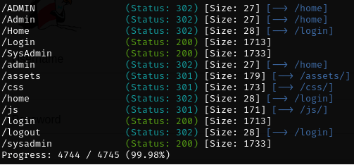

# _**Contexto**_
É uma prática comum usar aplicativos prontos para uso  
Isso pode ser qualquer coisa, desde servidores padrão como <mark>Apache</mark> até o uso de frameworks comuns como </mark>Django</mark> construído usando Python
Infelizmente, muitos componentes prontos para uso não são seguros  
Muitos usam credenciais padrão e até deixam páginas confidenciais abertas ao público, incluindo:
* **Painéis de administração**
* **Verificações de status do servidor**
* **Páginas de depuração**

Essas páginas contém informações e funcionalidades que pelo menos permitem que um invasor aprenda mais sobre um sistema  
Caminhos para arquivos sensíveis no servidor e informações de versão  
No máximo, essas páginas têm dados de usuários ativos e funcionalidades reais que não devem ser deixadas abertas; consulta e manipulação de dados de usuários e muito mais

# _**O que um invasor faria?**_
Alguns aplicativos da web facilitam para os invasores encontrarem essas páginas sensíveis  
A maneira mais comum é <mark>enumerar diretórios por força bruta</mark>  
Isso envolve enviar solicitações para diferentes páginas no servidor e usar a resposta do servidor para verificar a existência de uma página  
Como um invasor, eu usaria uma lista de páginas comuns que são conhecidas por serem expostas para acessar as páginas  

Por exemplo, eu sei que a página _/css_ existe porque o servidor responde com um código de status 200 que indica que o servidor recuperou a página com sucesso  
Suponha que eu tente acessar 2 páginas (/random-page e /server-status)  
Acessar a _/random-page_ retorna um código de status de resposta 404 (esse código de status significa que a página não foi encontrada)  

No entanto, acessar a página _/server-status_ retorna um código de status de resposta 200  
Acessar _/server-status_ retorna o mesmo código de status de uma página normal, então eu sei que ela está acessível  
Por outro lado, acessar _/random-page_ fornece um código de resposta diferente de acessar uma página normal, então sabemos que ela não existe  

Dependendo do aplicativo usado, um invasor pode facilmente encontrar informações confidenciais ao acessar o aplicativo
Exemplos incluem:
* Comentários e chaves de API no código-fonte
* Senha (Hashes) em solicitações e respostas
  
Para respostas, ter informações confidenciais como parte de solicitações **GET** é inseguro, pois essas solicitações geralmente são registradas para depuração. Isso significaria que qualquer pessoa com acesso aos logs tem informações sobre isso  
Para respostas, informações confidenciais geralmente são colocadas em cabeçalhos, cookies ou código-fonte  

# _**O que um invasor faria parte 2**_
Após verificar os locais mencionados acima, um invasor pode usar principalmente essas informações extras para enumerar o aplicativo  
Exemplos de enumeração incluem:
* Quebrando hashes de senha na resposta para acessar contas de usuários
* Usando chaves de API para acessar funções e chamadas de API sem autorização
* Encontre URLs ocultas e informações do sistema que eles podem usar para encontrar exploits públicos

# _**Execução**_
Utilizando a ferramenta <mark>Gobuster</mark>, vamos enumerar
> ```bash
> gobuster dir --url [ip_address] -w ../Web-Content/common.txt
> ```


Ao entrar no diretório <mark>SysAdmin</mark>, inspeciona-se o código da página e tem-se a seguinte mensagem:  
_Admin portal created by arctic digital design - check out our github repo_  
Realizando uma busca no google, obtém-se o link do github e logo na descrição, usuário e senha padrão!  
Ao tentar, um login com sucesso na página de _administrador_  
 
