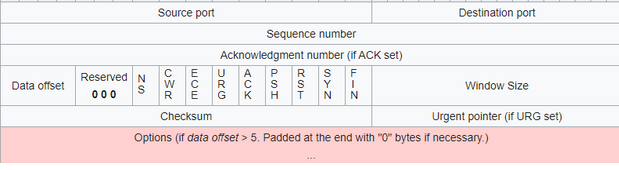
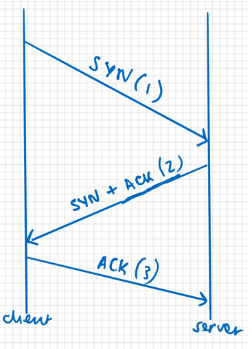

# _**Contexto de Enumeração de redes**_
Um computador passa por vários processos e mídias para se comunicar com outros computadores pela internet  
Isso pode ser resumido pelo modelo OSI  
Cada camada é modular e conectada à camada acima e abaixo dela, portanto, cada camada precisa ser segura

| Layers |
| ---------- |
| _Application_ |
| _Transport_ |
| _Network_ |
| _Data link_ |
| _Physical_ |

As camadas **Física** e de **Enlace de Dados** exploram como as informações são transferidas em redes físicas e entre elas  
Para garantir a padronização em todos os computadores, cada camada do modelo OSI utiliza protocolos  

A internet é composta por muitos computadores, e esses computadores precisam saber como se localizar  
Cada computador na internet recebe um número chamado endereço IP  
Este é um número de 32 bits no formato: X.X.X.X, onde  X é um número entre 0 e 255  

Quando os computadores se comunicam, eles o fazem enviando pacotes pela _Internet_  
Os pacotes podem ser considerados unidades autônomas que contêm informações enviadas por computadores  
A <mark>camada de rede</mark> usa o **Protocolo de Internet (IP)** para garantir que os pacotes cheguem ao destino correto  

Levar pacotes de um destino para outro é importante, mas temos muitas outras coisas em que pensar:
* **Confiabilidade** - como garantir que um pacote chegue ao seu destino de forma confiável?
* **Controle de Congestionamento/Controle de Fluxo** - Em caso de tráfego excessivo, como garantir que nenhum dado seja perdido ou misturado?
* **Conexão** - como monitorar os dados que entram e saem dos computadores?
* **Multiplexação** - aplicativos em computadores rodam em portas (as portas recebem números de 0 a 65535)

A <mark>camada de transporte</mark> é composta principalmente por dois protocolos e daremos uma breve olhada em ambos  

O **TCP** é um protocolo de transmissão confiável e _orientado à conexão_  
Ele possui as seguintes características:
* **Confiável** - ao transferir dados pela internet, os pacotes podem ser descartados devido à perda de conexão
* O TCP utiliza reconhecimento para garantir que os dados sejam retransmitidos mesmo em caso de queda
* **Orientado à Conexão** - dependendo dos dados enviados, a ordem é muito importante
* O TCP utiliza números sequenciais para monitorar a ordem em que os dados são enviados
* **Controle de Fluxo/Congestionamento** - O TCP utiliza mecanismos para garantir que não haja congestionamento durante a transmissão de dados
* Enviar dados em excesso ou em falta pode causar problemas de confiabilidade

Esta é a aparência de um pacote TCP. Ele contém os seguintes dados:  



+ <mark>1ª linha:</mark> portas de origem/destino (16 bits) - número da porta para enviar/receber dados
+ <mark>2ª linha:</mark> Número de sequência (32 bits) - para rastrear a ordem dos dados
+ <mark>3ª linha:</mark> Número de confirmação (32 bits) - para rastrear quais dados foram recebidos
+ <mark>4ª linha:</mark>
  * _**Data offset**_: Especifica o tamanho do cabeçalho para que o computador saiba em qual posição iniciar a leitura para obter os dados
  * _**Flags**_: podem ser considerados opções de como o protocolo funciona:
    * **ACK** - indica que o pacote contém uma confirmação
    * **RST** - reinicia a conexão
    * **SYN** - inicia uma conexão
    * **FIN** - encerra uma conexão
+ <mark>5ª linha:</mark> Checksum - um valor que é verificado pelo receptor para garantir que o cabeçalho não esteja corrompido
+ <mark>6ª linha:</mark> Dados enviados pelo aplicativo

Quando um computador deseja enviar dados via TCP, ele precisa iniciar uma conexão  
Ele faz isso usando o que é chamado de <mark>triple-way handshake</mark>  



[1] A conexão inicial (cliente) envia primeiro um pacote SYN com um número de pacote inicial  
[2] O destinatário (servidor) envia um pacote com os sinalizadores SYN e ACK definidos, onde o número de confirmação deste pacote é o número de sequência do pacote enviado pelo cliente  
[3] O cliente recebe este pacote e envia um novo pacote com o sinalizador ACK definido e o número de confirmação definido como o número de sequência inicial enviado pelo servidor  
Após o terceiro pacote, o cliente e o servidor começam a transferir dados  

O **UDP** é um protocolo _sem conexão_ e _sem estado_  
Ao contrário do TCP, ele não se concentra na confiabilidade nem na criação de uma conexão  
Isso é útil em cenários onde a perda de dados é tolerada, como em streaming de vídeo e áudio  

Este é o formato de um pacote UDP:
+ <mark>A primeira linha</mark> contém um endereço de origem para indicar a origem
+ <mark>A segunda linha</mark> contém um endereço de destino para indicar o destino 
+ <mark>A terceira linha:</mark>
  * O comprimento contém o comprimento do cabeçalho UDP e dos dados
+ <mark>A quarta linha</mark> contém portas de origem e destino
+ <mark>A quinta linha</mark> contém:
  * Comprimento dos dados
  * Soma de verificação usada para verificar erros
+ <mark>A 6ª linha</mark> contém os dados transmitidos

Assim que os dados chegam ao computador, eles precisam ser processados ​​por ele  
Sabemos que os computadores executam diferentes serviços  
Os computadores processam esses dados de forma diferente, dependendo do que estão fazendo  
Para padronizar isso, os computadores também usam protocolos na <mark>camada de aplicação</mark>  
Protocolos diferentes são executados em números de porta diferentes, e serviços diferentes tendem a ter números de porta padrão  

***

**Escaneamento TCP**  
O cenário de ataque mais comum é quando um invasor recebe o(s) endereço(s) IP de uma(s) máquina(s)  
Um invasor precisaria enumerar a máquina para entender quais serviços estão em execução e explorá-los  
Ele faz isso <makr>escaneando as portas da máquina que está enumerando</mark>  
A ferramenta mais comum usada para realizar escaneamentos é o **nmap**  

***

**Ping scan**  
Ao receber um endereço IP, você precisa verificar se a máquina está realmente ativa  
Para isso, você pode usar o que é conhecido como **ping scan**  
Um ping scan usa ICMP mais especificamente, uma solicitação de _echo ICMP_ para verificar se uma máquina está ativa  
Se a máquina estiver ativa, ela responderá com uma resposta de _echo ICMP_  

# _**Parte 2: Execução**_
Com o comando abaixo, é possível obter todas as informações necessárias para completar o desafio
> ```bash
> nmap -sT -p 0-1024 -A -T5 -oA [file_name].nmap [ip_address]
> ```

Existe um diretório com um arquivo necessário para finalizar: [ip_address]:999
<mark>interesting.file</makr>
