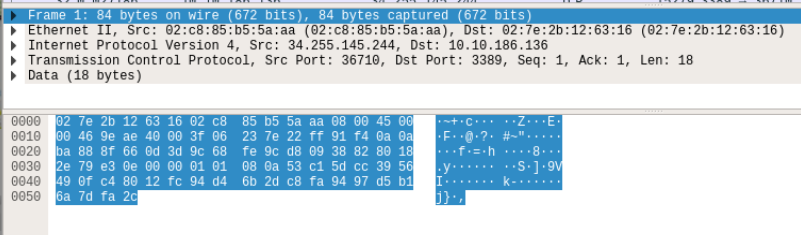
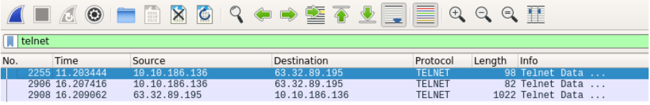
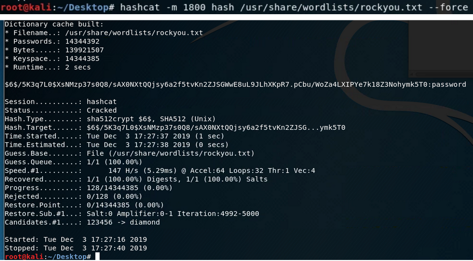

# Parte 1: Contexto
Dadas as permissões corretas, qualquer um pode carregar um programa como o <mark>Wireshark</mark> e começar a capturar o tráfego de rede  
Sem entrar em detalhes de baixo nível sobre como um quadro é formado, você pode facilmente filtrar por um arquivo de captura de rede e visualizar quais dados seu computador tem enviado e recebido  
Você pode 'farejar' seu próprio tráfego de rede e ver seus próprios dados enviados e recebidos, ou pode 'farejar' o tráfego em um _switch_ ou _hub_ e revelar o que todos estão olhando  

Sem que os dados do pacote sejam criptografados, você pode ver todas as solicitações e respostas da rede, junto com seus dados  
Você pode ver quais sites as pessoas têm visitado, informações pessoais dos usuários  
Qualquer coisa...  
Desde que os dados não estejam criptografados, é claro
Protocolos como _telnet_ e _http_ irão transferir dados em texto simples, o que significa que você pode extrair dados legíveis por humanos deles

<mark>Wireshark</mark>, uma ferramenta de análise de pacotes gratuita e de código aberto para revisar um arquivo _.pcap_  
Para abrir um arquivo _.pcap_, no Wireshark clique em <mark>Arquivo -> abrir</mark>  
Isso carregará a captura de rede, à primeira vista você verá as seguintes colunas: 
* **No** - Este é o número do pacote 
* **Time** - Este é o horário em que o pacote foi capturado quando o "sniffing" ocorreu. 
* **Source** - O endereço IP do dispositivo de origem 
* **Destination** - O endereço IP do dispositivo de destino 
* **Protocol** - O protocolo do pacote 
* **Lenght** - O comprimento do quadro 
* **Info** - Informações comuns

Ao selecionar um pacote, você verá o seguinte:  



Cada seção suspensa aqui é uma camada no modelo OSI
Por exemplo, temos o quadro inteiro, depois Ethernet (Data Link Layer - Layer 2), Internet Protocol Version 4 (Network Layer - Layer 3), Transmission Control Protocol (TCP - Transport Layer - Layer 4) e os dados contidos no pacote  

Podemos aplicar filtros ao Wireshark para procurar pacotes específicos  
Podemos filtrar por tamanho do pacote, protocolo, IP de origem ou destino e mais  
Vamos tentar procurar pela porta telnet para ver se há algum pacote de protocolo telnet  
No campo de filtro, digite ‘telnet’  



Você deve ver 3 pacotes  
Se você olhar na visualização de dados do pacote, você deve ver dados de texto simples!  
No nosso caso, parece que seus comandos Linux estão sendo enviados da fonte 10.10.186.136 para 63.32.89.195  

Para seguir o fluxo completo de dados, quando as duas máquinas estiverem se comunicando, clique com o botão direito no primeiro pacote mostrado, depois clique em seguir, depois clique em _TCP Stream_  
Agora você deve conseguir ver todos os comandos enviados para a máquina remota (mostrados em vermelho) e a resposta daquele servidor (mostrados em azul)!  

Em um sistema Linux, o arquivo <mark>shadow</mark> contém todos os detalhes da conta do usuário  
Ele é dividido no seguinte formato: _username:$hash_algorithm$hash_salt$hash_data:other_data._

Neste desafio, estamos realmente interessados ​​apenas na senha com hash dos usuários  
Podemos tentar a ferramenta <mark>Crack The Hash</mark> pegando uma lista de palavras, usando um algoritmo de hash e fazendo hash de cada palavra da lista, comparando-a com a original
Se for o mesmo hash, temos a palavra que foi originalmente hashada, se for diferente, podemos passar para a próxima palavra para comparar  

Digamos que temos os seguintes dados:
testuser:$6$/5K3q7L0$XsNMzp37s0Q8/sAX0NXtQQjsy6a2f5tvKn2ZJSGWwE8uL9JLhXKpR7.pCbu/WoZa4LXIPYe7k18Z3Nohymk5T0:18233:0:99999:7:::  
Temos:
* testuser sendo o nome de usuário
* do primeiro (:) até o segundo (:), todas as informações de hash
* o restante das informações de hash

Usando os primeiros $6, podemos procurar que tipo de algoritmo hash foi usado  
Para procurar, confira [nesta página](https://hashcat.net/wiki/doku.php?id=example_hashes) e veja o Hash-mode  
Podemos procurar por $6 e ver que o hash-mode para Hashcat é 1800 e o tipo está usando sha512crypt  

O <mark>Hashcat</mark> é uma ferramenta de quebra de senhas muito popular  
Agora precisamos de uma lista de palavras para fazer o hash e comparar com o original, para isso usaremos uma lista de senhas chamada _rockyou.txt_  

Primeiro, vamos salvar as Informações de Hash em um arquivo  
Agora vamos quebrar esse hash  
Temos nosso modo de hash (1800), nossos dados de hash em um arquivo e uma lista de palavras

Execute o seguinte comando:
> ```bash
> hashcat -m 1800 [hash_file] [password_list]
> ```


Você deve eventualmente obter a seguinte saída acima  
Podemos ver o hash e depois do : vemos que diz _password_
Para o <mark>testuser</mark>, a senha era: _Password_

# _**Execução**_
Abrindo o pacote e filtrando por Telnet, obtém-se o endereço IP desejado: <mark>63.32.89.195</mark>
Clicando em _**follow TCP Stream**_, observa-se um comando com o item ps4  

A hash abaixo é da senha de usuário de _Buddy_
> $6$3GvJsNPG$ZrSFprHS13divBhlaKg1rYrYLJ7m1xsYRKxlLh0A1sUc/6SUd7UvekBOtSnSyBwk3vCDqBhrgxQpkds

Utilizando a aplicação Hashcat e o comando abaixo, descobre-se a senha como: _rainbow_
> ```bash
> hashcat -a 0 -m 1800 [hash_file] [wordlist]
> ```
