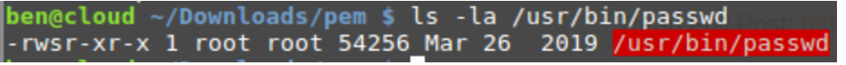
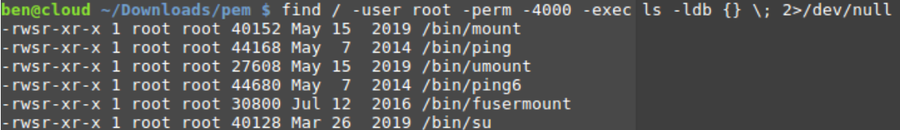

# _**Contexto de Escalação de Privilégios**_
Os sistemas de computador são projetados para serem usados ​​por múltiplos usuários, e privilégios significam o que um usuário tem permissão para fazer. Privilégios comuns incluem visualizar e editar arquivos ou modificar arquivos do sistema  

<mark>O escalonamento de privilégios</mark> é o ato de explorar um _bug, falha de projeto ou descuido de configuração em um sistema operacional ou aplicativo de software_ para obter acesso privilegiado a recursos que normalmente são protegidos de um aplicativo ou usuário 

***

**SOBRE O SUID**  

Definir o **ID** de usuário do proprietário na execução é um tipo especial de permissão de arquivo concedida a um arquivo  
Quando um usuário executa um programa, desde que tenha os direitos corretos de _leitura/execução_, ele será executado usando os privilégios da sua conta  
O **SUID** permite que um usuário execute um programa usando os privilégios de outro usuário  

Em alguns casos, podemos aproveitar a vantagem de ter um arquivo executado como outro usuário para executar comandos como ele  
Você pode estar se perguntando: por que permitir que alguém execute um arquivo como outro usuário?  
No entanto, precisamos que certos binários sejam executados como _root_ por um usuário sem privilégios  

Se um binário tiver o bit **SUID definido**, aparecerá um _s_  
Se verificarmos as permissões de arquivo do binário ```passwd```, podemos ver que as permissões são <mark>-rwsr-xr-x</mark>  

  

O <mark>bit SUID</mark> é definido na permissão de execução, o que significa que quando um usuário executa este comando, ele será executado como o proprietário do arquivo (que é root)  
Essencialmente, os arquivos SUID são executados com a permissão do proprietário do arquivo  

***

**ABUSANDO DE PERMISSÕES SUID**  

Alguns administradores definem o bit SUID manualmente para permitir que determinados programas sejam executados como eles  
Digamos que você seja um administrador de sistema e um usuário sem privilégios queira executar um programa que exija privilégios mais altos  
Ele pode definir o bit SUID para que o usuário sem privilégios possa executar o programa sem precisar definir nenhuma permissão de conta adicional  
Podemos varrer todo o sistema de arquivos para encontrar todos os arquivos com o bit SUID definido, com o seguinte código:
> ```bash
> find / -user root -perm -4000 -exec ls -ldb {} \;
> ```

O comando _find_ possui um parâmetro onde pode executar comandos  
Assim, ao encontrar um arquivo, ele **listará suas permissões**  

A saída revelará algo semelhante a isto:  

  

Podemos ver alguns binários executados como _root_, que são programas legítimos com as permissões corretas definidas para executar uma tarefa corretamente  
Se um administrador de sistema tiver definido manualmente um <mark>bit SUID em um binário</mark>, o código acima o encontrará  
Talvez haja um arquivo personalizado criado por outro usuário que executa como root?  
Você pode usar este programa para _aumentar seus privilégios_ ou executar comandos que normalmente não conseguiria  

# _**Parte 2: Execução**_
Primeiramente, executamos uma varredura para descobrir em qual porta o SSH está configurado
> ```bash
> nmap -p- -T5 [ip_address]
> ```

Após algum tempo, temos o retorno  
Na porta 65534, SSH está funcionando  
Como já temos o usuário e senha para conexão, basta digitar o comando e colocar a senha  
> ```bash
> ssh -p 65534 holly@[ip_address]
> ```

Com o login feito, primeiro, vemos em qual diretório estamos e listamos seu conteúdo  
Em seguida, vamos ao que interessa, _/home/igor/flag1.txt_  

Ao tentar ler este arquivo, temos permissão negada, porém, com as dicas anteriores, podemos executar os comandos abaixo para retornar o conteúdo do arquivo
> ```bash
> touch password
> ```
> ```bash
> find password -exec cat /home/igor/flag1.txt \;
> ```
Achamos a primeira flag  
Para a segunda flag, temos que ler o conteúdo do arquivo _/root/flag2.txt_, mas para isso, precisamos de acesso _root_  
Vasculhando os arquivos com o comando abaixo, temos que _/usr/bin/system-control_ tem permissões de SUID e execução  
> ```bash
> find / -user root -perm -4000 -exec ls -ldb {} \;
> ```

Executando o arquivo e digitando _/bin/bash_, conseguimos acesso _root_  
Basta um ```cat /root/flag2.txt``` para descobrir a segunda flag  
