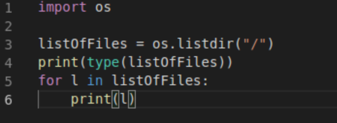
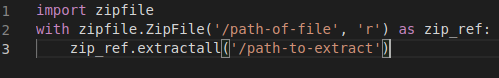
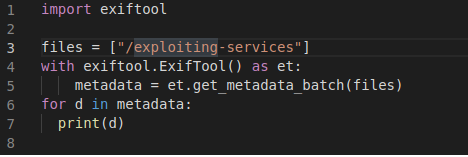

# _**Contexto de _scripts com Python**_
**Biblioteca SO**
A biblioteca do SO oferece diferentes funcionalidades que interagem com um sistema operacional  
Exemplos incluem a visualização de permissões de arquivo, a interação com processos e diversas outras funções do sistema operacional  

Para começar a usar uma biblioteca, precisamos importá-la como na linha 1  
A linha 3 mostra a função _listdir_ recebendo o caminho como parâmetro  
A linha 4 imprime a saída da variável e a linha 5 é um _loop_ que itera pela variável e imprime os valores nela contidos  

  

***

De vez em quando, encontraremos arquivos compactados  
Um formato de arquivo compactado comum é o ".zip"  
Gostaríamos de extrair esses arquivos para uso futuro  
Podemos fazer isso usando a biblioteca0 _zipfile_  



No exemplo acima, a biblioteca _zipfile_ recebe o arquivo fornecido pelo caminho em modo de leitura e cria um objeto _zipfile_ com ele, referenciando-o como a variável zip_ref  
Na linha 3, ela referencia a variável para extrair o conteúdo do arquivo zip  
A diretiva with é útil porque é usada para manipular arquivos  
Todas as ações dentro da diretiva são realizadas enquanto o arquivo está aberto, o que significa que um programador não precisa fechar explicitamente o arquivo após realizar a manipulação  
O trecho de código acima pega um arquivo zip em um caminho específico e extrai o conteúdo do arquivo para um diretório específico  

***

**Exiftool**
Exiftool é uma ferramenta de linha de comando que extrai metadados de arquivos  
Os metadados geralmente fornecem um acervo de informações, como o proprietário do arquivo, o software usado para criá-lo e muito mais  
Esses dados são usados ​​como parte da etapa de enumeração ao realizar ataques  
Por exemplo, se um usuário encontrar o nome e a versão de um software específico usado para criar um arquivo, ele poderá encontrar exploits contra esses softwares específicos  



***

**Lendo arquivos**
A maneira mais comum de ler um arquivo é usando a mesma diretiva with da instrução open  
Queremos abrir o arquivo _example.txt_ em modo de leitura  
Após abri-lo, lemos todas as linhas do arquivo até o final e armazenamos cada linha em uma lista  

# _**Execução**_
Buscando na Internet pelo código, acha-se o seguinte
> ```bash
> #!/usr/bin/env python3
> import os
> import shutil
> import zipfile
> import exiftool
> import mmap
> 
> def unzip(f, loc):
>     with zipfile.ZipFile(f, 'r') as zip_ref:
>         zip_ref.extractall(loc)
> 
> # Number of files with metadata vertion 1.1
> v11 = 0
> # number of files
> nfiles = 0
> 
> # Create directories
> zipdir = 'zip'
> filesdir = 'files'
> shutil.rmtree(zipdir); os.mkdir(zipdir)
> shutil.rmtree(filesdir); os.mkdir(filesdir)
> 
> # First unzip main archive (final-final-compressed.zip) in the "zip/"" directory
> unzip('final-final-compressed.zip', zipdir)
> 
> # For each zip in the "zip/"" directory, extract zip archive in "files/""
> files = [f for f in os.listdir(zipdir) if os.path.isfile(os.path.join(zipdir, f))]
> for file in files:
>     # uncompress
>     unzip(os.path.join(zipdir, file), filesdir)
> 
> # Process files in the "files/" directory
> files = [f for f in os.listdir(filesdir) if os.path.isfile(os.path.join(filesdir, f))]
> for file in files:
>     nfiles += 1
>     
>     # Checking if file contains "pasword"
>     with open(os.path.join(filesdir, file), 'rb', 0) as f, \
>         mmap.mmap(f.fileno(), 0, access=mmap.ACCESS_READ) as s:
>         if s.find(b'password') != -1:
>             fpass = file
> 
>     # Exif info
>     try:
>         with exiftool.ExifTool() as et:
>             metadata = et.get_metadata(os.path.join(filesdir, file))
>         if metadata['XMP:Version']:
>             if repr(metadata['XMP:Version']) == '1.1':
>                 v11 += 1
>     except:
>         pass
> 
> # Clean up
> shutil.rmtree(zipdir)
> shutil.rmtree(filesdir)
> 
> print("Unzipped files: %d" % nfiles)
> print("Files with metadata version 1.1: %d" % v11)
> print("File containing the password: %s" % fpass)
> ```

Basta realizar o download do arquivo .zip, executar o código e obter o que se deseja
* 50 arquivos
* 3 arquivos 1.1
* dL6w.txt
