# _**Cyborg CTF**_
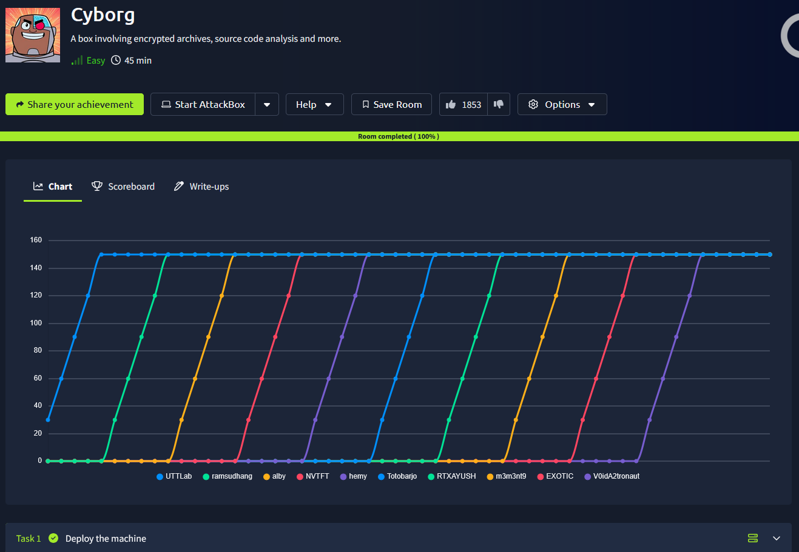

## _**Enumeração**_
Primeiro, vamos começar com um scan <mark>Nmap</mark>
> ```bash
> nmap -p 0-9999 -A -T5 [ip_address]
> ```
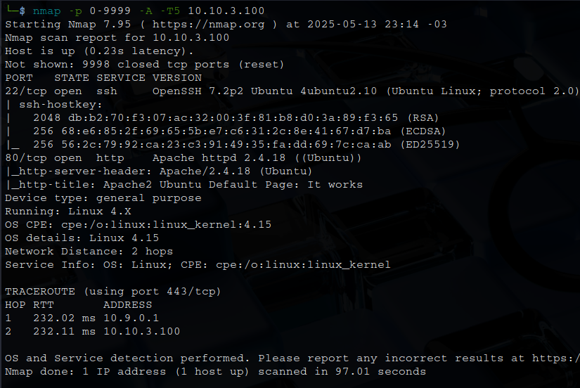

Vamos também realizar um scan com <mark>Gobuster</mark>
> ```bash
> gobuster dir --url [ip_address] -w ../Discovery/Web-Content/common.txt
> ```
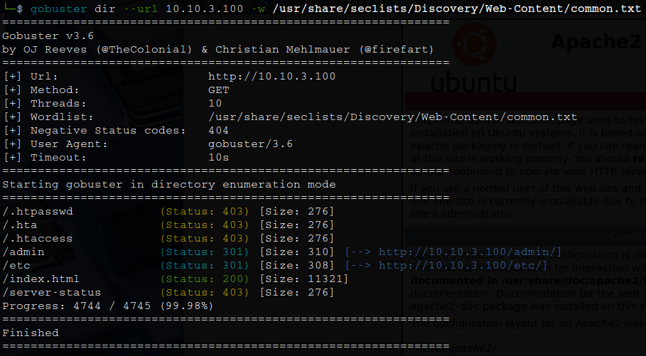

Vamos investigar os diretórios descobertos  
Primeiro, vamos começar com <mark>/etc</mark>  

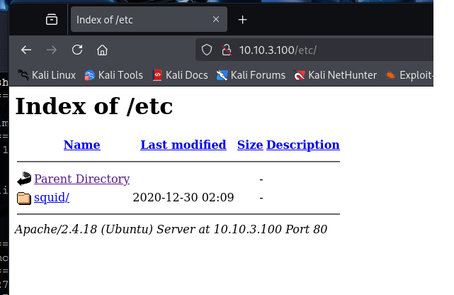

Parece que temos outro diretório, vamos ver até onde isso nos levará  
Temos dois arquivos que parecem ser de bom uso. Vamos realizar o download com ```wget```
Vamos investigar o arquivo <mark>passwd</mark>  
Temos o seguinte trecho: _music_archive:$apr1$BpZ.Q.1m$F0qqPwHSOG50URuOVQTTn._  

Isto é uma entrada de senha no formato Apache MD5 usado com o basic_ncsa_auth no Squid
* nome de usuário: _**music_archive**_
* hash MD5 Apache: _**$apr1$BpZ.Q.1m$F0qqPwHSOG50URuOVQTTn.**_

Vamos continuar nossa investigação  
Agora, indo até o diretório <mark>/admin</mark>  
Explorando um pouco a página, conseguimos realizar o download de um arquivo _.tar_ cliando em _download_  

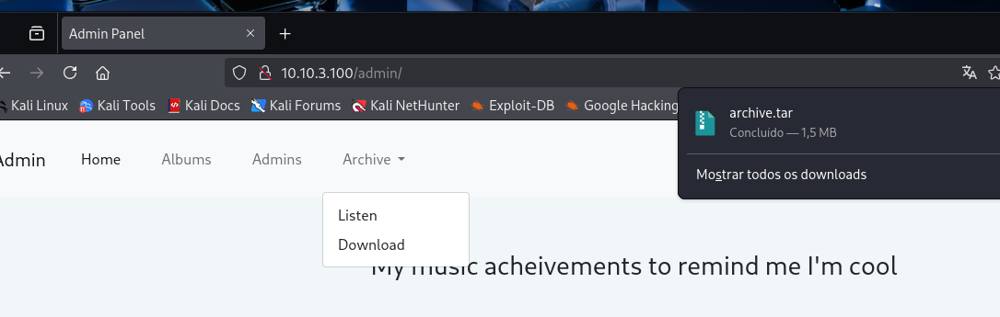

Verificando seu conteúdo (não extraindo), temos o seguinte:  

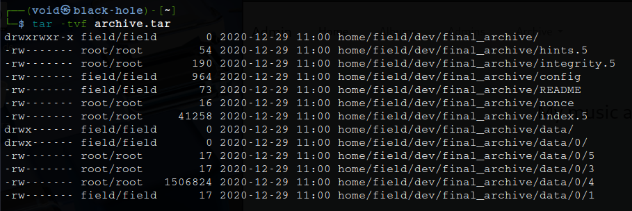

Agora, vamos extrair com ```tar -xvf archive.tar```  
Navegando até o novo diretório, temos os diversos arquivos  
Vamos verificar <mark>config</mark>  

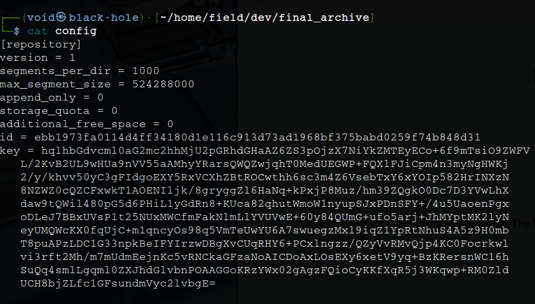

Nada de útil podemos ter daqui ou dos outros arquivos, por enquanto  
Vamos voltar para a página e ir procurar algumas pistas  

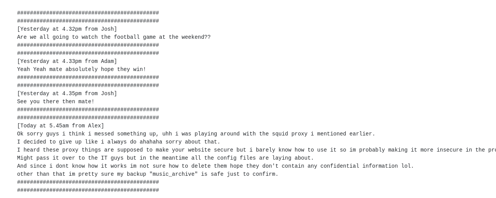

Encontramos a seguinte mensagem em <mark>/admin/admin.html</mark>
O administrador estava tentando configurar _**Squid Proxy**_  
Os arquivos de configuração ainda estão expostos  
Cita um backup chamado music_archive, afirmando que "acha que está seguro"  

Um Squid exposto ou mal configurado pode acarretar em problemas de seguranças como:
* Pode permitir uso como proxy aberto, bypass de rede, ou até proxy para ataques
* Possível autenticação básica mal protegida
* Diretórios como /etc/squid/ ou pastas web podem estar expostos

A porta para o _proxy_ squid está fechada

O que podemos tentar é o seguinte
Primeiro, vamos usar John para tentar quebrar a _hash_ encontrada previamente
> ```bash
> john --format=md5crypt --wordlist=/usr/share/wordlists/rockyou.txt passwd
> ```
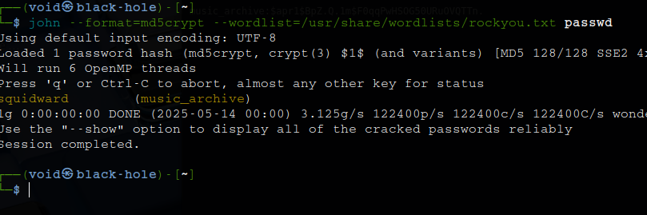

Agora, vamos instalar <mark>Borgbackup</mark> e tentar algum sentido no arquivo _.tar_ encontrado e extaído  
Utilizando o comando ```borg list /path/to/archive```, temos o seguinte resultado  

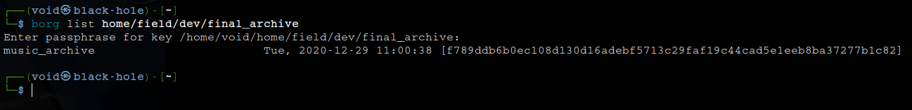

A senha estava correta!
Vamos extrair os arquivos  
Primeiro, navegamos até o diretório que está o backup  
Em seguida, executamos o seguinte comando: ```borg extract /home/void/home/field/dev/final_archive::music_archive```  

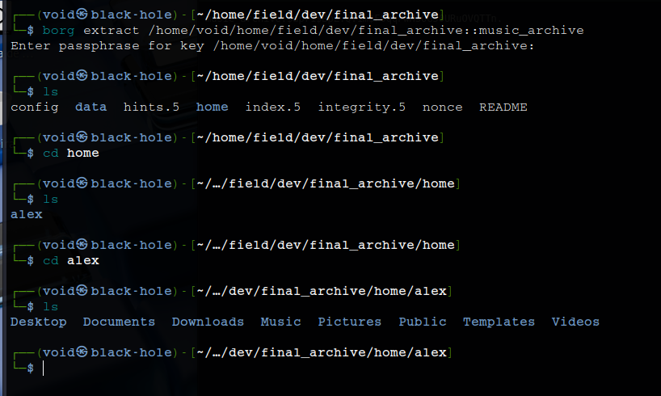

## _**Ganhando acesso**_
Vamos investigar este enorme diretório que acabamos de extrair
Primeiro, em _**Desktop**_  
Apenas uma mensagem  
Agora em _**Documents**_  

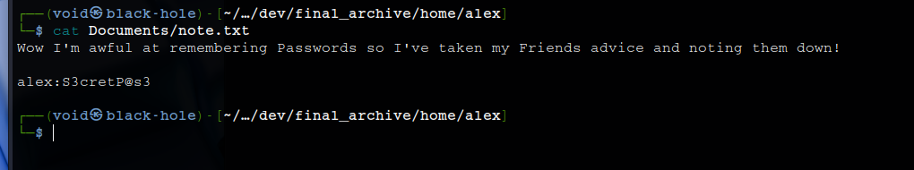

Parece que temos usuário e senha para login SSH  
Vamos utilizá-la  

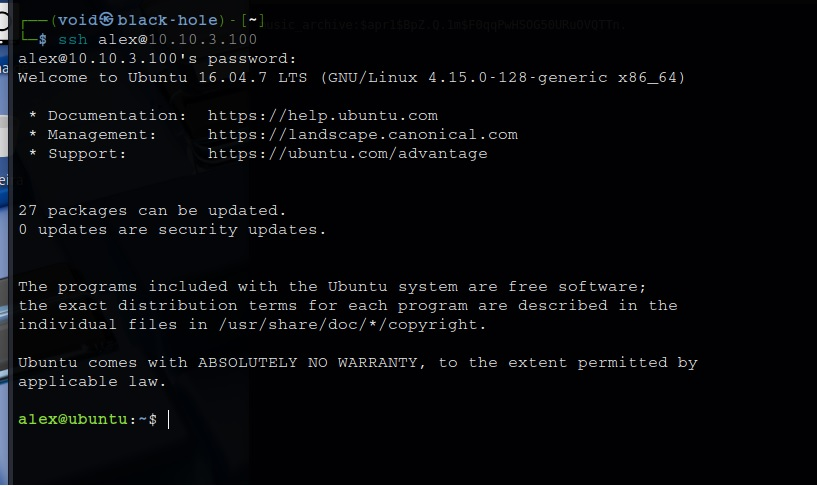

Obtemos nossa primeira flag após verificar os arquivos e utilizar ```cat``` para pegar

## _**Escalando privilégios**_
Agora, vamos tentar escalar privilégios neste sistema
Primeiro, vamos tentar alguns comandos conhecidos, como ```sudo -l```  

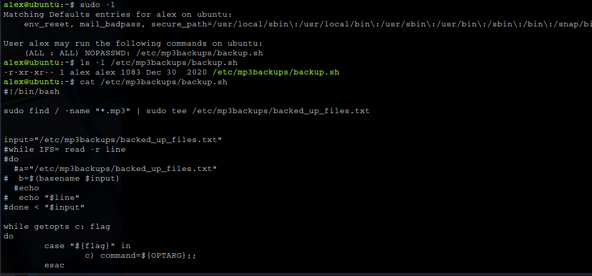

Após a leitura do que o script realiza, foi observado os seguintes pontos:
* O script é executado com privilégios de superusuário, o que significa que o comando find pode acessar arquivos em todo o sistema
* A execução do comando tar pode resultar na cópia de arquivos sensíveis para o diretório de destino /etc/mp3backups/
* O script permite que um comando arbitrário seja passado e executado através da opção -c
* O script está configurado para fazer backup apenas de arquivos específicos de /home/alex/Music/

Como o script permite a execução de comandos arbitrários com privilégios de superusuário, poderiamos tentar passar um comando malicioso usando a opção -c
> ```bash
> sudo /etc/mp3backups/backup.sh -c "id"
> ```

Temos a execução do script e o retorno de nossa ID  
Vamos tentar agora com _**/bin/bash -i**_ para tentarmos obter _root_  

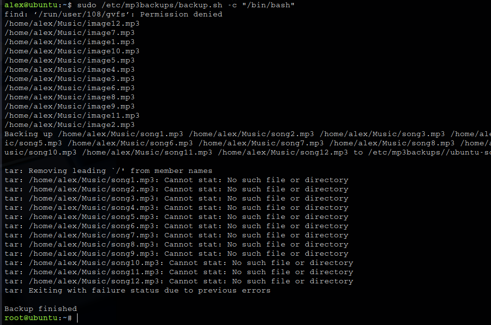

Apesar de ter executado, não estavamos conseguindo nenhum comando após  
Vamos tentar _**cat /root/root.txt**_  

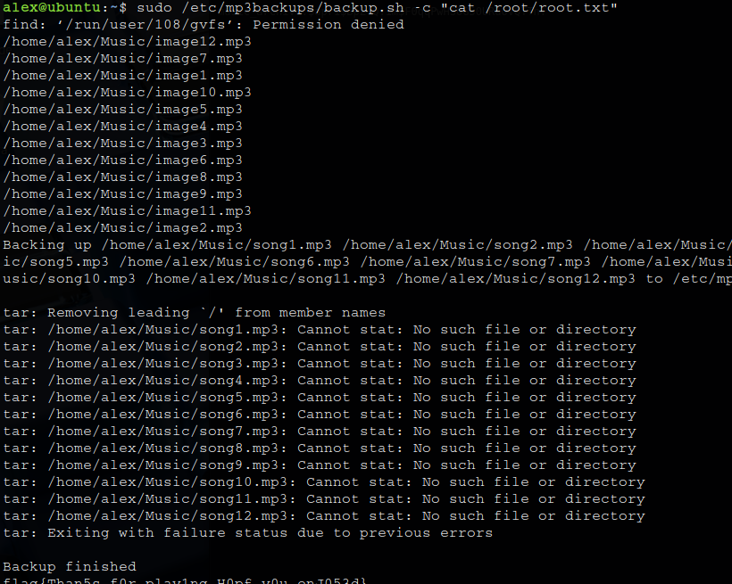

Conseguimos!!!
