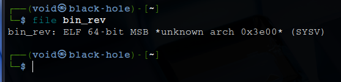
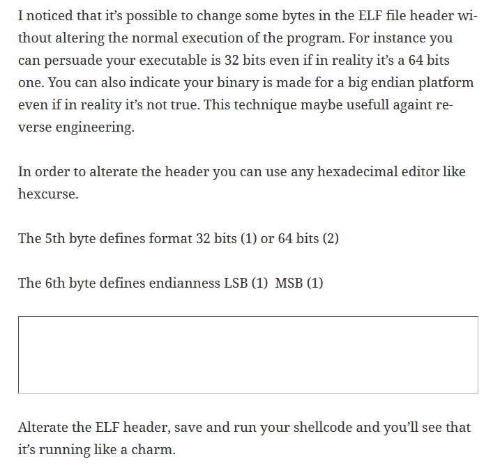

# _**0x41haz CTF**_

Primeiro, realizamos o downloa do arquivo  
Segundo, investigamos ele  
Parece ser um binário que requer uma senha para obtermos a flag  
Sabemos que é um arquivo do tipo **ELF**  
ELF: _Executable Linkable Format_ é um formato comum para executáveis Linux  
Outras informações:  

Utilizando <mark>file</mark>, encontramos um tipo de erro  

Vamos procurar no google sobre este erro  
Encontramos a seguinte informação  

Alteramos os seguintes bits
* 05 para: 01
* 06 para: 01
* 07 para: 01

