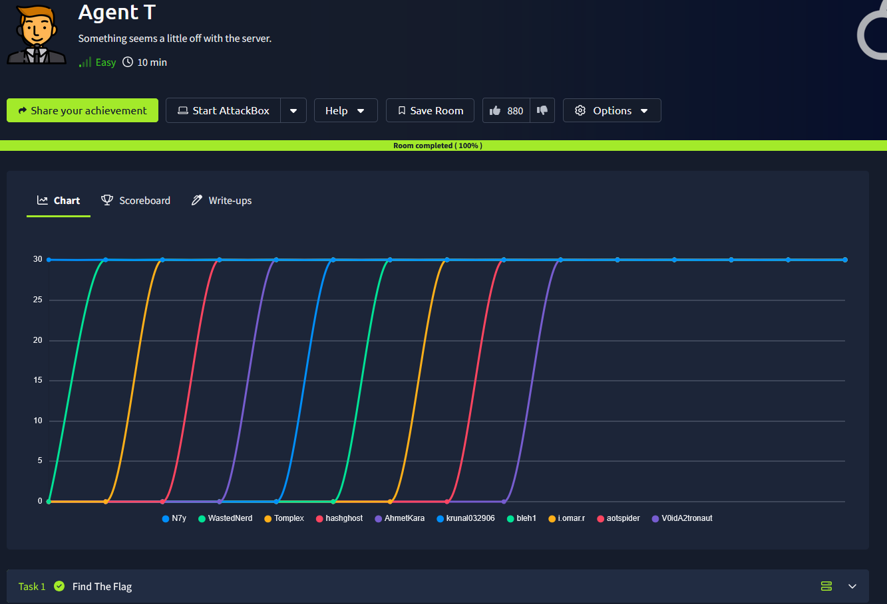
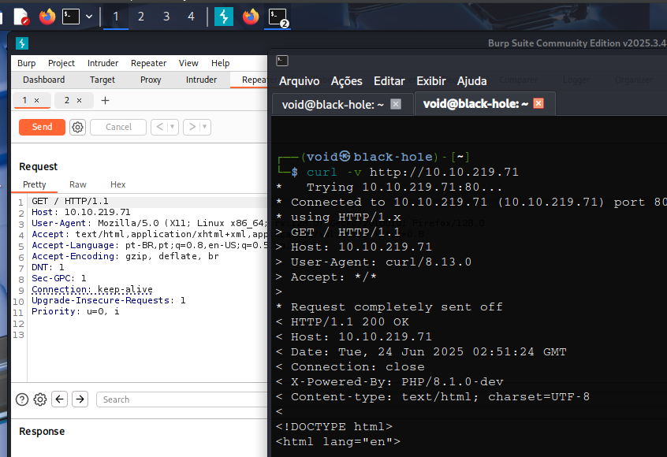
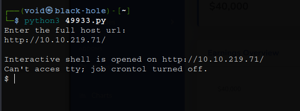

# _**Agent T CTF**_


## _**Enumeração**_
Primeiro, sabemos que temos uma página web  
Segundo, vamos seguir a dica da sala  
_Look closely at the HTTP headers when you request the first page..._  
Vamos utilizar a ferramenta <mark>Burpsuite</mark> para ver a primeira requisição  
E também vamos utilizar o comando ```curl -v [ip_address]```  



Parece que temos mais informações com ```curl```, incluindo a versão **PHP** utilizada  
Como já temos acesso a página de _admin_, procuramos por maneiras de explorar  
Encontramos algo em [exploit-db](https://www.exploit-db.com/exploits/49933)  
Realizamos o _download_ do arquivo e executamos fornecendo os parâmetros necessários  



E temos _shell_  
Vamos atrás da flag!
