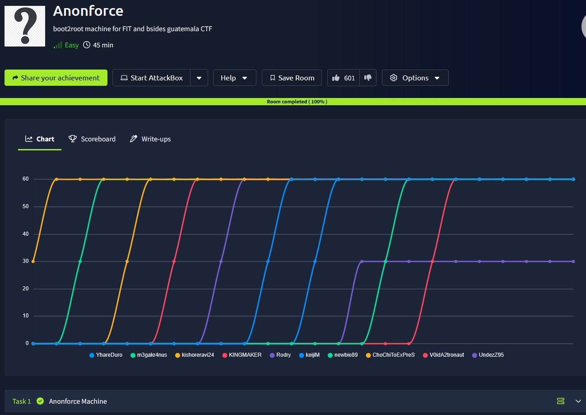
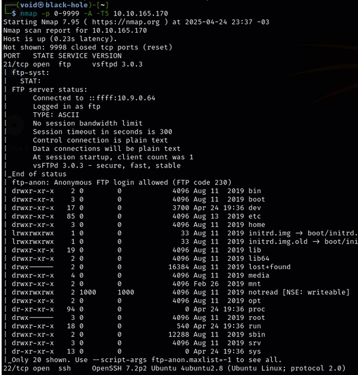
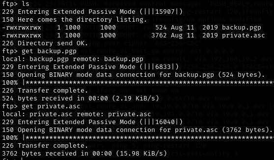
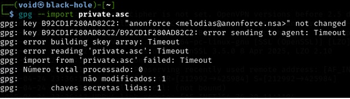
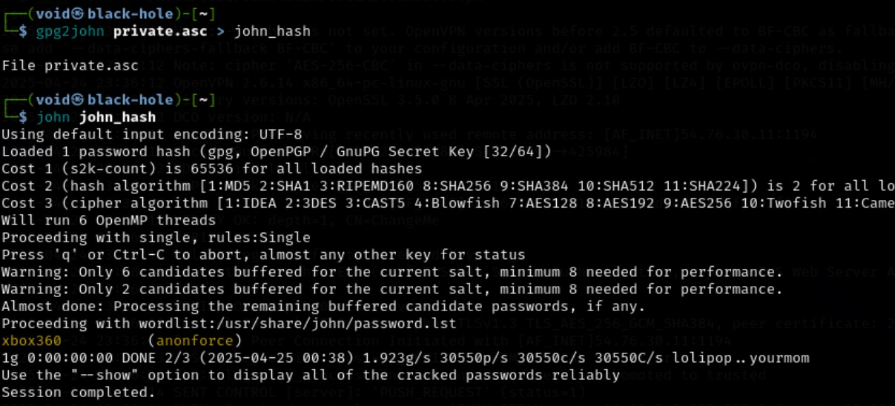
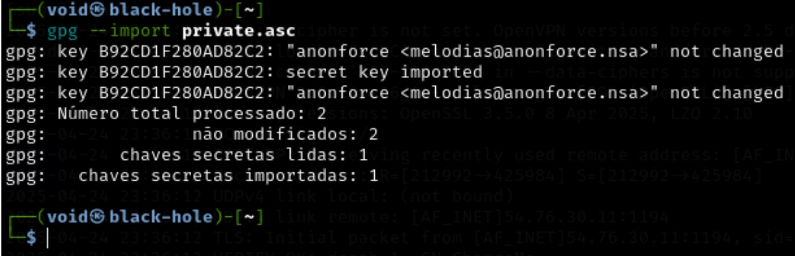
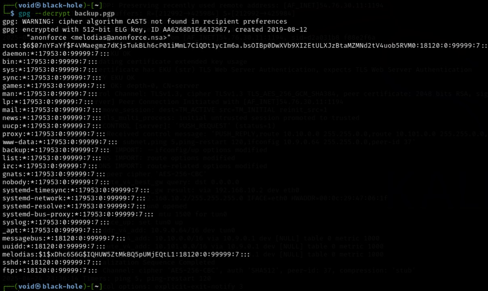
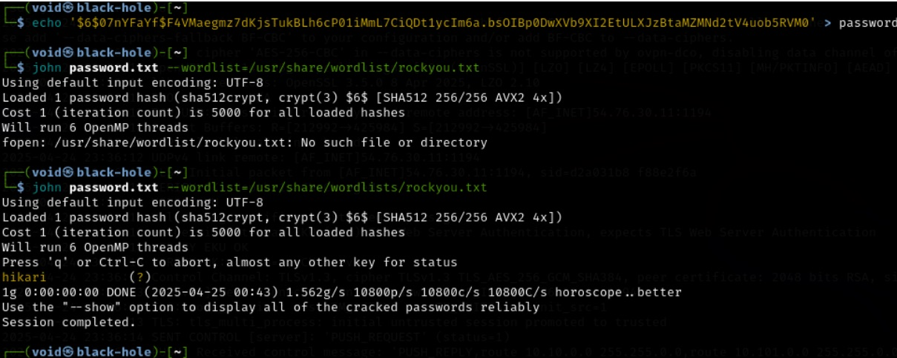
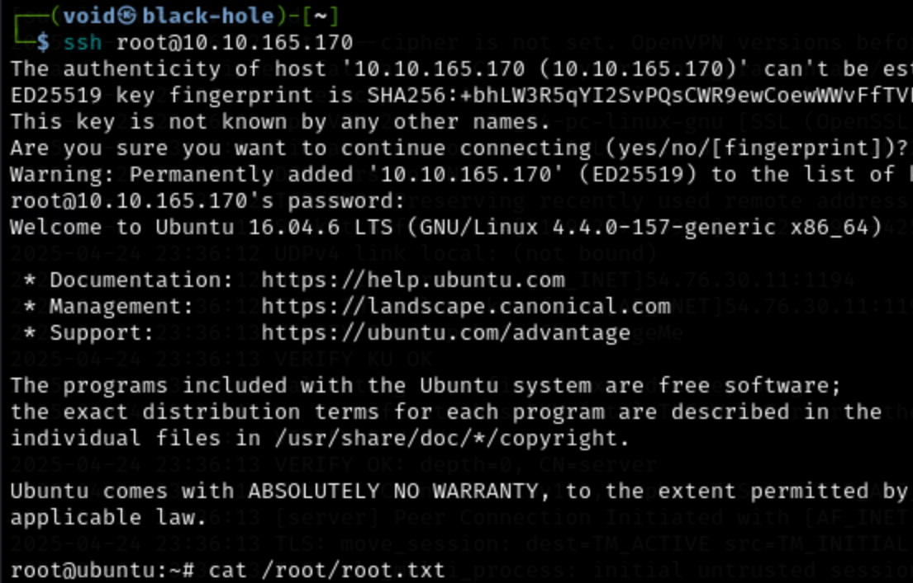

# _**Anonforce CTF**_


## _**Enumeração**_
Primeiro, vamos começar com um scan Nmap
> ```bash
> nmap -p 0-9999 -A -T5 [ip_address]
> ```


## _**Ganhando acesso**_
Parece que não teremos um web-server  
Vamos realizar login anonimamente no serviço _**ftp**_  
Realizando login com sucesso, buscamos a primeira flag em <mark>/home</mark> e no usuário correspondente  
Realizamos download com ```get [file_name]``` para nosso computador e com um simples ```cat``` obtém-se a primeira flag!  
Vamos para a segunda flag  

## _**Escalando privilégios**_
Após quase 1 hora vasculhando arquivos e quebrando a cabeça em como escalar privilégios, encontramos dois arquivos que parecem promissores  
* Backup.gpg
* Private.asc  



Usando ```get``` para obter eles
Vamos tentar importar o arquivo <mark>private.asc</mark> para a nossa GPG  



Não funcionou  
Outra maneira que podemos tentar é na força bruta com o <mark>John the Ripper</mark>  



Agora, podemos importar a chave GPG para a nossa  



Descriptografando com o comando ```gpg --decrypt backup.pgp```, temos:  



O backup do arquivo <mark>**/etc/shadow</mark>  
Podemos utilizar ele para conseguir acesso root e escalar nosso privilégio  
Vemos que a criptografia usada para _root_ é a _hash_ <mark>sha512crypt</mark>  
Vamos usar novamente o <mark>John</mark> para quebrar essa hash com _**rockyou.txt**_   



Temos a senha _**root!**_
<mark>Vamos realizar login via ssh e obter a última flag</mark>  


