# _**Anthem CTF**_ 
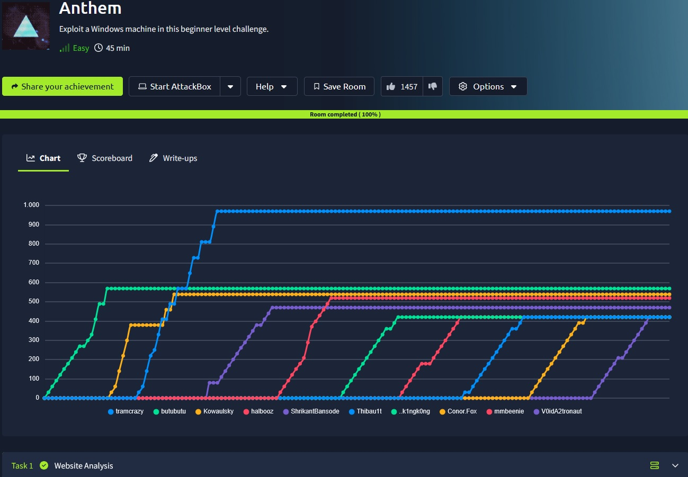

## _**Enumeração**_
Primeiro, vamos fazer um scan com o <mark>Nmap</mark>
> ```bash
> nmap -p 0-10000 -A -T5 [ip_address]
> ```
Resposta: _Host seems down. If it is really up, but blocking our ping probes, try -Pn_  
Tentamos novamente
> ```bash
> nmap -p 0-10000 -A -T5 -Pn [ip_address]
> ```
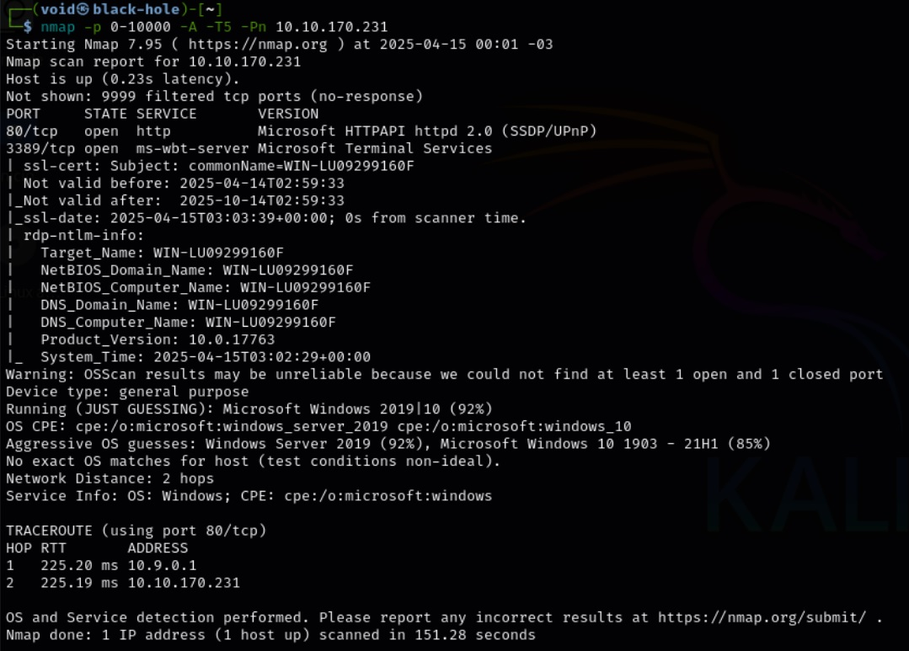

Agora com este retorno, podemos começar a verificar algumas coisas  
<mark>Primeiro, a página web na porta 80</mark>  

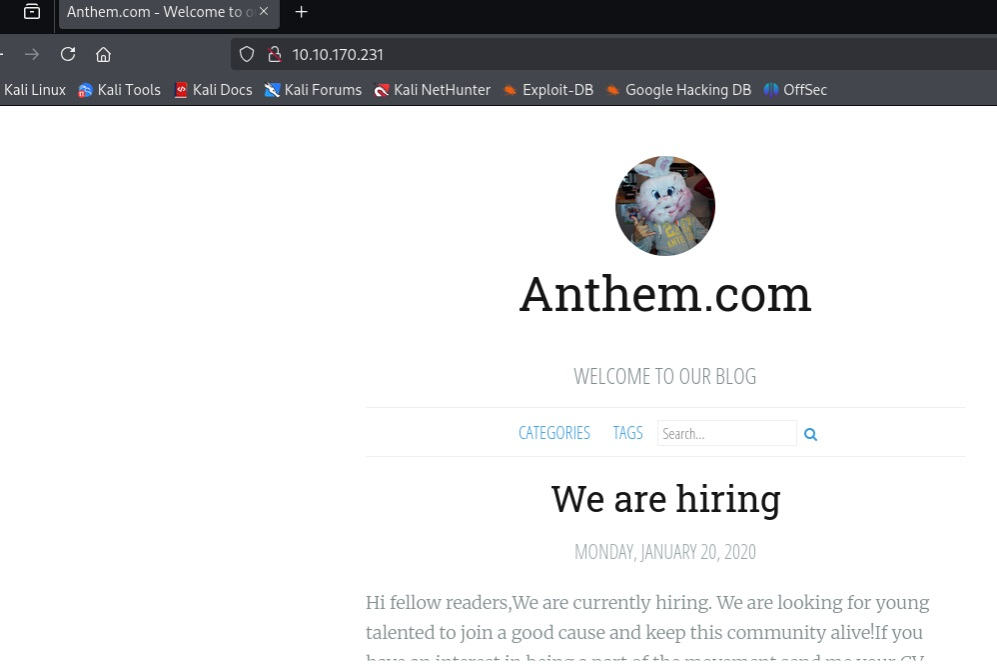

Investigando a página, encontramos um artigo recrutando para quem deseja trabalhar com o _**Anthem**_  


Um possível nome de domínio é <mark>anthem.com</mark>  
E um possível endereço de login é <mark>JD@anthem.com</mark>  
No segundo post, temos isto  

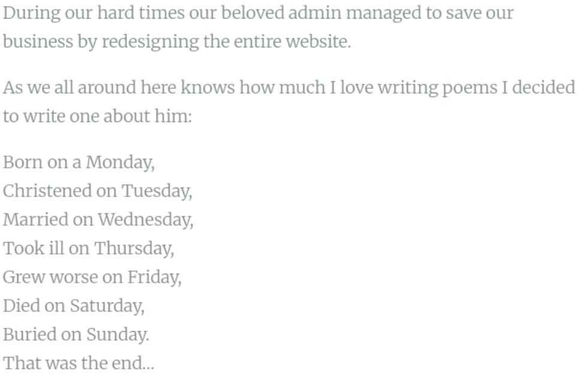

Perguntando ao gpt o que/quem este poema faz referência, temos um nome da cultura pop, <mark>Solomon Grundy</mark>  
O nome _**Solomon Grundy**_ também aparece como o de um vilão da DC Comics, geralmente enfrentando heróis como o Batman, Lanterna Verde ou Superman

Autores destes posts, respectivamente: <mark>Jane Doe e James Orchard Halliwell</mark>

Utilizando a ferramenta de enumeração de diretórios <mark>Gobuster</mark>, conseguimos obter os seguintes resultados
> ```bash
> gobuster dir --url http://[ip_address]:80 -w ../seclists/Discovery/Web-Content/common.txt
> ```
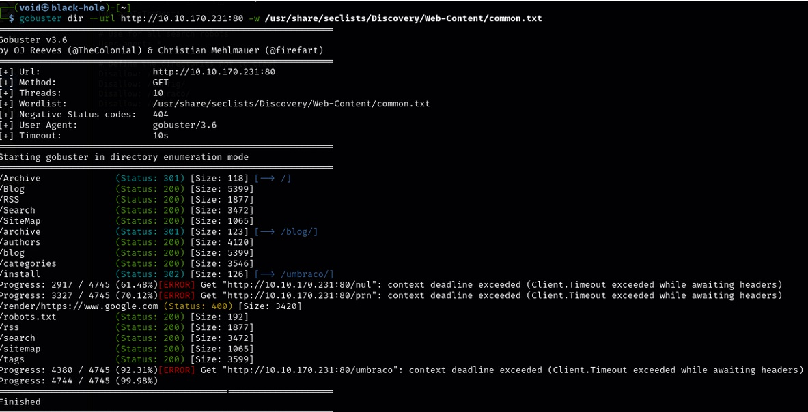

Uma simples busca no Google por <mark>Umbraco</mark> e visitando <mark>../robots.txt</mark>, temos o nosso CMS:  


Vemos alguns diretórios não acessíveis, user-agent e também <mark>UmbracoIsTheBest!</mark>  
Visitando algumas destas URLs descobertas com o Gobuster, temos a seguinte página em <mark>../authors</mark>  

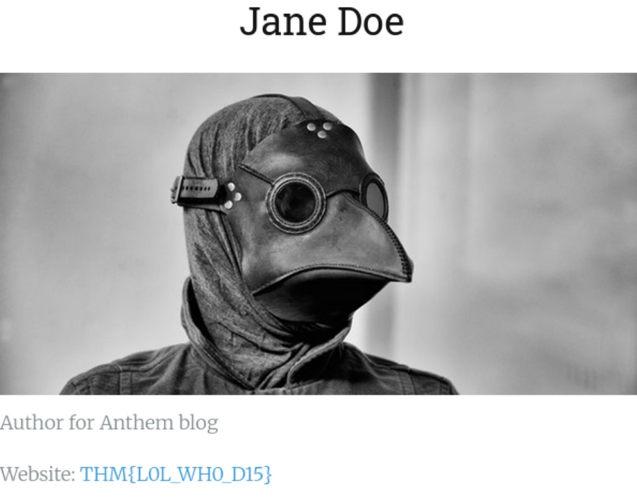

Uma flag descoberta!  
Na página <mark>../categories</mark>, inspecionamos os elementos da página e no código, com ctrl+f, buscamos por THM, nome padrão para as flags do TryHackMe  

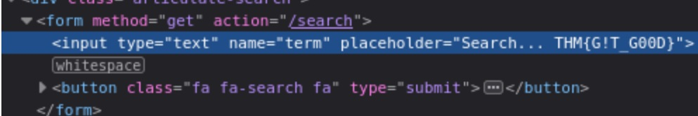

Na página <mark>../archive/we-are-hiring/</mark>, inspecionamos também os elementos da página e no código com ctrl+f, buscamos por THM, nome padrão para as flags do TryHackMe  

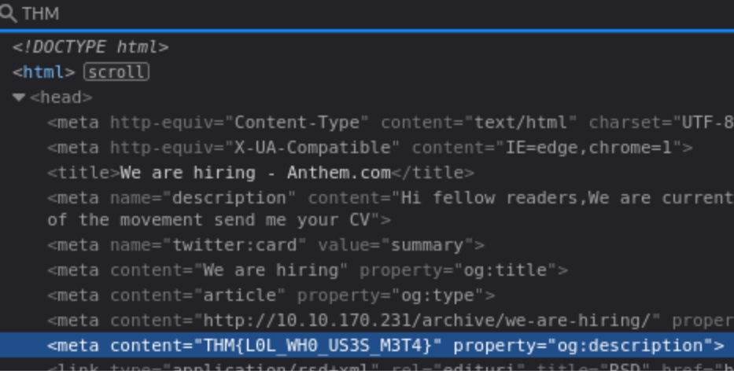

Mais uma vez, em <mark>../archive/a-cheers-to-our-it-department/</mark>, encontramos outra flag inspecionando os elementos da página e buscando por THM  

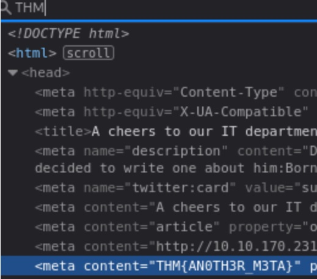

As flags necessárias foram estas, agora, precisamos encontrar o e-mail do administrador  
Por haver essa busca, há indícios de uma página de login ainda não descoberta  
Uma das dicas informa que o nome dos e-mails seguem um padrão  
O administrador é <mark>Solomon Grundy</mark> e o e-mail descoberto é JD (iniciais de Jane Doe), logo <mark>SG@anthem.com</mark>  
Agora, visitando <mark>../umbraco</mark>, encontramos uma página de login  

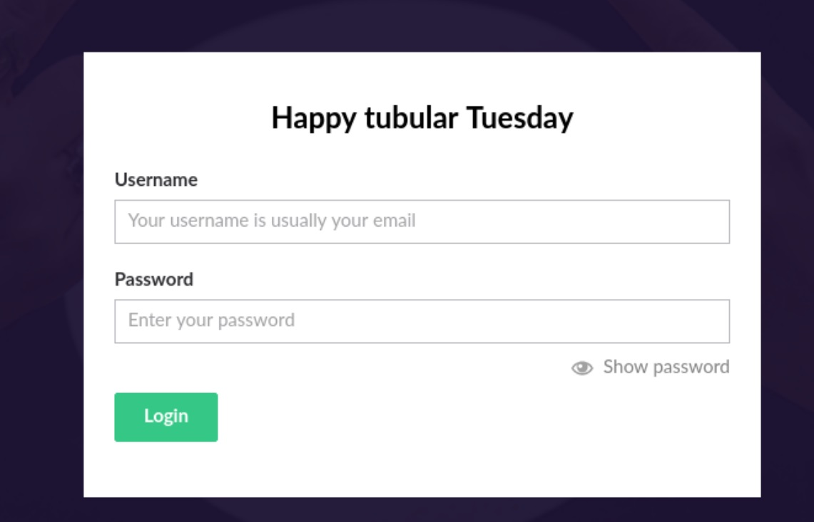

A senha correta (dica dada anteriormente) é <mark>UmbracoIsTheBest!</mark>, encontrada em robots.txt
Logo:
* user: <mark>SG@anthem.com</mark>
* password: <mark>UmbracoIsTheBest!</mark>

Senha incorreta!  
A tentativa agora é conectar-se remotamente na máquina  
Por ser uma máquina do tipo Windows (ver porta 3389), vamos usar a ferramenta <mark>Remmina</mark>  

Utilizando:
* endereço IP
* nome de domínio: <mark>anthem</mark>
* nome de usuário <mark>SG</mark>
* senha descoberta <mark>UmbracoIsTheBest!</mark>
* Obtivemos acesso! Agora, vamos ler o conteúdo de _user_


Para a próxima etapa, precisamos encontrar um arquivo escondido  
Primeiro, vamos habilitar para mostrar arquivos escondidos no Windows na página de busca  
Em seguida, vamos verificar os diretórios a partir de C:\  
Encontrei um diretório, <mark>backup</mark>  

Abrindo e lendo o que tem no arquivo _.txt_, um pop-up indicando que não temos permissão de leitura, vamos tentar alterar  
Para isso, clicamos com o botão direito e alteramos para nosso usuário (SG) conseguir ter controle total do arquivo  

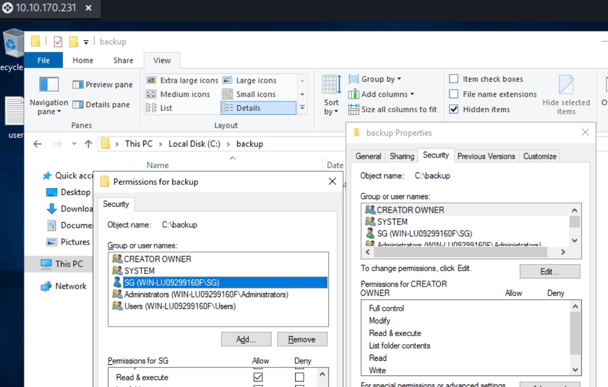

Lendo o arquivo, obtemos a resposta  
Navegamos até <mark>\Users\Administrator</mark>  
Agora, basta realizar login como _**admin**_ e elevar privilégios e buscar o arquivo _root.txt_
Está na área de trabalho (como de costume)
