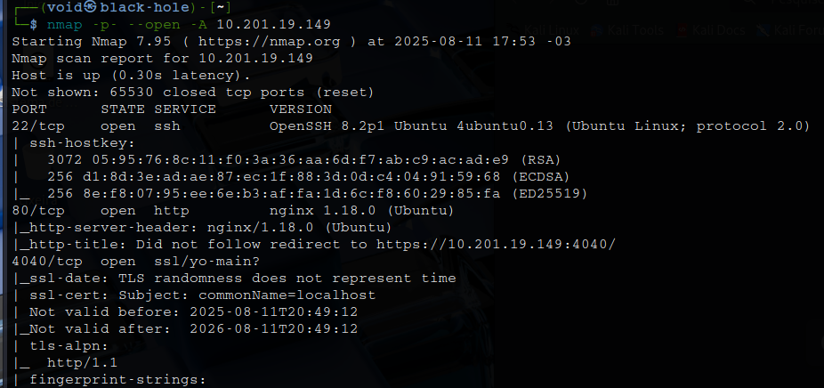

# _**B3dr0ck**_


## _**Enumeração**_
Primeiro, vamos começar com um scan <mark>Nmap</mark>
> ```bash
> nmap -p- --open -A [ip_address]
> ```



Seguindo a dica dada para a primeira flag, investigamos a porta 9009 com ```nc [ip_address] 9009```  
Temos um prompt  
Digitamos a palava _key_ e temos um retorno  


Também vamos digitar a palava _certificate_ para termos o retorno de um certificado  
Salvando no nosso computador e tentando utilizar para login via SSH ou no website, não temos muito resultado  
Voltando a nossa conexão a porta 9009, digitamos _login_ e temos um retorno interessante  
> ```bash
> socat stdio ssl:MACHINE_IP:54321,cert=<CERT_FILE>,key=<KEY_FILE>,verify=0
> ```
Vamos utilizar os obtidos para realizar uma conexão com o comando acima  


Com essa dica, vamos tentar um login via SSH com o usuário **barney**  
E temos sucesso!  


Conseguimos nossa primeira flag  
Agora, vamos investigar nosso acesso com o usuário _barney_  
Primeiro, com o comando ```sudo -l```, já que temos sua senha  


Executando o comando ```/usr/bin/certutil```, temos um retorno  
Vamos tentar ```/usr/bin/certutil fred Barney Rubble```


Erro de principiante, digitamos para procurar o usuário e informações erradas  
Alterando para ```sudo certutil fred FredFlintstone```, temos o retorno que desejamos  
Vamos utilizar novamente o comando de conexão _socket_ para recuperarmos a senha de **Fred**  


Após recuperar, vamos realizar login via **SSH** no usuário _fred_ e recuperarmos a segunda _flag_  
Em seguida, testamos, assim como no outro usuário, o comando ```sudo -l``` e temos retorno  


Executando o comando ```/usr/bin/base64 /root/pass.txt```, temos um retorno  
Decodificando para base32, temos mais um retorno em base64, que, decodificando, parece retornar uma string **MD5**  
Utilizando **crackstation**, temos o que parece ser uma senha  
Após tentar login na própria máquina e via SSH com o nome **root**, não conseguimos acesso  
Revisando, o comando foi digitado errado, sendo o certo ```su root```  
Conseguimos login  
Com ```cat /root/root.txt```, temos retorno da última flag!
