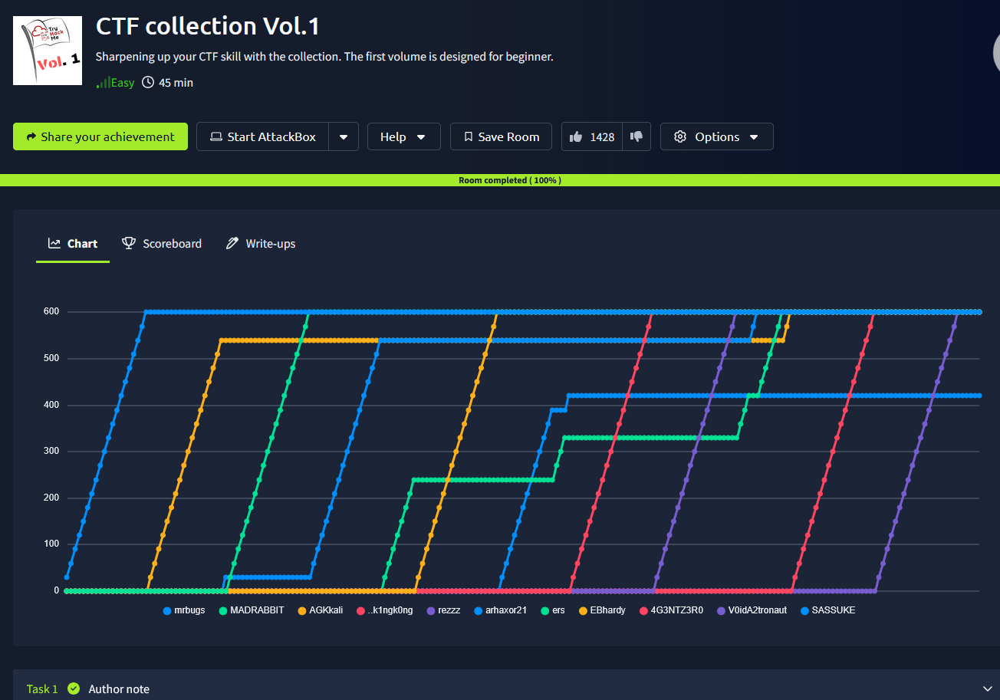

# _**CTF collection Vol.1**_


## _**Primeiro desafio**_
Para este, podemos utilizar [cyberchef](https://gchq.github.io/CyberChef/#recipe=From_Base64('A-Za-z0-9%2B/%3D',true,false)&input=VkVoTmUycDFOVGRmWkROak1HUXpYemRvTTE5aU5EVXpmUT09) para resolver  

## _**Segundo desafio**_
Para este, vamos utilizar primeiro ```exiftool```  
E lá está no nome  

## _**Teceiro desafio**_
Vamos utilizar ```steghide``` para tentar buscar o que está escondido: ```steghide extract -sf [filename]```  
Temos um _.txt_, então lemos e obtemos a flag

## _**Quarto desafio**_
Escondido no branco da própria página do desafio  

## _**Quinto desafio**_
Ao ler o código QR, temos a flag

## _**Sexto desafio**_
Usando ```r2``` podemos investigar o arquivo mais detalhadamente  
E assim, podemos enocntrar nossa flag

## _**Sétimo desafio**_
Vamos novamente utilizar [cyberchef](https://gchq.github.io/CyberChef/#recipe=From_Base64('A-Za-z0-9%2B/%3D',true,false)&input=VkVoTmUycDFOVGRmWkROak1HUXpYemRvTTE5aU5EVXpmUT09) 
E temos rapidamente nossa resposta ao decodificar de base58  

## _**Oitavo desafio**_
No [cyberchef](https://gchq.github.io/CyberChef/#recipe=From_Base64('A-Za-z0-9%2B/%3D',true,false)&input=VkVoTmUycDFOVGRmWkROak1HUXpYemRvTTE5aU5EVXpmUT09), vamos utilizar ROT13, mas ir diminuindo  
Isso nos revela a resposta em 7

## _**Nono desafio**_
Procurando através da tecla F12, encontramos a flag no código HTML

## _**Décimo desafio**_
Como o desafio afirma, este é um arquivo PNG corrompido  
Primeiro, verifiquei o conteúdo em um arquivo usando xxd  
Os 8 primeiros caracteres indicam o formato do arquivo fornecido  
Para PNG, é 89504e47 e, os primeiros 8 caracteres são 2333445f  
Realizando a alteração com ```nano```, mas ao abrir a imagem, nada de diferente  
Para obter a flag, tive que enviar a imagem para o CyberChef  
Primeiro, tive que decodificar as informações do formato hexadecimal e, em seguida, renderizar a imagem usando os dados brutos  

## _**Décimo primeiro desafio**_
A dica para este desafio é simplesmente "reddit"  
Uma busca rápida no Google por "TryHackMe room reddit" retorna uma página  
Acessando, temos a resposta

## _**Décimo segundo desafio**_
Um novo "desafio de descriptografia"  
Temos nossa resposta com ```brainfuck``` e [neste site](https://www.dcode.fr/brainfuck-language)  

## _**Décimo terceiro desafio**_
Pedidno para o chatGPT para decodificar S1 XOR S2 temos nossa resposta  

## _**Décimo quarto desafio**_
Utilizando ```binwalk```, extraimos o arquiov escondido com ```binwalk -e [filename.jpg]```  
Verificando a pasta, temos um arquivo _.txt_ e a flag!

## _**Décimo quinto desafio**_
A dica do desafio sugeriu usar o stegsolve  
Executando isso com o arquivo aberto, comecei a percorrer os planos e conseguimos encontrar a flag em ```blue 1```  

## _**Décimo sexto desafio**_
A decodificação do código QR revelou um link para uma faixa do SoundCloud
Ouvindo, temos a nossa resposta

## _**Décimo sétimo desafio**_
Vamos utilizar a [wayback machine](https://web.archive.org/) para verificar a data e o site assim, encontrando a flag  

## _**Décimo oitavo desafio**_
Vamos utilizar novamente ```cyberchef``` e vigenère  
Digitando como chave ```THM```, obtemos nosa resposta

## _**Décimo nono desafio**_
Vamos novamente pedir ao chatgpt para decodificar  
E parece estar em base35  

## _**Vigésimo desafio**_
Para o último desafio, vamos realizar o download do arquivo e utilizar _wireshark_ para verificar os pacotes  
Vamos digitar na barra de pesquisa ```http.request``` e investigar os pactes HTTP  
Logo, encontramos nossa flag
