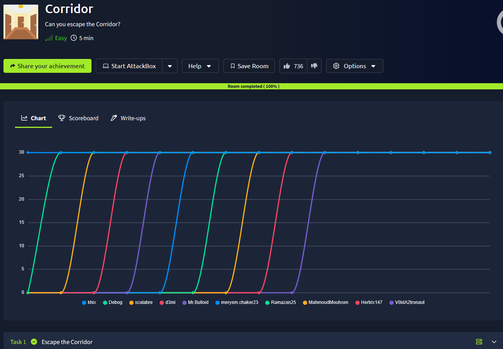
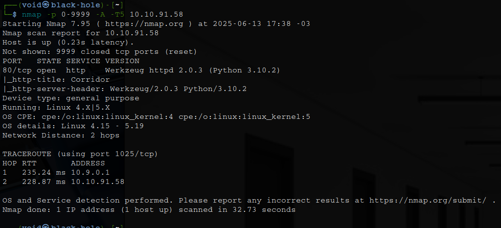
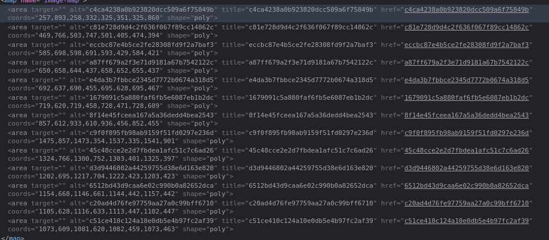

# _**Corridor**_


## _**Enumeração**_
Primeiro, vamos começar com um scan <mark>Nmap</mark>
> ```bash
> nmap -p 0-9999 -A -T5 [ip_address]
> ```


A sala fala sobre buscar por IDOR
Também nos deixa a seguinte mensagem: _Examine the URL endpoints you access as you navigate the website and note the hexadecimal values you find_  
Vamos investigar o segundo. Temos hashes MD5  



Estes hashes vão do número 1 ao 13  
Vamos tentar buscar na URL com os números  
Nenhum sucesso  
Vamos tentar a _hash_ em si  
Parece que cada _hash_ nos leva a um lugar diferente  
Testando cada uma delas, temos apenas imagens em branco  
Podemos continuar testando com 0 ou 14  
Gerando as _hashes_ para ambos os números e testando, com 0, temos a flag!

Porque funciona?
IDOR (Insecure Direct Object Reference) é uma vulnerabilidade de controle de acesso, onde um atacante consegue acessar recursos (arquivos, registros, informações de usuários, etc.) diretamente através da manipulação de parâmetros sem passar por checagens adequadas de permissão
