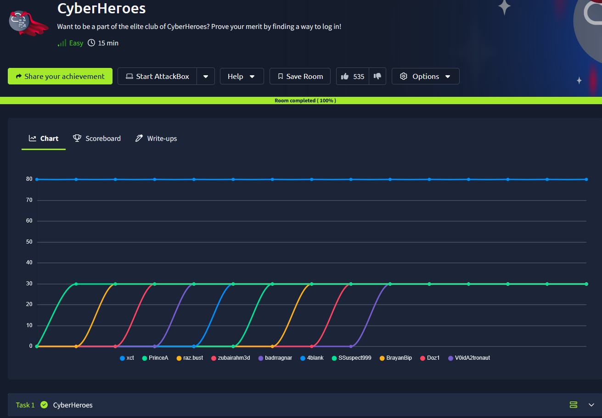
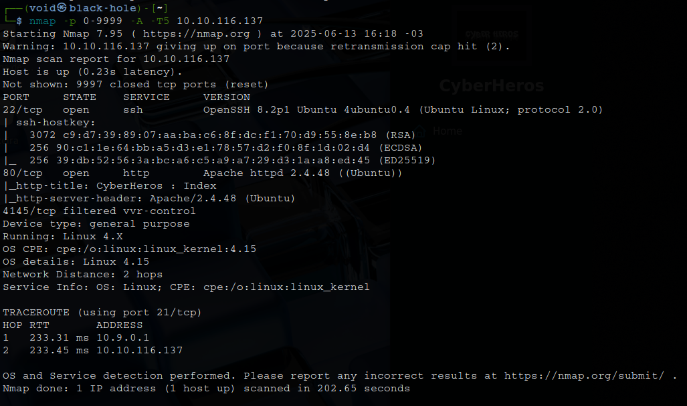
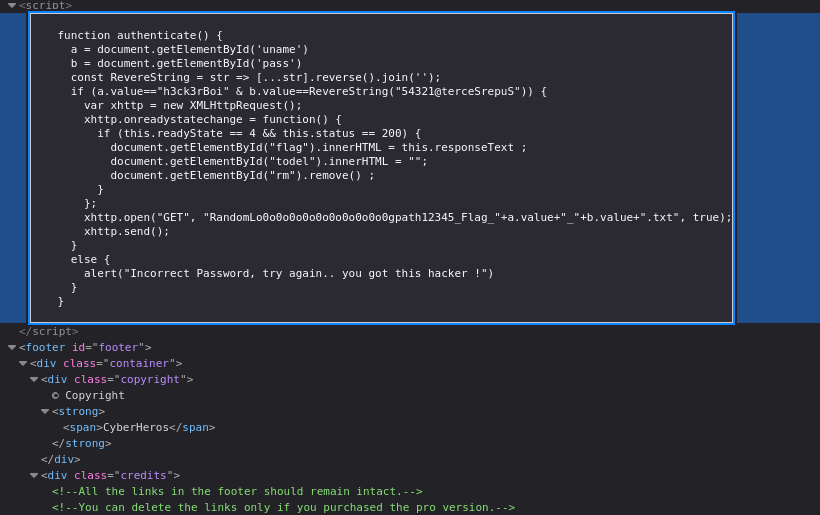

# _**CyberHeroes CTF**_


## _**Enumeração**_
Primeiro, vamos começar com um scan <mark>Nmap</mark>
> ```bash
> nmap -p 0-9999 -A -T5 [ip_address]
> ```


Parece que temos um website, vamos investigar  
Uma página de login logo no menu a direita  
Pela sugestão do criador, podemos visitar uma sala para _authentication bypass_  
Vamos tentar SQL Injection com ```' || '1'='1';-- -```  
Não funcionou  

Investigando o código da página, temos:  



Parece que temos o código de login da página  
Algo que deveria estar no _backend_ da página
Esse código nos permite manipular login  
E temos usuário e a senha  
Inserindo as credenciais, temos a flag!
