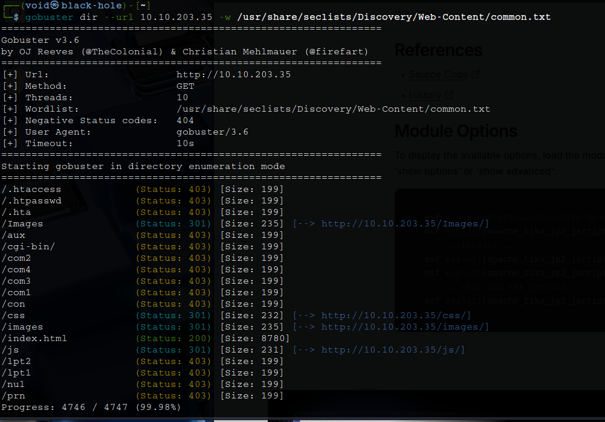

# _**CyberLens CTF**_


## _**Enuemração**_
Primeiro, vamos começar com um scan com <mark>Nmap</mark>
> ```bash
> nmap -p- --open -A [ip_address]
> ```


Temos um website, vamos investigar  
Procurando por pistas nas ferramentas de desenvolvedor, nada foi encontrado  
Vamos realizar um scan com <mark>Gobuster</mark> em busca de diretórios
> ```bash
> gobuster dir --url [ip_address] -w ../seclists/Discovery/Web-Content/common.txt
> ```


Diretórios interessantes foram encontrados  
Investigando em _/images_, temos as imagens do próprio site, nada de interessante  
Nos outros diretórios, nada também chama a atenção  
Procurando no site em si, temos um local para _upload_ de imagens  
Tentando enviar algum arquivo e obter shell, não foi possível  


No scan <mark>Nmap</mark>, encontramos uma outra página web na porta 61777  
Investigando o site, temos o seguinte  


Temos versão e software do servidor: **Apache Tika 1.17**  
Procurando pelo nome no _google_, encontramos [neste site](https://www.rapid7.com/db/modules/exploit/windows/http/apache_tika_jp2_jscript/), informações sobre a CVE-2018-1335 e de como explorar essa falha  
Executando ```msfconsole``` e configurando LHOST, RHOST e RPORT, tentamos explorar, mas sem sucesso  
Devido a dica dada, _Às vezes, os exploits exigem algumas tentativas antes de serem bem-sucedidos ;)_, tentamos novamente e conseguimos uma sessão _meterpreter_  


## _**Escalando privilégio**_
Executando ```shell```, temos uma conexão melhor  
Agora, para escalarmos privilégios, primeiro, vamos investigar o sistema executando <mark>WinPeas.ps1</mark>  


Aqui, podemos ver que as _registry keys_ AlwaysInstallElevated estão habilitadas  
Com essas chaves habilitadas, todos os usuários podem executar arquivos do Windows Installer (.msi) com privilégios elevados  
Podemos usar o <mark>msfvenom</mark> para criar um _installer_ malicioso, que podemos usar para executar comandos arbitrários  
Tentando realizar a execução do arquivo após o _upload_, temos falha  
Deixamos nossa sessão do _meterpreter_ em background e então, selecionamos o seguinte módulo: **windows/local/always_install_elevated**  
Configurando LHOST, SESSION e LPORT, executamos e novamente, temos uma sessão _meterpreter_  
Com ```shell```, verificamos quem somos!  


Agora só ir atrás das flags
