# _**Dav CTF**_
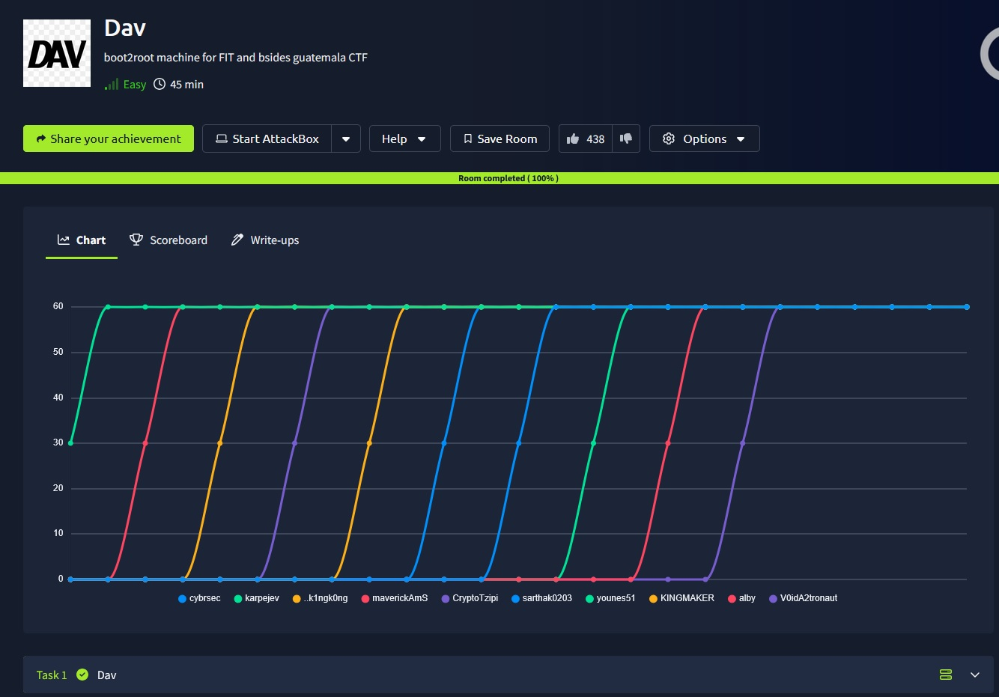

## _**Enumeração**_
Primeiro, vamos começar com um scan <mark>Nmap</mark>
> ```bash
> nmap --open -A -T5 [ip_address]
> ```
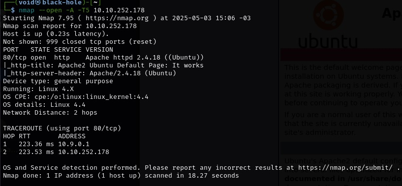

Segundo, vamos realizar um scan <mark>Gobuster</mark>
> ```bash
> gobuster dir --url [ip_address] -w ../Discovery/Web-Content/common.txt
> ```
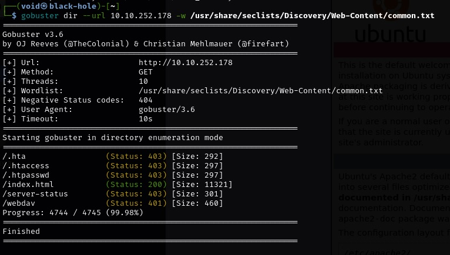

Recebemos um código 401, [acesso não autorizado](https://developer.mozilla.org/pt-BR/docs/Web/HTTP/Reference/Status/401)  
Pede uma senha e usuário  
Podemos tentar explorar  

Primeiro, tentamos um login anonimo com a ferramenta <mark>Cadaver</mark>  

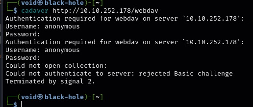

Mas não funcionou

Tentamos com o comando ```curl```, mas também não adiantou  

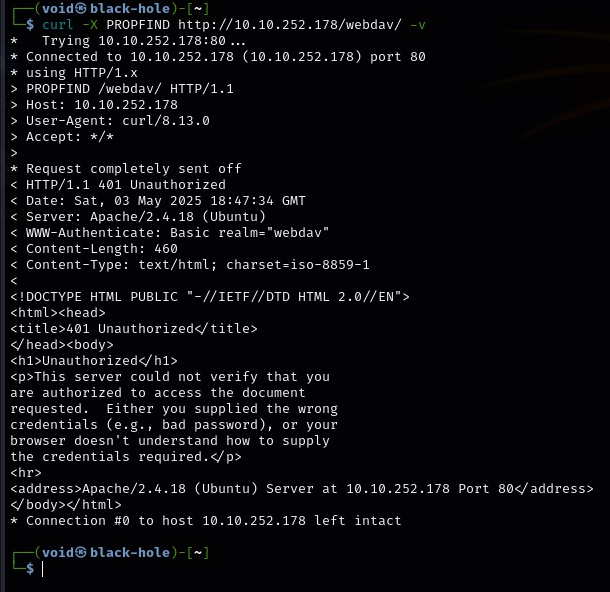

Novamente, tentamos algo com o Nmap através do comando abaixo
> ```bash
> nmap -p 80 --script http-methods,http-webdav-scan [ip_address]
> ```
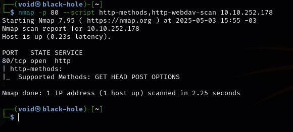

Isso nos diz que /webdav não aceita métodos POST

Vamos procurar as credenciais padrão para Webdav  
Temos:
* **username**: wampp
* **password**: xampp

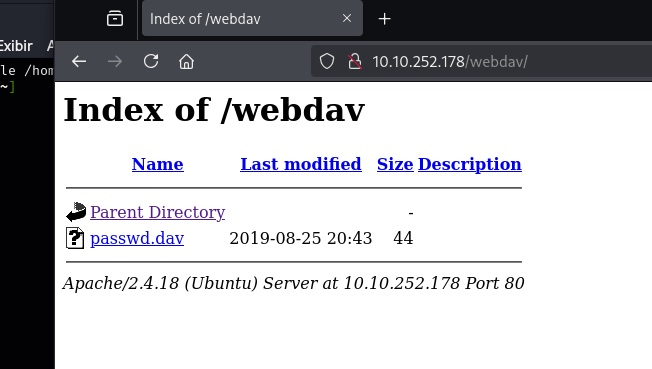

Chegamos em uma página onde contém o seguinte  

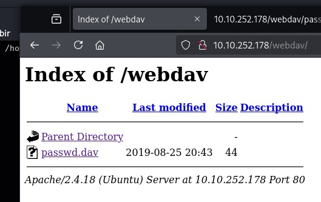

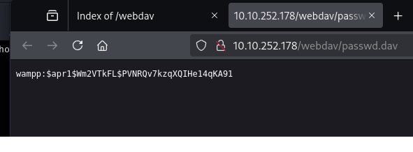

Usando ```hash-identifier```, temos:

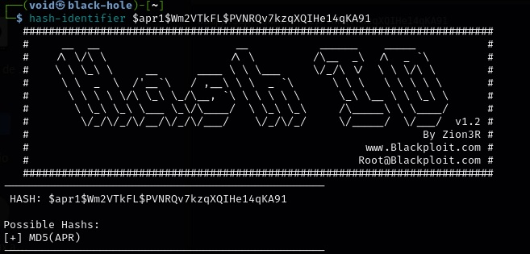

Vamos usar <mark>John</mark> para quebrá-la
> ```bash
> echo 'wampp:$apr1$Wm2VTkFL$PVNRQv7kzqXQIHe14qKA91' > hash_passwd.txt
> ```
> ```bash
> 'john --wordlist=/usr/share/wordlists/rockyou.txt --format=md5crypt hash_passwd.txt
> ```
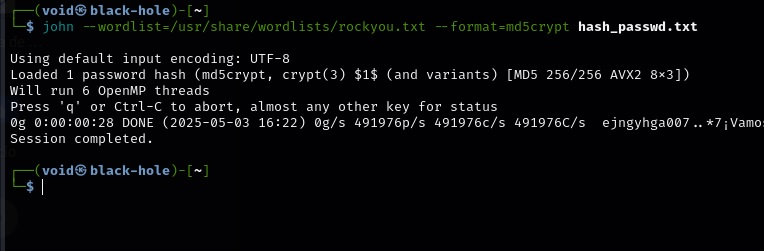

Sem resutlados!  
Este não parece ser o caminho  
Vamos tentar de outra maneira  

Verificando novamente (agora que temos acesso) se aceita PUT (típico de webdav)  

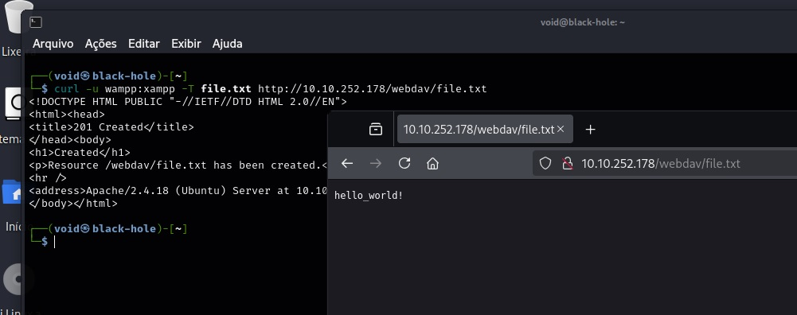

## _**Ganhando acesso**_
Vamos pegar um [script em PHP](https://github.com/pentestmonkey/php-reverse-shell/blob/master/php-reverse-shell.php) para um _reverse shell_  
Agora, vamos realizar upload via PUT
> ```bash
> curl -u wampp:[password] -T reverse_shell.php http://10.10.252.178/webdav/reverse_shell.php
> ```
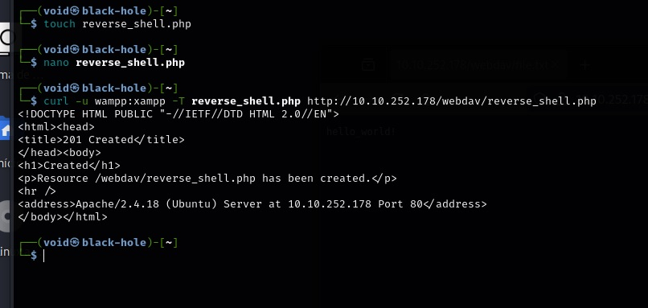

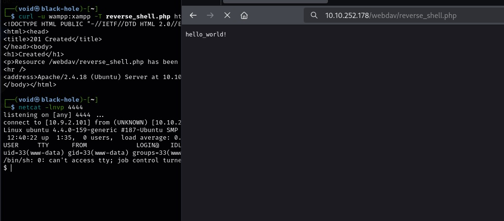

## _**Escalando privilégios**_
Primeiro, vamos verificar ```id``` e diretório atual com ```pwd```  

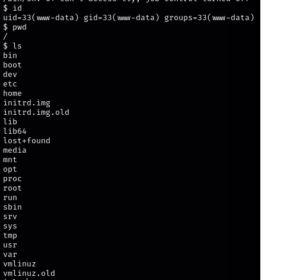  

Temos nossa primeira flag!  

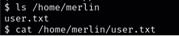

Para podermos escalar privilégios, precisamos saber o que podemos fazer  
Primeiro, vamos usar ```sudo -l```  

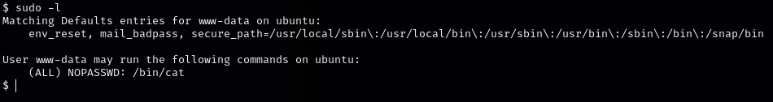

Com isso, você pode ler qualquer arquivo no sistema como _root_, basta usar <mark>/bin/cat</mark>  
Vamos tetnar com <mark>/root/root.txt</mark>, provável local da flag 2  
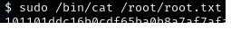

Conseguimos!!!
