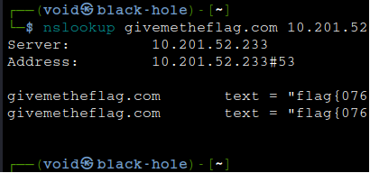

# _**Dig Dug CTF**_

Devemos recuperar a flag do servidor DNS  
Para isso, vamos primeiro ler e estudar as salas recomendadas  
Na sala _passive reconnnaissance_, temos a ferramenta _nslookup_  
Pelas informações, a sala apenas responde a um tipo de requisição, especificamente para _givemetheflag.com_  
Vamos executar o comando
> ```bash
> nslookup givemetheflag.com [ip_address]
> ```


Assim, conseguimos encontrar a flag!
