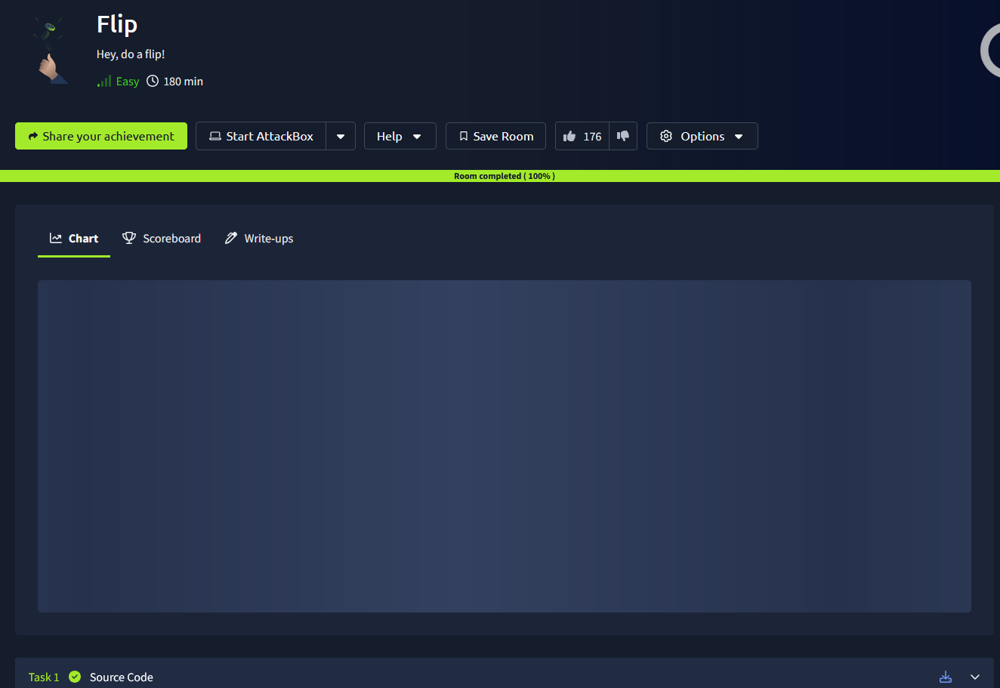
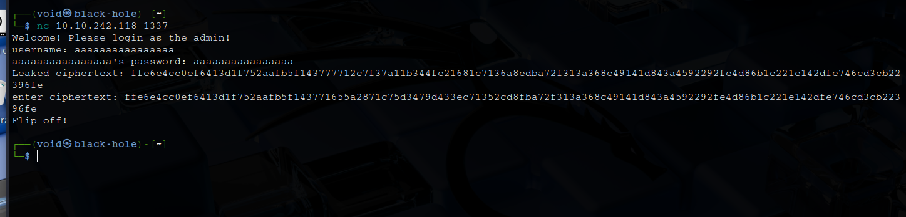
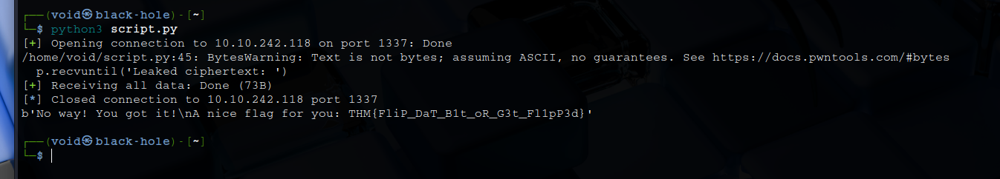

# _**Flip CTF**_

## _**Enumeração**_
Primeiro, vamos analisar o código que nos foi fornecido  
O script Python implementa um servidor TCP interativo que desafia o usuário a forjar um ciphertext válido que contenha as credenciais corretas para obter a flag  
* Algoritmo: AES (Advanced Encryption Standard)
* Modo: CBC (Cipher Block Chaining)
* Padding: PKCS7
* Chave e IV: Aleatórios, gerados a cada conexão

Como acontece:
* Conexão aceita (handle() → start())
* Usuário insere username e password
* Se tentar "admin" com "sUp3rPaSs1", temos rejeição
* Se usar outro par, o servidor retorna um ciphertext
* Se o ciphertext enviado for, após decriptado, igual a uma string que contenha "admin&password=sUp3rPaSs1", podemos ganhar a flag

Como é CBC, pode ser vulnerável a um ataque de bit flipping  
O atacante altera blocos anteriores para mudar a mensagem descriptografada  
Como o servidor mostra o ciphertext de entrada, isso pode ser explorado para construir manualmente um ciphertext que passe na verificação  

Porque CBC permite bit flip?
* Cada bloco de texto plano é XORado com o bloco criptografado anterior, antes de ser criptografado
* Ao modificar um bloco anterior, você altera o texto plano do próximo bloco após a decriptação

Vamos enviar:
* **username**: aaaaaaaaaaaaaaaa
* **password**: aaaaaaaaaaaaaaaa

O servidor vai te mostrar um ciphertext correspondente (em hex)  
Você quebra ele em blocos de 16 bytes  
Identifique qual bloco contém "password=" e qual contém o valor aaaaaaaa  
Altere o bloco anterior ao bloco da senha com XORs específicos, para que o bloco da senha decodifique para sUp3rPaSs1  

